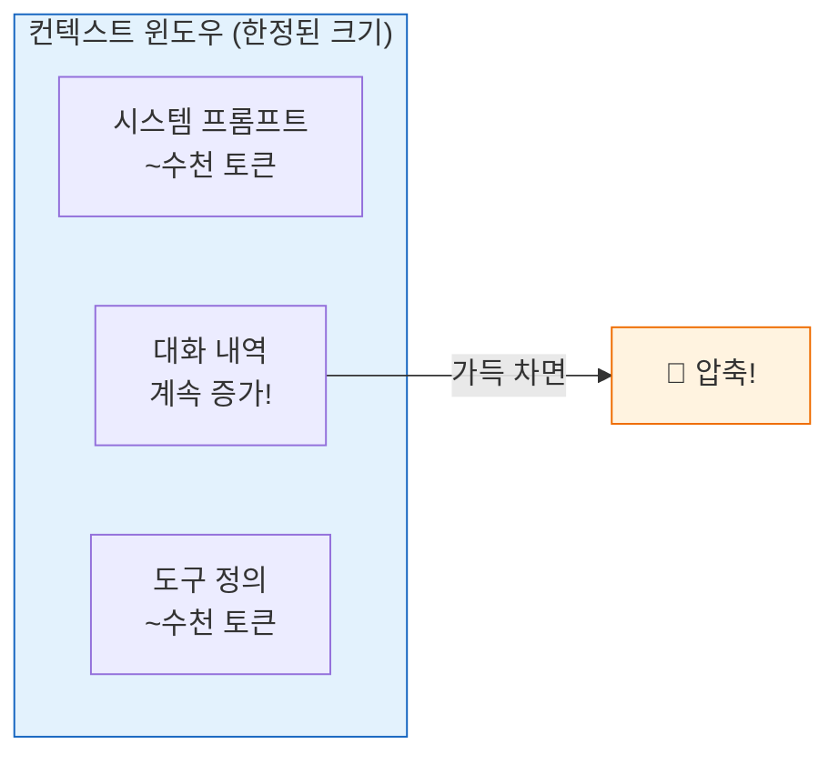
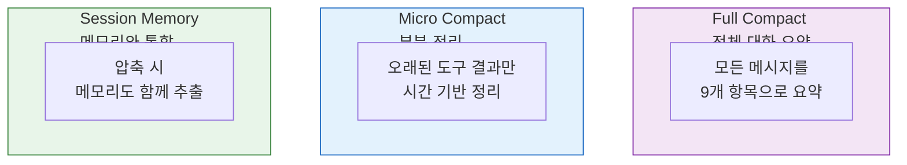
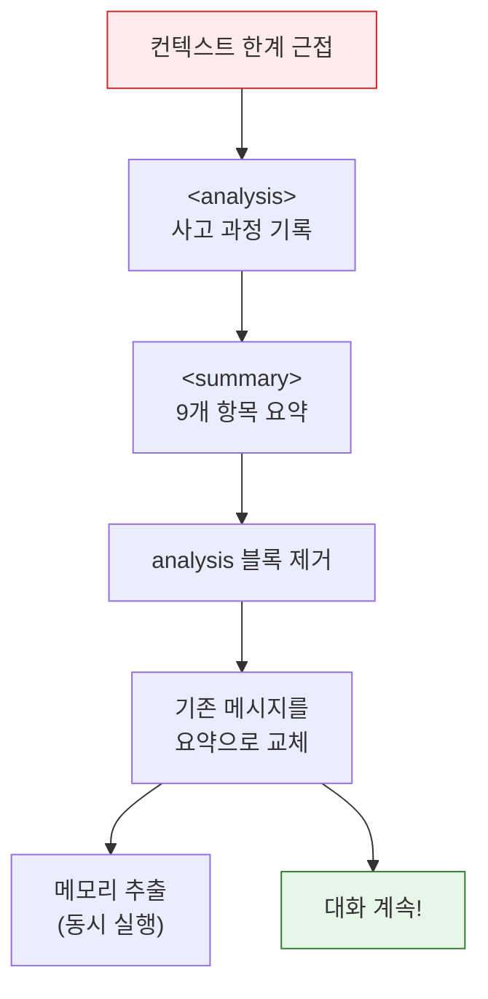

# 🧹 컨텍스트 압축과 토큰 관리

> AI의 기억 창(컨텍스트 윈도우)은 무한하지 않습니다. 이 장에서는 Claude Code가 **긴 대화를 효율적으로 관리**하는 방법을 다룹니다.

## 📏 컨텍스트 윈도우란?

AI가 한 번에 처리할 수 있는 텍스트의 양에는 한계가 있어요. 마치 칠판 크기가 정해져 있는 것처럼!

예를 들어 Claude의 컨텍스트 윈도우가 200K 토큰이라면, 시스템 프롬프트(~수천 토큰) + 도구 정의(~수천 토큰) + 대화 내역(계속 증가!) 을 모두 합쳐서 이 한도 안에 넣어야 해요. 대화가 길어지면 결국 한계에 도달하고, 이때 **압축**이 필요합니다.

## 🔄 3가지 압축 전략

## 📋 Full Compact — 9가지 기억 항목

압축 시 **반드시 보존**해야 하는 9가지:

| # | 항목 | 중요도 |
|:--|:-----|:------|
| 1 | 📌 주요 요청과 의도 | 🔴 최고 |
| 2 | 💡 핵심 기술 개념 | 🟡 높음 |
| 3 | 📄 파일과 코드 스니펫 | 🟡 높음 |
| 4 | 🐛 에러와 수정 내역 | 🟡 높음 |
| 5 | 🧩 문제 해결 과정 | 🟢 중간 |
| 6 | 💬 모든 사용자 메시지 | 🟡 높음 |
| 7 | ⏳ 대기 중인 작업 | 🔴 최고 |
| 8 | 🔨 현재 작업 상태 | 🔴 최고 |
| 9 | ➡️ 다음 단계 | 🟡 높음 |

**핵심 제약:** 압축 중에는 **도구 사용 금지!** (`NO_TOOLS_PREAMBLE`) 텍스트 전용 응답만 가능.

왜 도구를 금지할까요? 압축의 목적은 "대화 내용을 짧게 요약하는 것"이지, 새로운 작업을 수행하는 게 아니기 때문이에요. 도구를 허용하면 요약 과정에서 불필요한 파일 읽기나 코드 실행이 발생해 비용이 늘어날 수 있어요.

> 소스: [`src/services/compact/prompt.ts`](../src/services/compact/prompt.ts) · [`src/services/compact/compact.ts`](../src/services/compact/compact.ts)

## 💰 프롬프트 캐싱 — 비용 절약

정적 시스템 프롬프트를 매번 재전송하지 않고 **캐시**해서 재사용:

| 범위 | 대상 | TTL |
|:-----|:-----|:----|
| `global` | 정적 시스템 프롬프트 | 5분 |
| `ephemeral` | 개별 도구 스키마 | 요청 단위 |

---

## 💡 엔지니어를 위한 팁

<b>기술 심화</b>

### 자동 압축 임계값

`autoCompact.ts`에서 컨텍스트 사용률이 임계값을 초과하면 자동으로 압축이 트리거됩니다. 사용자는 `/compact` 명령으로 수동 압축도 가능합니다.

### 압축 변형

| 변형 | 함수 | 용도 |
|:-----|:-----|:-----|
| Full | `BASE_COMPACT_PROMPT` | 전체 대화 요약 |
| Partial | `PARTIAL_COMPACT_PROMPT` | 최근 부분만 |
| Up-to | `PARTIAL_COMPACT_UP_TO_PROMPT` | 캐시 히트 기준 |

---

👉 다음 장: [**11장: 화면 시스템과 세션 관리**](./11_Screens_Sessions.md) 📺
