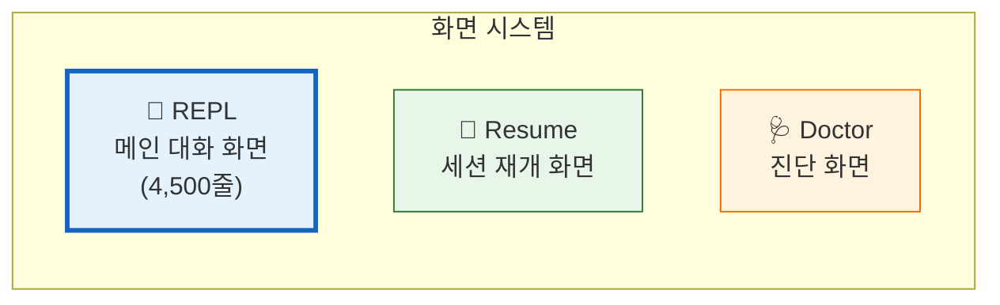
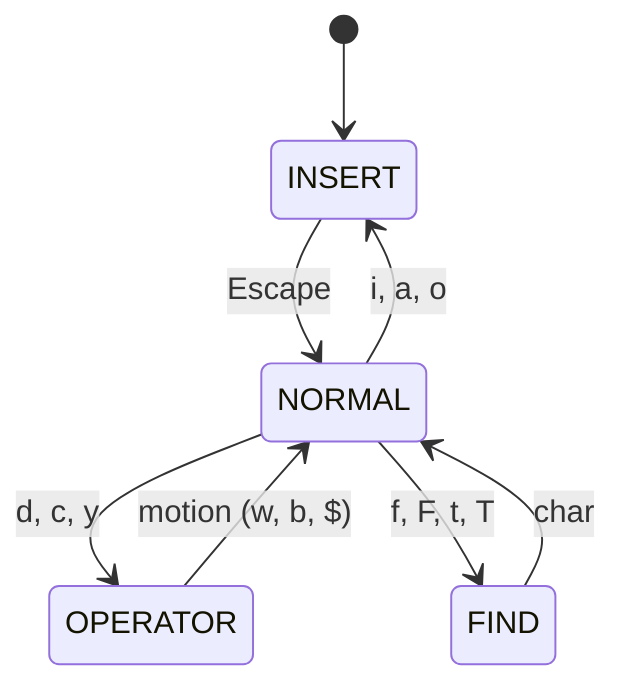

# 📺 화면 시스템과 세션 관리

> 이 장에서는 REPL 화면, 세션 재개, 진단 화면, 그리고 Vim/음성 모드 등 부가 기능을 다룹니다.

## 🖥️ 3가지 화면



### REPL 화면 — 핵심 기능

REPL.tsx는 Claude Code에서 **가장 큰 파일**(4,500줄 이상)이에요. 모든 대화 UI가 이 파일 하나에서 관리됩니다.

| 기능 | 설명 | 왜 필요한가? |
|:-----|:-----|:-----------|
| 메시지 스트리밍 | 실시간 토큰 표시, 도구 호출 | API 응답을 기다리지 않고 즉시 표시 |
| 가상 스크롤 | VirtualMessageList로 대량 메시지 | 수천 개 메시지도 메모리 효율적 |
| 텍스트 선택 | 스크롤 보정과 함께 복사 | 터미널에서 코드 복사 시 정확성 |
| 검색 하이라이트 | 메시지 전체에서 키워드 검색 | 긴 대화에서 특정 내용 찾기 |
| 투기적 실행 | 사용자 타이핑 중 AI 제안 | 응답 대기 시간 절약 |

**REPL의 핵심 루프:** 사용자 입력 → `onSubmit()` → `onQuery()` → API 호출 → 응답 스트리밍 → 도구 실행 → 다시 API 호출 (도구가 없을 때까지) → 최종 응답 표시 → 사용자 입력 대기. 이 전체 흐름이 [14장](./14_Execution_Flow.md)에서 상세히 다뤄집니다.

> 소스: [`src/screens/REPL.tsx`](../src/screens/REPL.tsx)

## 🔄 세션 재개 — 이전 대화 이어가기

Claude Code는 대화를 **세션 단위로 저장**해요. 나중에 `claude --resume` 명령으로 이전 대화를 이어갈 수 있어요.

| 기능 | 설명 |
|:-----|:-----|
| 세션 목록 | 퍼지 검색으로 이전 세션 찾기 |
| 비용 복원 | 이전 세션의 토큰/비용 누적값 복원 |
| 워크트리 복원 | Git 워크트리 상태 복원 |
| 에이전트 복원 | 서브에이전트 컨텍스트 복원 |

> 소스: [`src/screens/ResumeConversation.tsx`](../src/screens/ResumeConversation.tsx)

## 🩺 Doctor 화면 — 자가 진단

문제가 생겼을 때 `/doctor` 명령으로 Claude Code의 상태를 점검할 수 있어요. 설정 검증, 플러그인 오류, MCP 파싱 경고, 키바인딩 유효성 등을 확인합니다.

> 소스: [`src/screens/Doctor.tsx`](../src/screens/Doctor.tsx)

## ⌨️ Vim 모드

Claude Code는 **Vim 키바인딩**을 내장하고 있어요! 터미널에서 Vim을 쓰는 개발자를 위해, 익숙한 모달 편집 경험을 제공합니다.



지원: `h/j/k/l`, `w/b`, `d/c/y` + 모션, `f/F/t/T`, 텍스트 오브젝트 (`iw`, `i)`)

> 소스: [`src/vim/`](../src/vim/)

## 🎤 음성 모드 & 🐾 Buddy 시스템

- **음성 모드**: Feature-gated, 음성 입출력 (Voice → Text → Claude → Text → Voice)
- **Buddy**: 절차적 생성 컴패니언 — 세션 ID 기반 시드로 종(Species), 눈, 모자, 레어도 결정!

```
레어도: common(5) → uncommon(15) → rare(25) → epic(35) → legendary(50)
반짝이 확률: 1% ✨
```

> 소스: [`src/voice/`](../src/voice/) · [`src/buddy/companion.ts`](../src/buddy/companion.ts)

---

👉 다음 장: [**12장: 고급 패턴과 내부 최적화**](./12_Advanced_Patterns.md) 🏗️
