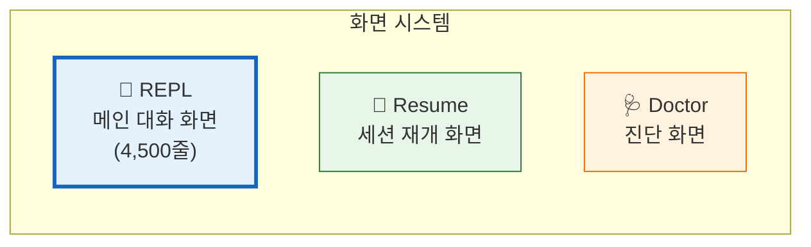
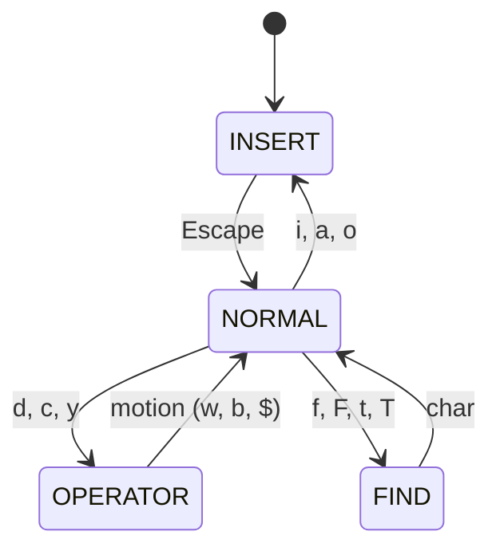

# 📺 화면 시스템과 세션 관리

> 이 장에서는 REPL 화면, 세션 재개, 진단 화면, 그리고 Vim/음성 모드 등 부가 기능을 다룹니다.

## 🖥️ 3가지 화면



### REPL 화면 — 핵심 기능

| 기능 | 설명 |
|:-----|:-----|
| 메시지 스트리밍 | 실시간 토큰 표시, 도구 호출 |
| 가상 스크롤 | VirtualMessageList로 대량 메시지 |
| 텍스트 선택 | 스크롤 보정과 함께 복사 |
| 검색 하이라이트 | 메시지 전체에서 키워드 검색 |
| 투기적 실행 | 사용자 타이핑 중 AI 제안 |

> 소스: [`src/screens/REPL.tsx`](../src/screens/REPL.tsx)

## ⌨️ Vim 모드

Claude Code는 **Vim 키바인딩**을 내장하고 있어요!



지원: `h/j/k/l`, `w/b`, `d/c/y` + 모션, `f/F/t/T`, 텍스트 오브젝트 (`iw`, `i)`)

> 소스: [`src/vim/`](../src/vim/)

## 🎤 음성 모드 & 🐾 Buddy 시스템

- **음성 모드**: Feature-gated, 음성 입출력 (Voice → Text → Claude → Text → Voice)
- **Buddy**: 절차적 생성 컴패니언 — 세션 ID 기반 시드로 종(Species), 눈, 모자, 레어도 결정!

```
레어도: common(5) → uncommon(15) → rare(25) → epic(35) → legendary(50)
반짝이 확률: 1% ✨
```

> 소스: [`src/voice/`](../src/voice/) · [`src/buddy/companion.ts`](../src/buddy/companion.ts)

---

👉 다음 장: [**12장: 고급 패턴과 내부 최적화**](./12_Advanced_Patterns.md) 🏗️
