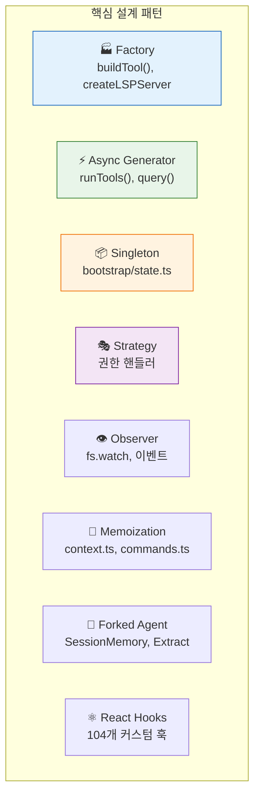
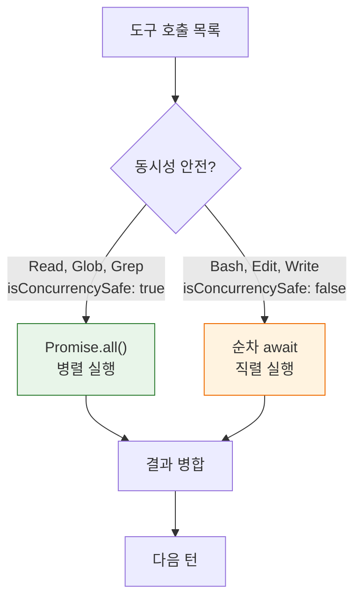
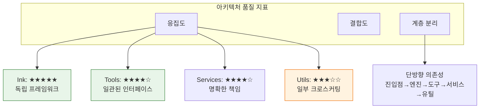

# 🏗️ 고급 패턴과 내부 최적화

> 마지막 장에서는 Claude Code 소스코드에서 발견되는 **고급 설계 패턴**과 **성능 최적화 기법**을 종합합니다.

## 🎯 8대 설계 패턴

## ⚡ 성능 최적화 기법

| 기법 | 위치 | 효과 |
|:-----|:-----|:-----|
| **프롬프트 캐싱** | `SYSTEM_PROMPT_DYNAMIC_BOUNDARY` | 정적 프롬프트 재전송 방지 |
| **동적 임포트** | `cli.tsx` | Fast-path에서 불필요한 모듈 로딩 방지 |
| **프레임 더블버퍼링** | `ink.tsx` | 터미널 깜빡임 방지 |
| **도구 스키마 캐시** | `toolSchemaCache.ts` | 세션 중 도구 스키마 재계산 방지 |
| **메모이제이션** | `context.ts` | getUserContext/getSystemContext 재계산 방지 |
| **병렬 도구 실행** | `StreamingToolExecutor` | concurrencySafe 도구 Promise.all |
| **지연 스키마 평가** | 도구 inputJsonSchema | 임포트 사이클 방지 |
| **Yoga 단일 슬롯 캐시** | `yoga-layout` | 반복 레이아웃 계산 방지 |

## 🔀 동시성 모델

## 🧩 네이티브 TS 포트 — Rust/C++ 없이 순수 TypeScript

| 포트 | 원본 | 용도 | 소스 |
|:-----|:-----|:-----|:-----|
| **yoga-layout** | Meta Yoga (C++) | Flexbox 레이아웃 엔진 | [`src/native-ts/yoga-layout/`](../src/native-ts/yoga-layout/) |
| **color-diff** | Rust syntect + similar | 구문 하이라이트 디프 | [`src/native-ts/color-diff/`](../src/native-ts/color-diff/) |
| **file-index** | 네이티브 파일 인덱서 | 파일 시스템 캐시 | [`src/native-ts/file-index/`](../src/native-ts/file-index/) |

## 🏛️ 아키텍처 품질 요약

---

## 🎓 튜토리얼을 마치며

12개의 장을 모두 읽으셨습니다! 이제 여러분은 **1,902개 파일로 이루어진 Claude Code의 내부 구조**를 이해하는 전문가예요.

### 배운 것 정리

| 장 | 핵심 |
|:---|:-----|
| 1-4 | 기초: Claude, 에이전트, 프롬프트, 코드 투어 |
| 5 | 메모리: 세션/자동/팀 메모리, 추출 에이전트 |
| 6 | 보안: 3층 방어, 12단계 권한, AST 파싱 |
| 7 | 확장: MCP, 스킬, 플러그인 |
| 8 | 렌더링: Ink, Yoga Flexbox, 더블 버퍼링 |
| 9 | 상태: 209개 getter/setter 싱글톤 |
| 10 | 압축: 9항목 보존, 캐싱 전략 |
| 11 | 화면: REPL, Vim, 음성, Buddy |
| 12 | 고급: 8대 패턴, 동시성, 네이티브 TS |

더 깊이 탐구하고 싶다면 [`./src/`](../src/) 폴더와 [분석 문서](../Index.md)를 함께 읽어보세요! 🚀

---

👉 돌아가기: [**튜토리얼 목차**](./README.md) 🗺️
