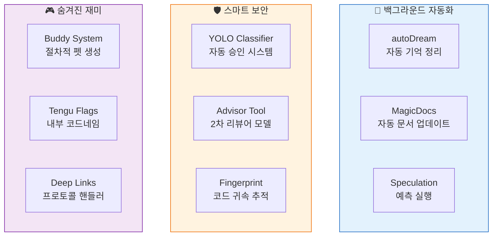
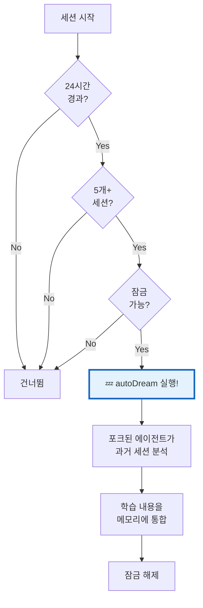
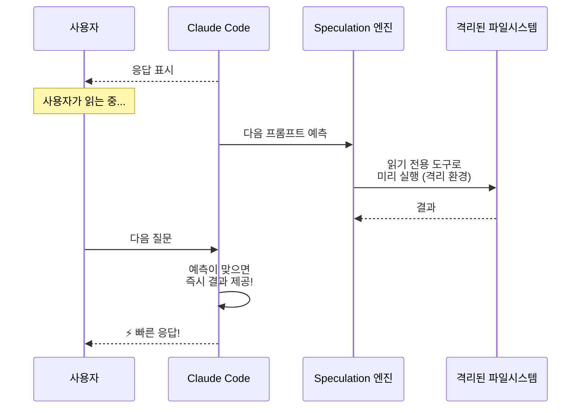
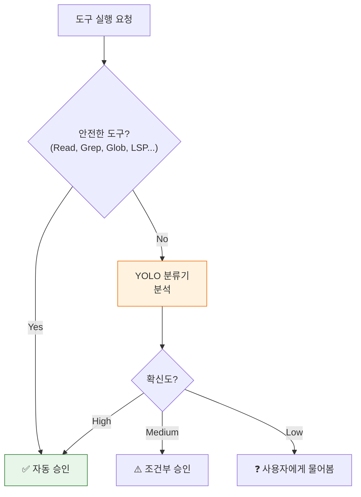
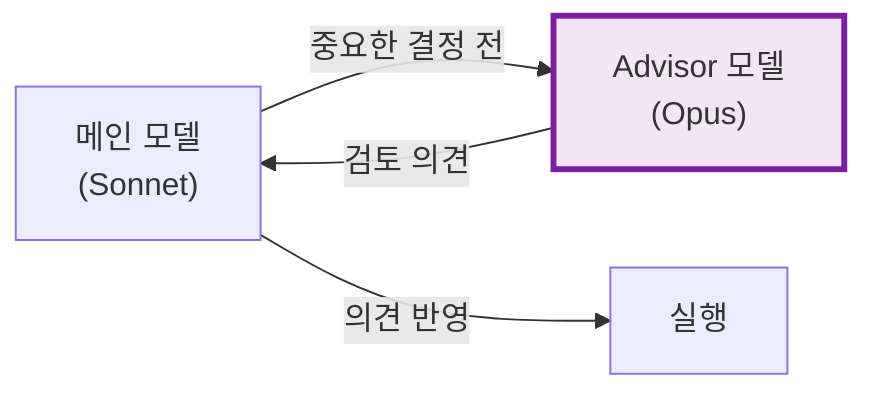
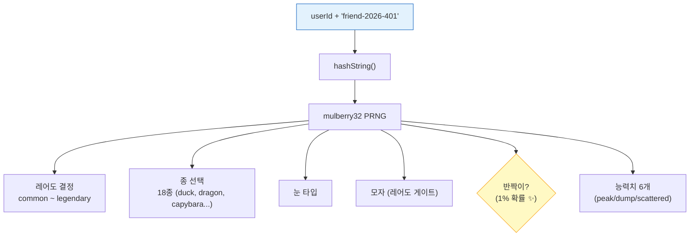
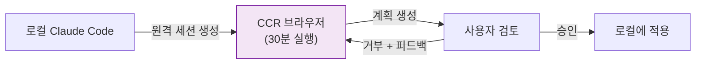
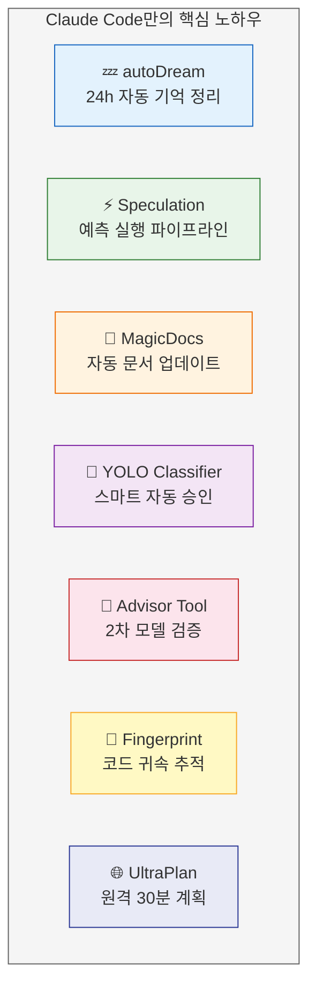

# 🔮 소스코드에 숨겨진 비밀들 — Claude Code만의 노하우

> 이 장은 특별편입니다. 소스코드를 깊이 파헤쳐서 발견한 **문서화되지 않은 기능**, **독특한 구현 트릭**, **이스터 에그**를 공개합니다.

## 🗺️ 숨겨진 비밀 지도



---

## 1. 💤 autoDream — AI가 잠들 때 기억을 정리한다

사람이 잠을 자면서 기억을 정리하듯, Claude Code도 **24시간마다 자동으로 과거 세션을 정리**해요!

**동작 조건 (Triple Gate):**

| 게이트 | 조건 | 비유 |
|:-------|:-----|:-----|
| 🕐 시간 게이트 | 마지막 정리 후 24시간 경과 | "하루에 한 번만 정리" |
| 📊 세션 게이트 | 5개 이상의 세션 누적 | "충분히 쌓여야 정리할 가치" |
| 🔒 잠금 게이트 | 다른 정리가 진행 중이 아님 | "동시에 두 번 정리 안 함" |



**핵심 트릭:** 잠금에 **mtime(수정시간)**을 사용해서, 실패하면 롤백 후 다음에 재시도. Thundering herd 문제 방지!

> 소스: [`src/services/autoDream/autoDream.ts`](../src/services/autoDream/autoDream.ts) · Feature flag: `tengu_onyx_plover`

---

## 2. ⚡ Speculation — 사용자가 읽는 동안 미리 실행

사용자가 AI 응답을 읽고 있는 동안, Claude Code는 **다음 할 일을 미리 예측해서 실행**해요!



**비밀 기술:**
- **Copy-on-Write 오버레이**: 파일 쓰기는 `/tmp/speculation/{pid}/{id}/`로 격리 → 사용자가 승인해야만 실제 적용
- **3단계 파이프라인**: 현재 실행 | 다음 예측 | 그 다음 준비
- **경계 감지**: 파일 편집, Bash 쓰기, 권한 거부 시 자동 중단
- **최대 20턴, 100메시지** 제한

> 소스: [`src/services/PromptSuggestion/speculation.ts`](../src/services/PromptSuggestion/speculation.ts)

---

## 3. 📄 MagicDocs — 스스로 업데이트되는 문서

파일 맨 위에 `# MAGIC DOC: 제목`이라고 쓰면, Claude Code가 **대화에서 학습한 내용으로 자동 업데이트**해요!

```markdown
# MAGIC DOC: API 가이드
_이 문서는 자동으로 업데이트됩니다_

(Claude Code가 자동으로 내용을 채워줌)
```

**동작 원리:**
1. `^#\s*MAGIC\s+DOC:\s*(.+)$` 패턴으로 매직 독 헤더 감지
2. 대화에서 도구 호출이 포함된 어시스턴트 턴 후
3. 포크된 서브에이전트가 백그라운드에서 문서 업데이트

> 소스: [`src/services/MagicDocs/magicDocs.ts`](../src/services/MagicDocs/magicDocs.ts)

---

## 4. 🎯 YOLO Classifier — 이름부터 대담한 자동 승인 시스템

"YOLO" (You Only Live Once)라는 이름의 분류기가 **사용자 확인 없이 도구를 자동 승인/거부**해요!



**안전 허용 목록:** `FileRead`, `Grep`, `Glob`, `LSP`, `ToolSearch`, `TaskCreate/Get/Update/List/Stop`

> 소스: [`src/utils/permissions/yoloClassifier.ts`](../src/utils/permissions/yoloClassifier.ts)

---

## 5. 🧙 Advisor Tool — 두 번째 뇌로 검증

중요한 작업(코드 작성, 커밋, 파일 편집) 전에 **더 강력한 모델이 한 번 더 검토**하는 시스템이에요!



**특징:**
- 파라미터 없이 전체 대화 내역이 자동 전달
- 작업 **전에** 호출 (후에 호출하면 늦으니까!)
- 증거가 충돌하면 "reconcile" 호출로 조정

> 소스: [`src/utils/advisor.ts`](../src/utils/advisor.ts) · Feature flag: `tengu_sage_compass`

---

## 6. 🐾 Buddy — 절차적 생성 컴패니언

Claude Code에는 숨겨진 **가상 애완동물** 시스템이 있어요! 사용자 ID를 시드로 **결정론적으로 생성**되어, 항상 같은 컴패니언이 나타나요.

**생성 알고리즘:**



**레어도 시스템:**

| 등급 | 능력치 하한 | 확률 |
|:-----|:----------|:-----|
| Common | 5 | 높음 |
| Uncommon | 15 | 중간 |
| Rare | 25 | 낮음 |
| Epic | 35 | 매우 낮음 |
| Legendary | 50 | 극히 낮음 |
| + Shiny ✨ | - | 1% |

**이스터 에그:** 종 이름이 `String.fromCharCode()`로 인코딩되어 있어요! 빌드 검증에서 모델 코드네임이 감지되는 것을 방지하기 위해서.

**ASCII 애니메이션:** 500ms 간격으로 눈 깜빡임 + `/buddy pet` 하면 하트 파티클 효과!

```
·  ♡         ♡
 ♡    ♡   ·
   ♡    ·
  (=^.^=)    ← 반짝이 ✨
```

> 소스: [`src/buddy/companion.ts`](../src/buddy/companion.ts) · [`src/buddy/sprites.ts`](../src/buddy/sprites.ts) · [`src/buddy/types.ts`](../src/buddy/types.ts)

---

## 7. 🔏 Fingerprint — 코드 귀속 추적

Claude Code가 작성한 코드에 **보이지 않는 지문**을 남겨요!

**알고리즘:**
1. 하드코딩된 솔트: `59cf53e54c78`
2. 첫 사용자 메시지의 **4번째, 7번째, 20번째 문자** 추출
3. SHA256 해시 후 3자리 hex로 축약

이 지문은 커밋 메시지, PR 설명 등에 포함되어 **어떤 Claude 세션이 코드를 작성했는지** 추적할 수 있어요.

> 소스: [`src/utils/fingerprint.ts`](../src/utils/fingerprint.ts)

---

## 8. 🌐 UltraPlan — 30분 원격 멀티에이전트 계획

로컬이 아닌 **Claude Code on the Web(CCR 브라우저)**에서 30분간 멀티에이전트 탐색을 실행하는 숨겨진 명령이에요!



> 소스: [`src/commands/ultraplan.tsx`](../src/commands/ultraplan.tsx)

---

## 9. 🔗 Deep Links — `claude-cli://` 프로토콜

브라우저에서 `claude-cli://` 링크를 클릭하면 **로컬 Claude Code가 자동으로 실행**돼요!

| 플랫폼 | 구현 방법 |
|:-------|:---------|
| macOS | `.app` 트램폴린 (~/Applications/) |
| Linux | `.desktop` 파일 등록 |
| Windows | 레지스트리 등록 |

**24시간 실패 백오프**: 등록 실패 시 24시간 재시도 안 함 (시스템 과부하 방지)

> 소스: [`src/utils/deepLink/registerProtocol.ts`](../src/utils/deepLink/registerProtocol.ts)

---

## 10. 🌿 Grove — 개인정보 동의 관리

사용자의 대화 데이터가 Claude 학습에 사용되는 것에 대한 **동의 시스템**이에요.

- 유예 기간 관리 (2025년 10월 8일 기준)
- 24시간 캐시 만료로 최신 상태 유지
- `viewed_at` 추적으로 같은 세션에서 다이얼로그 중복 표시 방지
- "NEW TERMS" ASCII 아트 다이얼로그

> 소스: [`src/services/api/grove.ts`](../src/services/api/grove.ts) · [`src/components/grove/Grove.tsx`](../src/components/grove/Grove.tsx)

---

## 11. 👹 Tengu Feature Flags — 내부 코드네임 체계

Anthropic은 내부 feature flag에 **"Tengu"(일본 전설의 산신)**라는 코드네임을 사용해요:

| Flag | 의미 |
|:-----|:-----|
| `tengu_onyx_plover` | autoDream 임계값 |
| `tengu_sage_compass` | Advisor 모델 설정 |
| `tengu_ultraplan_model` | UltraPlan 모델 선택 |
| `tengu_passport_quail` | 메모리 추출 게이팅 |
| `tengu_bramble_lintel` | 추출 빈도 제어 |
| `tengu_moth_copse` | 메모리 기능 토글 |
| `tengu_herring_clock` | 팀 메모리 활성화 |
| `tengu_coral_fern` | 과거 컨텍스트 검색 |
| `tengu_strap_foyer` | 설정 동기화 자격 |
| `tengu_frond_boric` | 분석 싱크 킬스위치 |

모두 [GrowthBook](https://www.growthbook.io/) 동적 설정값으로, 코드 배포 없이 A/B 테스트와 점진적 롤아웃이 가능!

---

## 12. 📊 mulberry32 — 초경량 PRNG

Buddy 시스템에 사용되는 **32비트 시드 난수 생성기**:

```typescript
function mulberry32(a: number) {
  return function() {
    a = (a + 0x6d2b79f5) | 0;
    let t = Math.imul(a ^ (a >>> 15), 1 | a);
    t = (t + Math.imul(t ^ (t >>> 7), 61 | t)) ^ t;
    return ((t ^ (t >>> 14)) >>> 0) / 4294967296;
  }
}
```

**왜 이 알고리즘?** 코드 주석 왈: **"picking ducks"** (오리 뽑기)를 위해 선택! 가벼우면서 충분히 균일한 분포를 보장해요.

> 소스: [`src/buddy/companion.ts`](../src/buddy/companion.ts) (15-25줄)

---

## 🏆 비밀 요약 — Claude Code의 진짜 차별점



이 기능들이 공개됨으로써, AI 코딩 도구 생태계 전체의 기술 수준이 한 단계 올라갈 수 있을 것으로 예상됩니다.

---

👉 돌아가기: [**튜토리얼 목차**](./README.md) 🗺️
