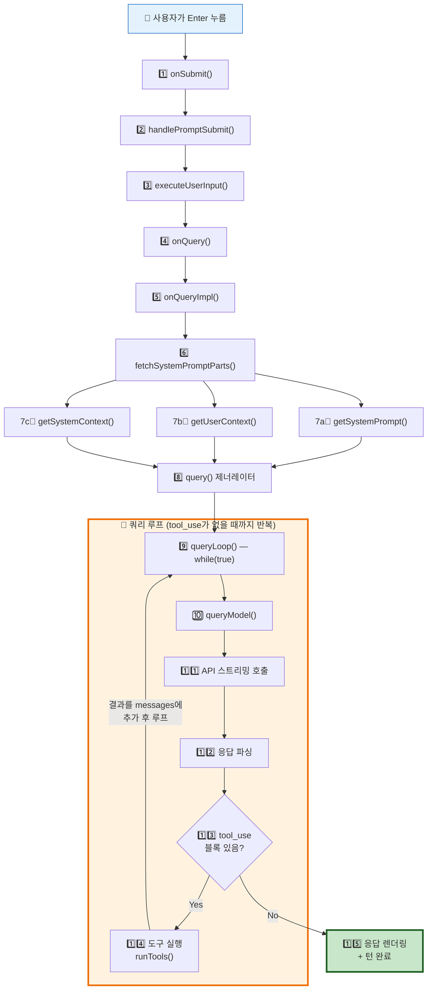
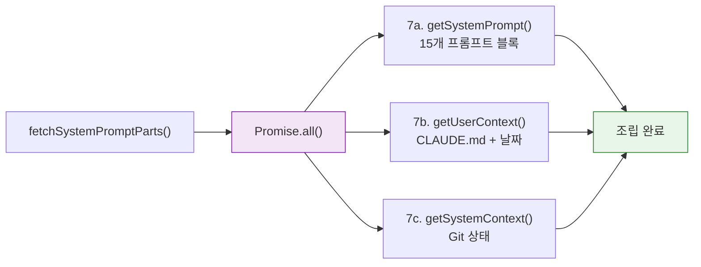
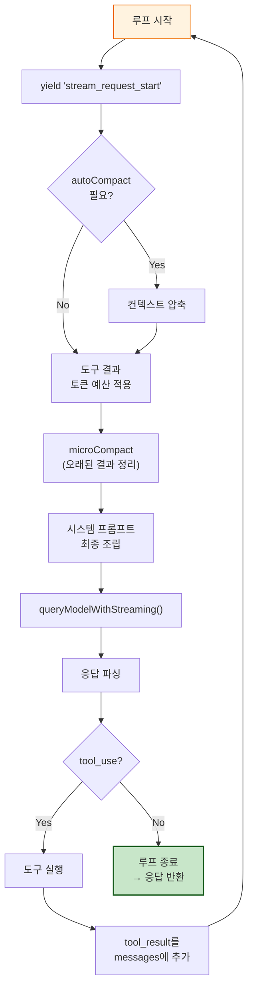
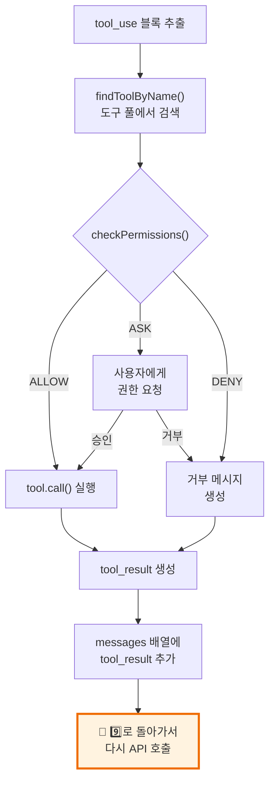
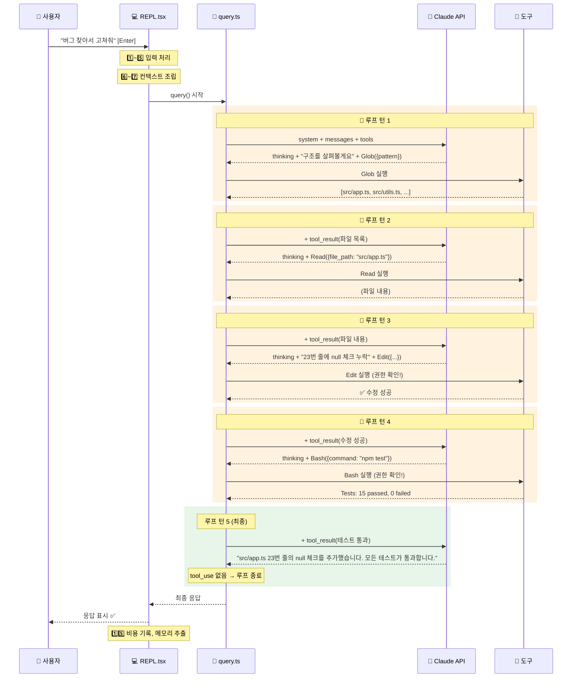

# 🔄 사용자 입력부터 응답까지 — 실행 흐름 완전 해부

> 이 장에서는 사용자가 Enter를 누르는 순간부터 화면에 응답이 표시되는 순간까지, **모든 단계를 번호순으로 추적**합니다. 각 단계에서 실행되는 프롬프트와 관련 파일을 함께 보여줍니다.

## 🗺️ 전체 실행 흐름 개요

아래 다이어그램은 전체 15단계를 한눈에 보여줍니다. **빨간 박스는 루프**(반복 실행)입니다.



---

## 📋 단계별 상세 설명

### 1️⃣ onSubmit() — 키 입력 캡처

사용자가 프롬프트에 텍스트를 입력하고 **Enter를 누르면** 이 함수가 호출됩니다.

```
역할: 입력값 검증, 히스토리 저장, 슬래시 명령 감지
다음 호출: handlePromptSubmit()
```

**프롬프트 예시:** (사용자가 입력한 그대로)
```
이 프로젝트의 버그를 찾아서 고쳐줘
```

**무슨 일이 일어나는가:**
- 빈 입력이면 무시
- `/help`, `/model` 등 슬래시 명령이면 별도 처리 경로로 분기
- 일반 텍스트면 다음 단계로 전달
- 입력을 REPL 히스토리에 저장 (Ctrl+R로 검색 가능)

> 소스: [`src/screens/REPL.tsx`](../src/screens/REPL.tsx) 3142번째 줄 부근

---

### 2️⃣ handlePromptSubmit() — 입력 전처리

입력을 분석하고 적절한 처리 경로를 선택합니다.

```
역할: 슬래시 명령 파싱, 큐 생성, 이미지/파일 첨부 처리
다음 호출: executeUserInput()
```

**무슨 일이 일어나는가:**
- 입력이 `/`로 시작하면 → 명령어 레지스트리에서 검색 후 실행
- 일반 텍스트면 → `QueuedCommand` 객체로 래핑
- 이미지나 파일이 첨부되었으면 → 멀티모달 콘텐츠 블록으로 변환
- `UserPromptSubmit` 훅이 등록되어 있으면 → 훅 실행 (입력 가로채기 가능)

> 소스: [`src/utils/handlePromptSubmit.ts`](../src/utils/handlePromptSubmit.ts) 120번째 줄

---

### 3️⃣ executeUserInput() — 입력 실행 관리

큐에 쌓인 명령들을 순서대로 실행합니다.

```
역할: AbortController 생성, queryGuard 잠금, 순차 실행
다음 호출: onQuery()
루프: 큐에 명령이 여러 개면 순차적으로 반복
```

**무슨 일이 일어나는가:**
- `AbortController` 생성 — 사용자가 Ctrl+C를 누르면 이것으로 중단
- `queryGuard`를 `tryStart()`로 잠금 — 동시에 두 쿼리가 실행되는 것을 방지
- 큐의 각 명령에 대해 `processUserInput()` 호출
- 최종적으로 `onQuery()`에 새 메시지 배열을 전달

> 소스: [`src/utils/handlePromptSubmit.ts`](../src/utils/handlePromptSubmit.ts) 396번째 줄

---

### 4️⃣ onQuery() — 쿼리 시작

React 콜백으로, 새 메시지를 앱 상태에 추가하고 실제 쿼리를 시작합니다.

```
역할: 메시지 상태 업데이트, 로딩 표시 시작
다음 호출: onQueryImpl()
```

**무슨 일이 일어나는가:**
- `setMessages()`로 React 상태에 새 사용자 메시지 추가 → 화면에 표시
- 로딩 스피너 표시 시작
- `onQueryImpl()`에 전체 메시지 배열 전달

> 소스: [`src/screens/REPL.tsx`](../src/screens/REPL.tsx) 2855번째 줄

---

### 5️⃣ onQueryImpl() — 쿼리 구현부

실제 쿼리 로직의 핵심 진입점입니다. 시스템 프롬프트를 조립하고 API 호출 루프를 시작합니다.

```
역할: 시스템 프롬프트 조립 시작, query() 제너레이터 실행, 스트림 이벤트 처리
다음 호출: fetchSystemPromptParts() → query()
```

**무슨 일이 일어나는가:**
- `fetchSystemPromptParts()`를 호출하여 3가지 컨텍스트를 병렬로 수집
- `query()` 제너레이터를 시작
- 제너레이터가 yield하는 각 이벤트를 `onQueryEvent()`로 처리
- 이벤트 유형: `stream_request_start`, `assistant_message`, `tool_use`, `tool_result` 등

> 소스: [`src/screens/REPL.tsx`](../src/screens/REPL.tsx) 2661번째 줄

---

### 6️⃣ fetchSystemPromptParts() — 3가지 컨텍스트 병렬 수집

**Claude에게 보낼 '편지'의 봉투를 준비하는 단계**입니다. 3가지를 동시에 가져옵니다.

```
역할: 시스템 프롬프트 + 사용자 컨텍스트 + 시스템 컨텍스트를 Promise.all()로 병렬 수집
다음 호출: getSystemPrompt(), getUserContext(), getSystemContext() — 동시 실행
```



**왜 병렬로?** Git 상태 가져오기, CLAUDE.md 파일 읽기, 프롬프트 블록 조립은 서로 독립적이라 동시에 실행하면 시간을 절약할 수 있어요.

> 소스: [`src/utils/queryContext.ts`](../src/utils/queryContext.ts) 44번째 줄

---

### 7a️⃣ getSystemPrompt() — 15개 프롬프트 블록 조립

Claude에게 **"넌 이런 존재야, 이런 규칙을 따라"**라고 알려주는 시스템 프롬프트를 15개 블록으로 조립합니다.

```
역할: 정적 7개 + 동적 8개 섹션을 순서대로 조립
반환: string[] (문자열 배열)
```

**조립되는 프롬프트 (실제 텍스트 발췌):**

| # | 블록 | 실제 프롬프트 (첫 줄) |
|:--|:-----|:-------------------|
| 1 | 자기소개 | `"You are an interactive agent that helps users with software engineering tasks."` |
| 2 | 시스템 규칙 | `"All text you output outside of tool use is displayed to the user."` |
| 3 | 작업 가이드 | `"Don't add features, refactor code, or make 'improvements' beyond what was asked."` |
| 4 | 행동 주의 | `"Carefully consider the reversibility and blast radius of actions."` |
| 5 | 도구 사용법 | `"Do NOT use the Bash to run commands when a relevant dedicated tool is provided."` |
| 6 | 톤 & 스타일 | `"Only use emojis if the user explicitly requests it."` |
| 7 | 출력 효율 | `"Go straight to the point. Try the simplest approach first."` |
| — | **경계선** | `SYSTEM_PROMPT_DYNAMIC_BOUNDARY` |
| 8 | 세션 안내 | 에이전트 도구, 스킬 목록 |
| 9 | 메모리 | `loadMemoryPrompt()` 결과 |
| 10 | 환경 정보 | 현재 폴더, OS, 모델명, 셸 |
| 11 | 언어 설정 | 사용자 선호 언어 |
| 12 | MCP 지침 | 연결된 MCP 서버 안내 |
| 13 | 스크래치패드 | 임시 디렉터리 안내 |
| 14 | 도구 결과 요약 | 결과 요약 지침 |
| 15 | 토큰 예산 | 토큰 사용 지침 |

> 소스: [`src/constants/prompts.ts`](../src/constants/prompts.ts) 444번째 줄

---

### 7b️⃣ getUserContext() — CLAUDE.md 로딩

사용자가 작성한 **CLAUDE.md 지시서**와 **현재 날짜**를 수집합니다. 결과는 메모이제이션(캐시)됩니다.

```
역할: CLAUDE.md 계층 로딩 + 날짜 수집
반환: { claudeMd: string, currentDate: string }
캐시: 세션 중 1회만 실행 (memoize)
```

**CLAUDE.md 로딩 순서:**
```
1. /etc/claude-code/CLAUDE.md       ← 회사 전체
2. ~/.claude/CLAUDE.md              ← 개인 전역
3. 프로젝트/CLAUDE.md               ← 프로젝트
4. .claude/CLAUDE.md                ← 프로젝트 (.claude 폴더)
5. .claude/rules/*.md               ← 프로젝트 규칙
6. CLAUDE.local.md                  ← 개인 로컬
```

**API에 주입되는 형태:**
```xml
<system-reminder>
# claudeMd
Codebase and user instructions are shown below...

Contents of /project/CLAUDE.md:
(CLAUDE.md 내용)

# currentDate
Today's date is 2026-04-01.
</system-reminder>
```

> 소스: [`src/context.ts`](../src/context.ts) 155번째 줄 · [`src/utils/claudemd.ts`](../src/utils/claudemd.ts)

---

### 7c️⃣ getSystemContext() — Git 상태 수집

현재 **Git 브랜치, 최근 커밋, 변경된 파일** 정보를 수집합니다. 역시 메모이제이션됩니다.

```
역할: Git 상태 수집 (5개 git 명령 병렬 실행)
반환: { gitStatus: string }
캐시: 세션 중 1회만 실행 (memoize)
```

**병렬 실행되는 Git 명령:**
```bash
git branch                          # 현재 브랜치
git rev-parse --abbrev-ref origin/HEAD  # 메인 브랜치
git status --short                  # 변경 파일 (2000자 제한)
git log --oneline -n 5              # 최근 5개 커밋
git config user.name                # Git 사용자 이름
```

**API에 주입되는 형태:**
```
gitStatus: Current branch: main
Recent commits:
  abc1234 fix: update dependencies
  def5678 feat: add new feature
Status: M src/app.ts, ?? new-file.ts
```

> 소스: [`src/context.ts`](../src/context.ts) 36~128번째 줄

---

### 8️⃣ query() 제너레이터 — 쿼리 루프 진입

`async function*` 제너레이터로 구현된 **핵심 실행 엔진**입니다. `queryLoop()`에 위임합니다.

```
역할: 파라미터 정리 후 queryLoop()에 위임
반환: AsyncGenerator<QueryEvent>
```

> 소스: [`src/query.ts`](../src/query.ts) 219번째 줄

---

### 9️⃣ queryLoop() — 메인 실행 루프 🔄

**`while(true)` 무한 루프**로 구현됩니다. Claude가 도구를 호출할 때마다 루프가 반복됩니다.

```
역할: API 호출 → 응답 파싱 → 도구 실행 → 결과 추가 → 다시 API 호출
루프 조건: tool_use 블록이 있으면 계속, 없으면 종료
```

**루프 내부에서 일어나는 일 (순서대로):**



> 소스: [`src/query.ts`](../src/query.ts) 241번째 줄 — `while(true)` 307번째 줄

---

### 🔟 queryModel() — API 호출 준비

Claude API에 보낼 **최종 파라미터**를 조립합니다.

```
역할: 도구 스키마 변환, 메시지 정규화, 시스템 프롬프트 블록화
다음 호출: anthropic.beta.messages.stream()
```

**이 함수에서 일어나는 일:**

| 순서 | 작업 | 함수 |
|:-----|:-----|:-----|
| 1 | 도구 40개의 JSON Schema 생성 | `toolToAPISchema()` |
| 2 | 메시지 배열 정규화 | `normalizeMessagesForAPI()` |
| 3 | 시스템 프롬프트를 TextBlock 배열로 | `buildSystemPromptBlocks()` |
| 4 | 캐시 마커 부착 | `cache_control: { scope: "global" }` |
| 5 | UserContext를 messages[0]에 삽입 | `prependUserContext()` |
| 6 | SystemContext를 system 끝에 추가 | `appendSystemContext()` |

**각 도구의 스키마 예시 (Bash):**
```json
{
  "type": "function",
  "name": "Bash",
  "description": "Executes a given bash command and returns its output.\n\nThe working directory persists between commands...",
  "input_schema": {
    "type": "object",
    "properties": {
      "command": { "type": "string", "description": "The command to execute" },
      "timeout": { "type": "number", "description": "Optional timeout in ms" }
    },
    "required": ["command"]
  },
  "strict": true,
  "cache_control": { "type": "ephemeral" }
}
```

> 소스: [`src/services/api/claude.ts`](../src/services/api/claude.ts) 1017번째 줄

---

### 1️⃣1️⃣ API 스트리밍 호출 — Claude와 대화

실제 **Anthropic API에 HTTPS 요청**을 보내고 **스트리밍 응답**을 받습니다.

```
역할: 최종 파라미터로 API 호출, 응답 스트리밍
반환: AsyncIterable<StreamEvent>
```

**실제 전송되는 API 페이로드:**
```typescript
anthropic.beta.messages.create({
  model: "claude-sonnet-4-20250514",
  stream: true,

  system: [
    { text: "You are an interactive agent...", cache_control: { scope: "global" } },
    { text: "[동적 섹션들: 메모리, 환경정보, MCP...]" },
    { text: "gitStatus: Current branch: main..." }
  ],

  messages: [
    { role: "user", content: [
      { text: "<system-reminder># claudeMd\n..." },
      { text: "이 프로젝트의 버그를 찾아서 고쳐줘" }
    ]},
    // ... 이전 대화 내역
  ],

  tools: [
    { name: "Bash", description: "...", input_schema: {...} },
    { name: "Read", description: "...", input_schema: {...} },
    { name: "Edit", description: "...", input_schema: {...} },
    // ... 40+ 도구
  ],

  thinking: { type: "adaptive" },
  max_tokens: 16384,
  betas: [
    "interleaved-thinking-2025-05-14",
    "advanced-tool-use-2025-04-22",
    "prompt-caching-scope-2025-04-18"
  ]
})
```

> 소스: [`src/services/api/claude.ts`](../src/services/api/claude.ts) 1300번째 줄 부근

---

### 1️⃣2️⃣ 응답 파싱 — 스트림 이벤트 처리

API에서 돌아오는 **스트리밍 응답의 각 delta 이벤트**를 파싱합니다.

```
역할: content_block_start, content_block_delta, message_stop 등 이벤트 파싱
반환: 텍스트 블록, thinking 블록, tool_use 블록
```

**응답 예시 (Claude가 도구를 호출하는 경우):**
```json
{
  "role": "assistant",
  "content": [
    { "type": "thinking", "thinking": "먼저 프로젝트 구조를 살펴봐야겠다..." },
    { "type": "text", "text": "프로젝트 구조를 살펴보겠습니다." },
    { "type": "tool_use", "id": "toolu_01X", "name": "Glob", "input": { "pattern": "src/**/*.ts" } }
  ]
}
```

---

### 1️⃣3️⃣ tool_use 블록 확인 — 분기점

응답에 `tool_use` 블록이 있는지 확인합니다. **있으면 도구 실행 → 루프 반복, 없으면 종료**.

```
역할: tool_use 블록 존재 여부 확인
분기:
  - 있음 → 14️⃣ 도구 실행으로 이동 (🔄 루프 계속)
  - 없음 → 15️⃣ 응답 렌더링으로 이동 (루프 종료)
```

---

### 1️⃣4️⃣ 도구 실행 — runTools() 🔄

Claude가 요청한 도구를 **실제로 실행**합니다. 이것이 Claude Code의 핵심 차별점!

```
역할: 도구 조회 → 권한 확인 → 실행 → 결과를 messages에 추가
루프: 여러 도구가 호출되면 병렬/직렬로 실행 후 모두 messages에 추가
다음: 9️⃣ queryLoop()의 다음 반복으로 돌아감
```



**실제 도구 실행 예시:**

| 턴 | Claude 요청 | 도구 | 결과 |
|:---|:----------|:-----|:-----|
| 턴 1 | `Glob({ pattern: "src/**/*.ts" })` | 파일 검색 | 파일 목록 반환 |
| 턴 2 | `Read({ file_path: "src/app.ts" })` | 파일 읽기 | 파일 내용 반환 |
| 턴 3 | `Edit({ file_path: "src/app.ts", old_string: "...", new_string: "..." })` | 파일 수정 | 수정 성공 |
| 턴 4 | `Bash({ command: "npm test" })` | 테스트 실행 | 테스트 결과 반환 |
| 턴 5 | (도구 호출 없음 — 최종 텍스트 응답) | — | 루프 종료 |

> 소스: [`src/services/tools/toolOrchestration.ts`](../src/services/tools/toolOrchestration.ts) · [`src/tools.ts`](../src/tools.ts)

---

### 1️⃣5️⃣ 응답 렌더링 + 턴 완료

Claude의 **최종 텍스트 응답이 터미널에 표시**되고, 백그라운드 작업이 실행됩니다.

```
역할: 응답 표시, 비용 기록, 메모리 추출, 로딩 해제
```

**턴 완료 시 실행되는 작업들:**

| 작업 | 설명 | 조건 |
|:-----|:-----|:-----|
| 응답 렌더링 | React 상태 업데이트 → Ink가 터미널에 그림 | 항상 |
| 비용 기록 | `addToTotalCostState()` | 항상 |
| 메모리 추출 | `executeExtractMemories()` | Feature gate ON + 조건 충족 |
| 세션 메모리 | `shouldExtractMemory()` → 업데이트 | 토큰/도구 임계값 충족 |
| 분석 로깅 | `logEvent('tengu_exit', ...)` | 항상 |
| 쿼리 가드 해제 | `queryGuard.stop()` | 항상 |
| 로딩 해제 | `resetLoadingState()` | 항상 |
| 프롬프트 입력 포커스 | 사용자에게 입력 커서 반환 | 항상 |

> 소스: [`src/screens/REPL.tsx`](../src/screens/REPL.tsx) 2920번째 줄 부근

---

## 🔬 실전 예시: "버그 찾아서 고쳐줘"의 전체 실행 로그

사용자가 `이 프로젝트의 버그를 찾아서 고쳐줘`를 입력했을 때 실제로 일어나는 일을 시간순으로 추적합니다.



---

## 📁 관련 파일 전체 목록

| 단계 | 파일 | 핵심 함수 |
|:-----|:-----|:---------|
| 1️⃣ | [`src/screens/REPL.tsx`](../src/screens/REPL.tsx) | `onSubmit()` |
| 2️⃣ | [`src/utils/handlePromptSubmit.ts`](../src/utils/handlePromptSubmit.ts) | `handlePromptSubmit()` |
| 3️⃣ | [`src/utils/handlePromptSubmit.ts`](../src/utils/handlePromptSubmit.ts) | `executeUserInput()` |
| 4️⃣ | [`src/screens/REPL.tsx`](../src/screens/REPL.tsx) | `onQuery()` |
| 5️⃣ | [`src/screens/REPL.tsx`](../src/screens/REPL.tsx) | `onQueryImpl()` |
| 6️⃣ | [`src/utils/queryContext.ts`](../src/utils/queryContext.ts) | `fetchSystemPromptParts()` |
| 7a | [`src/constants/prompts.ts`](../src/constants/prompts.ts) | `getSystemPrompt()` |
| 7b | [`src/context.ts`](../src/context.ts) | `getUserContext()` |
| 7c | [`src/context.ts`](../src/context.ts) | `getSystemContext()` |
| 8️⃣ | [`src/query.ts`](../src/query.ts) | `query()` |
| 9️⃣ | [`src/query.ts`](../src/query.ts) | `queryLoop()` — `while(true)` |
| 🔟 | [`src/services/api/claude.ts`](../src/services/api/claude.ts) | `queryModel()` |
| 1️⃣1️⃣ | [`src/services/api/claude.ts`](../src/services/api/claude.ts) | `anthropic.beta.messages.create()` |
| 1️⃣2️⃣ | [`src/services/api/claude.ts`](../src/services/api/claude.ts) | 스트림 파싱 |
| 1️⃣3️⃣ | [`src/query.ts`](../src/query.ts) | tool_use 분기 |
| 1️⃣4️⃣ | [`src/services/tools/toolOrchestration.ts`](../src/services/tools/toolOrchestration.ts) | `runTools()` |
| 1️⃣5️⃣ | [`src/screens/REPL.tsx`](../src/screens/REPL.tsx) | 턴 완료 처리 |

**프롬프트 관련:**

| 파일 | 내용 |
|:-----|:-----|
| [`src/constants/prompts.ts`](../src/constants/prompts.ts) | 시스템 프롬프트 15개 블록 |
| [`src/utils/systemPrompt.ts`](../src/utils/systemPrompt.ts) | 프롬프트 우선순위 체인 |
| [`src/utils/claudemd.ts`](../src/utils/claudemd.ts) | CLAUDE.md 계층 로딩 |
| [`src/tools/BashTool/prompt.ts`](../src/tools/BashTool/prompt.ts) | Bash 도구 설명 프롬프트 |
| [`src/tools/FileReadTool/prompt.ts`](../src/tools/FileReadTool/prompt.ts) | Read 도구 설명 프롬프트 |
| [`src/tools/FileEditTool/prompt.ts`](../src/tools/FileEditTool/prompt.ts) | Edit 도구 설명 프롬프트 |
| [`src/tools/AgentTool/prompt.ts`](../src/tools/AgentTool/prompt.ts) | Agent 도구 설명 프롬프트 |
| [`src/services/compact/prompt.ts`](../src/services/compact/prompt.ts) | 컨텍스트 압축 프롬프트 |
| [`src/services/SessionMemory/prompts.ts`](../src/services/SessionMemory/prompts.ts) | 세션 메모리 템플릿 |
| [`src/services/extractMemories/prompts.ts`](../src/services/extractMemories/prompts.ts) | 메모리 추출 프롬프트 |

---

## 💡 엔지니어를 위한 팁

<details>
<summary><b>펼쳐서 기술 심화 내용 보기</b></summary>

### 완전한 함수 호출 체인

```
onSubmit(input) [REPL.tsx:3142]
  → handlePromptSubmit({input}) [handlePromptSubmit.ts:120]
    → executeUserInput({queuedCommands}) [handlePromptSubmit.ts:396]
      → onQuery(newMessages, abortController) [REPL.tsx:2855]
        → onQueryImpl(messages) [REPL.tsx:2661]
          → fetchSystemPromptParts() [queryContext.ts:44]
            → Promise.all([
                getSystemPrompt() [prompts.ts:444],
                getUserContext()  [context.ts:155],
                getSystemContext() [context.ts:116]
              ])
          → query({messages, systemPrompt, ...}) [query.ts:219]
            → queryLoop() [query.ts:241]
              → while(true): [query.ts:307]
                → queryModelWithStreaming() [query.ts:~1060]
                  → queryModel() [claude.ts:1017]
                    → toolToAPISchema() × 40 [api.ts]
                    → normalizeMessagesForAPI() [messages.ts]
                    → buildSystemPromptBlocks() [claude.ts]
                    → prependUserContext() [api.ts]
                    → appendSystemContext() [api.ts]
                    → paramsFromContext() [claude.ts:1250]
                    → anthropic.beta.messages.create({stream:true})
                ← stream events parsed
                → if tool_use:
                    → runTools() [toolOrchestration.ts]
                      → findToolByName() [tools.ts]
                      → canUseTool() → checkPermissions()
                      → tool.call(input, context)
                    ← tool_result added to messages
                    → continue loop ← 🔄
                → if no tool_use:
                    → break loop ← ✅
          ← for each yielded event: onQueryEvent()
            → handleMessageFromStream()
              → setMessages(prev => [...prev, msg])
                → React re-render → Ink → Terminal
```

### 성능 최적화 포인트

| 포인트 | 기법 | 효과 |
|:-------|:-----|:-----|
| 6️⃣ | `Promise.all()` 병렬 수집 | 컨텍스트 조립 시간 1/3 |
| 7b-7c | `memoize()` 캐싱 | 세션 중 재계산 방지 |
| 7a | `SYSTEM_PROMPT_DYNAMIC_BOUNDARY` | 정적 프롬프트 API 캐시 |
| 🔟 | `toolSchemaCache` | 도구 스키마 재계산 방지 |
| 1️⃣1️⃣ | `stream: true` | 응답 즉시 표시 (전체 대기 없음) |
| 1️⃣4️⃣ | `isConcurrencySafe()` | 안전한 도구 병렬 실행 |

### 루프 탈출 조건

`queryLoop`의 `while(true)`는 다음 경우에 종료됩니다:
1. Claude 응답에 `tool_use` 블록이 없음 (정상 종료)
2. `AbortController.signal.aborted` (사용자 Ctrl+C)
3. `maxTurns` 초과 (에이전트 모드)
4. API 에러 (재시도 실패 후)
5. 컨텍스트 윈도우 초과 후 압축 실패

</details>

---

👉 돌아가기: [**튜토리얼 목차**](./README.md) 🗺️
