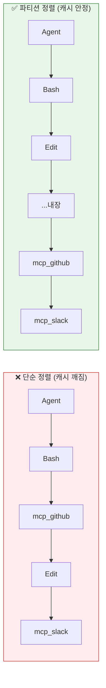
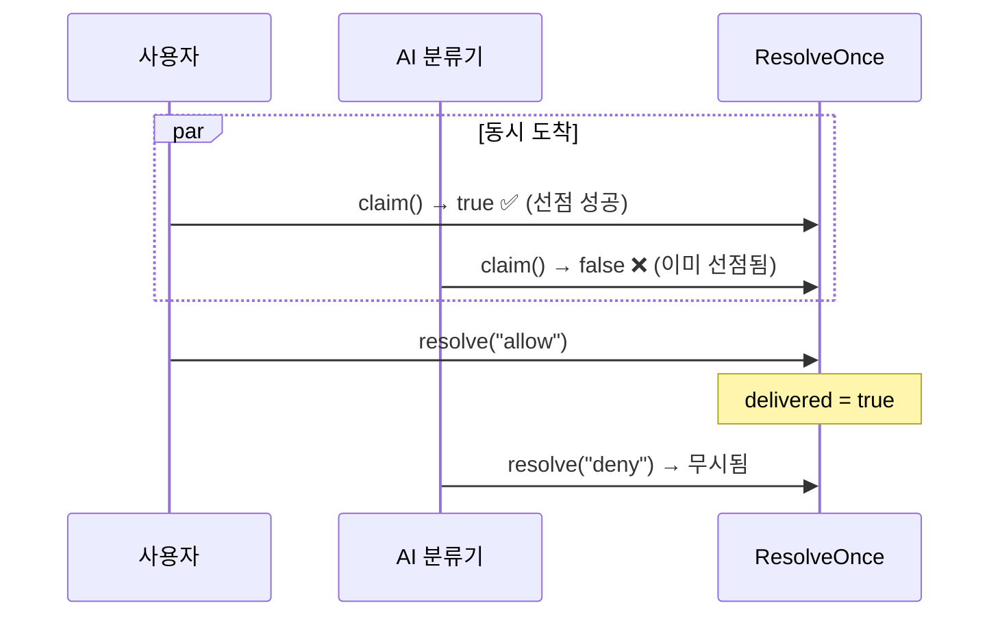
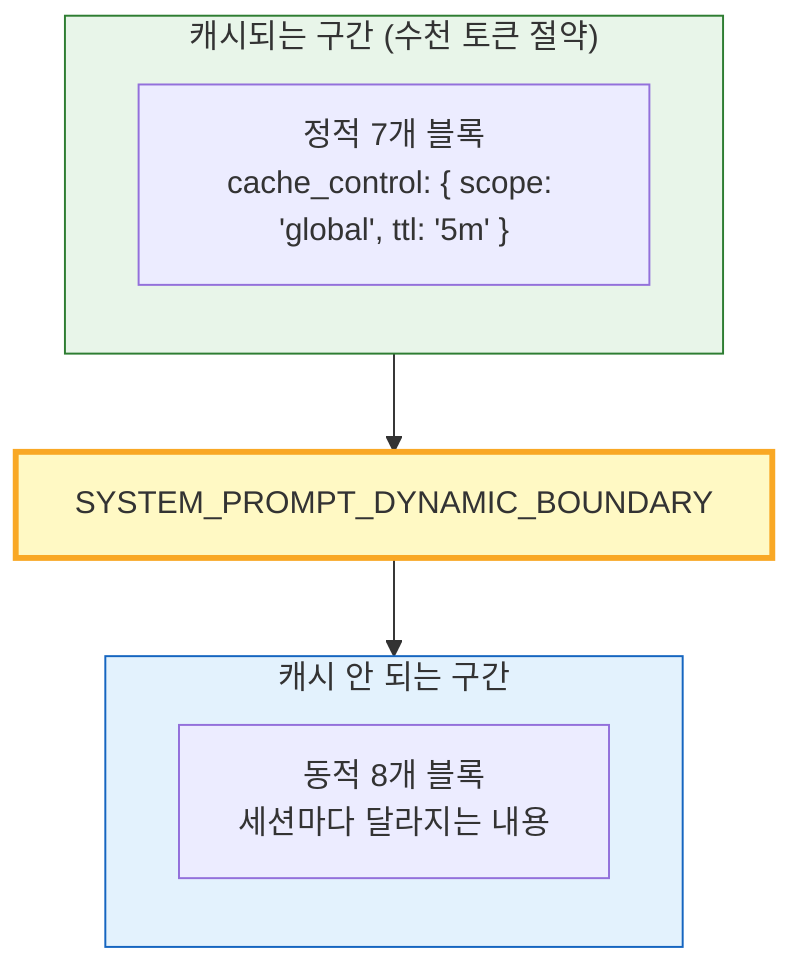
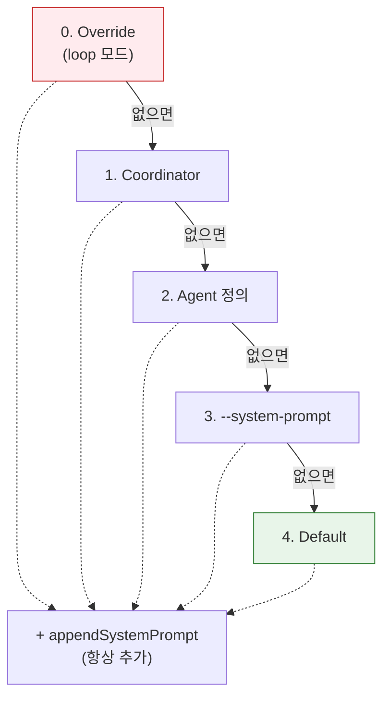
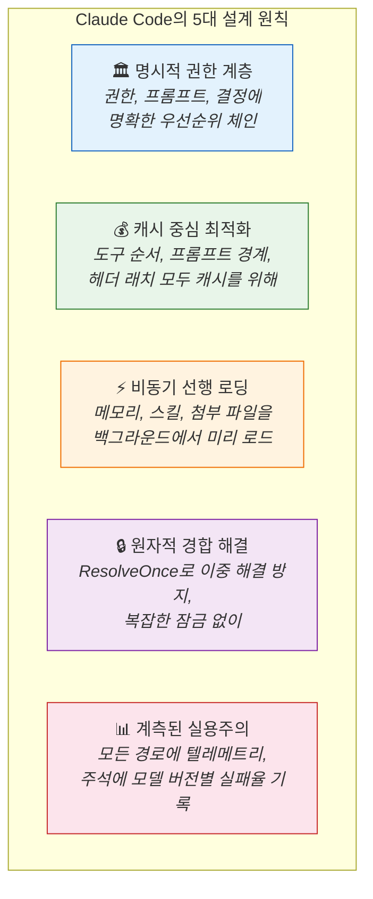

# 🔬 리버스 엔지니어링 — 코드 스니펫으로 설계 철학 해부하기

> 이 장에서는 소스코드의 **실제 코드 스니펫**을 하나씩 해부하면서, Claude Code의 설계 철학을 역공학 관점에서 분석합니다. "왜 이렇게 만들었을까?"에 집중합니다.

---

## 🧬 철학 1: 도구는 일급 시민이다 — Tool Interface

모든 것은 [`src/Tool.ts`](../src/Tool.ts)의 `Tool` 인터페이스에서 시작합니다:

```typescript
export type Tool<Input, Output, P> = {
  name: string;
  call(args: Input, context: ToolUseContext): Promise<ToolResult<Output>>;
  checkPermissions(input: Input, context: ToolUseContext): PermissionResult;
  isReadOnly(input: Input): boolean;
  isConcurrencySafe(input: Input): boolean;
  isDestructive?(input: Input): boolean;
  requiresUserInteraction?(): boolean;
  shouldDefer?: boolean;
  alwaysLoad?: boolean;
}
```

**왜 이런 설계인가?**

| 메서드 | 설계 의도 |
|:-------|:---------|
| `isReadOnly()` | 읽기 전용 도구는 권한 검사를 건너뛸 수 있음 |
| `isConcurrencySafe()` | true면 `Promise.all()`로 병렬 실행 → 속도 2~5배 향상 |
| `isDestructive()` | 위험한 도구는 bypass 모드에서도 확인 요청 |
| `shouldDefer` | 도구 스키마를 처음부터 보내지 않고 필요할 때 로드 → 토큰 절약 |
| `checkPermissions()` | 도구별 세밀한 권한 (Bash는 AST 파싱, File은 경로 검증) |

핵심 통찰: **모든 도구가 "자기 자신이 얼마나 위험한지" 알고 있어요.** 중앙 권한 시스템이 개별 도구의 자기 진단 결과를 조합해서 최종 판단합니다.

> 소스: [`src/Tool.ts`](../src/Tool.ts) 362번째 줄

---

## 🧬 철학 2: 캐시를 깨지 마라 — assembleToolPool()

도구 목록을 조립하는 [`src/tools.ts`](../src/tools.ts)의 `assembleToolPool()`:

```typescript
export function assembleToolPool(
  permissionContext: ToolPermissionContext,
  mcpTools: Tools,
): Tools {
  const builtInTools = getTools(permissionContext)
  const allowedMcpTools = filterToolsByDenyRules(mcpTools, permissionContext)

  // Sort each partition for prompt-cache stability, keeping built-ins as a
  // contiguous prefix. The server's claude_code_system_cache_policy places a
  // global cache breakpoint after the last prefix-matched built-in tool; a flat
  // sort would interleave MCP tools into built-ins and invalidate all downstream
  // cache keys whenever an MCP tool sorts between existing built-ins.
  const byName = (a: Tool, b: Tool) => a.name.localeCompare(b.name)
  return uniqBy(
    [...builtInTools].sort(byName).concat(allowedMcpTools.sort(byName)),
    'name',
  )
}
```

**왜 이런 설계인가?**



MCP 도구가 내장 도구 사이에 끼어들면 **프롬프트 캐시 키가 매번 달라져** API 비용이 급증합니다. 내장 도구를 앞쪽 블록으로 고정하고, MCP 도구를 뒤에 붙이면 내장 도구 부분의 캐시가 항상 유효해요.

> 소스: [`src/tools.ts`](../src/tools.ts) 345번째 줄

---

## 🧬 철학 3: 경합 조건을 원천 차단 — ResolveOnce

권한 다이얼로그에서 **사용자 응답**과 **AI 분류기 결과**가 동시에 도착할 수 있습니다. 누가 먼저 올지 모르죠:

```typescript
// src/hooks/toolPermission/PermissionContext.ts
function createResolveOnce<T>(resolve: (value: T) => void): ResolveOnce<T> {
  let claimed = false
  let delivered = false
  return {
    resolve(value: T) {
      if (delivered) return    // 이미 전달됨 → 무시
      delivered = true
      claimed = true
      resolve(value)
    },
    claim() {
      if (claimed) return false  // 누군가 이미 선점 → 실패
      claimed = true
      return true                // 내가 선점 성공!
    },
  }
}
```

**왜 이런 설계인가?**



`claim()` → `resolve()` 2단계로 분리해서 **TOCTOU(Time-of-Check-Time-of-Use) 취약점**을 방지합니다. `isResolved()` 확인 후 `resolve()` 호출 사이에 다른 쓰레드가 끼어드는 것을 원천 차단!

> 소스: [`src/hooks/toolPermission/PermissionContext.ts`](../src/hooks/toolPermission/PermissionContext.ts) 63번째 줄

---

## 🧬 철학 4: 프롬프트도 캐시 경계가 있다 — Dynamic Boundary

[`src/constants/prompts.ts`](../src/constants/prompts.ts)에서 시스템 프롬프트를 만들 때:

```typescript
// 정적 블록 (모든 세션에서 동일 → 글로벌 캐시)
getSimpleIntroSection(),      // "You are an interactive agent..."
getSimpleSystemSection(),     // 시스템 규칙
getSimpleDoingTasksSection(), // 코딩 가이드라인
getActionsSection(),          // 행동 주의사항
getUsingYourToolsSection(),   // 도구 사용법
getSimpleToneAndStyleSection(), // 톤 & 스타일
getOutputEfficiencySection(), // 출력 효율

// ═══ SYSTEM_PROMPT_DYNAMIC_BOUNDARY ═══

// 동적 블록 (세션마다 다름 → 캐시 불가)
session_guidance,   // 에이전트/스킬 목록
memory,             // MEMORY.md 내용
env_info_simple,    // cwd, OS, 모델명
mcp_instructions,   // MCP 서버 지침
```

**왜 이런 설계인가?**



정적 블록은 **5분 TTL 글로벌 캐시**로 재사용됩니다. 10번 쿼리를 보내도 정적 부분은 1번만 전송하면 돼요. API 비용을 **수십 퍼센트** 절약하는 핵심 최적화!

> 소스: [`src/constants/prompts.ts`](../src/constants/prompts.ts) 560번째 줄

---

## 🧬 철학 5: 위험을 구체적으로 열거하라 — Actions Section

Claude에게 보내는 시스템 프롬프트의 실제 텍스트:

```
Carefully consider the reversibility and blast radius of actions.

Examples of the kind of risky actions that warrant user confirmation:
- Destructive operations: deleting files/branches, dropping database tables,
  killing processes, rm -rf, overwriting uncommitted changes
- Hard-to-reverse operations: force-pushing, git reset --hard,
  amending published commits, removing packages
- Actions visible to others: pushing code, creating/closing PRs or issues,
  sending messages (Slack, email, GitHub)

When you encounter an obstacle, do not use destructive actions as a shortcut.
In short: measure twice, cut once.
```

**왜 이런 설계인가?**

"위험한 행동을 하지 마라"라고만 말하면 AI는 경계를 판단하기 어렵습니다. **구체적인 예시를 열거**해야 AI가 유사한 상황에서 올바르게 일반화할 수 있어요.

| 추상적 지시 | 구체적 지시 |
|:----------|:----------|
| "위험한 거 하지 마" | "rm -rf, git push --force, DROP TABLE은 확인 받아" |
| "신중하게 행동해" | "force-push는 upstream을 덮어쓸 수 있으니 확인" |
| "안전하게 해" | "lock 파일이 있으면 삭제하지 말고 원인을 조사해" |

> 소스: [`src/constants/prompts.ts`](../src/constants/prompts.ts) — `getActionsSection()` 256번째 줄

---

## 🧬 철학 6: 프롬프트 우선순위는 명시적으로 — buildEffectiveSystemPrompt

```typescript
// src/utils/systemPrompt.ts
/**
 * Priority:
 * 0. Override (loop mode - REPLACES all)
 * 1. Coordinator (if coordinator mode active)
 * 2. Agent (if mainThreadAgentDefinition set)
 *    - Proactive: APPENDED to default
 *    - Otherwise: REPLACES default
 * 3. Custom (--system-prompt flag)
 * 4. Default (standard Claude Code prompt)
 *
 * Plus appendSystemPrompt always added at end (except override).
 */
export function buildEffectiveSystemPrompt({
  overrideSystemPrompt,
  mainThreadAgentDefinition,
  customSystemPrompt,
  defaultSystemPrompt,
  appendSystemPrompt,
}) {
  if (overrideSystemPrompt) return [overrideSystemPrompt]
  if (isCoordinatorMode()) return [getCoordinatorSystemPrompt(), ...append]
  if (agentSystemPrompt) return [agentSystemPrompt, ...append]
  if (customSystemPrompt) return [customSystemPrompt, ...append]
  return [...defaultSystemPrompt, ...append]
}
```

**왜 이런 설계인가?**

5단계 우선순위가 **코드 위에 주석으로 문서화**되어 있어요. 이것은 의도적인 설계예요:



**설계 원칙:** 복잡한 조건 분기를 if-else 체인이 아닌 **선형 우선순위 스택**으로 표현. 새로운 우선순위를 추가하려면 체인의 적절한 위치에 삽입하면 됩니다.

> 소스: [`src/utils/systemPrompt.ts`](../src/utils/systemPrompt.ts) 41번째 줄

---

## 🧬 철학 7: 컨텍스트는 게으르게, 한 번만 — Memoized Context

```typescript
// src/context.ts
export const getSystemContext = memoize(async () => {
  const gitStatus = isRemoteMode() ? null : await getGitStatus()
  const injection = feature('BREAK_CACHE_COMMAND')
    ? getSystemPromptInjection() : null
  return {
    ...(gitStatus && { gitStatus }),
    ...(injection ? { cacheBreaker: `[CACHE_BREAKER: ${injection}]` } : {}),
  }
})

export const getUserContext = memoize(async () => {
  const claudeMd = shouldDisableClaudeMd
    ? null
    : getClaudeMds(filterInjectedMemoryFiles(await getMemoryFiles()))
  return {
    ...(claudeMd && { claudeMd }),
    currentDate: `Today's date is ${getLocalISODate()}.`,
  }
})
```

**왜 이런 설계인가?**

| 기법 | 이유 |
|:-----|:-----|
| `memoize()` | 세션 중 같은 컨텍스트를 반복 계산하지 않음 |
| 조건부 포함 (`&&`) | null/undefined를 깔끔하게 제외 |
| 분리 (system vs user) | 독립적으로 캐시/무효화 가능 |
| `Promise.all()` | 두 컨텍스트를 병렬로 수집 |

Git 명령 5개를 실행하고 CLAUDE.md를 읽는 작업은 수백 ms가 걸릴 수 있지만, **세션 중 1번만 실행**되고 이후는 캐시에서 즉시 반환!

> 소스: [`src/context.ts`](../src/context.ts) 116, 155번째 줄

---

## 🧬 철학 8: 모델도 실수한다 — NO_TOOLS Preamble

컨텍스트 압축 프롬프트의 첫 줄:

```typescript
// src/services/compact/prompt.ts
const NO_TOOLS_PREAMBLE = `CRITICAL: Respond with TEXT ONLY. Do NOT call any tools.

- Do NOT use Read, Bash, Grep, Glob, Edit, Write, or ANY other tool.
- You already have all the context you need in the conversation above.
- Tool calls will be REJECTED and will waste your only turn — you will fail the task.
- Your entire response must be plain text.
`
```

**왜 이렇게 강력한가?**

주석이 답을 알려줘요:

```
// Sonnet 4.6+ adaptive-thinking models sometimes attempt a tool call despite
// the weaker trailer instruction. With maxTurns: 1, a denied tool call means
// no text output → falls through to the streaming fallback (2.79% on 4.6 vs
// 0.01% on 4.5).
```

특정 모델 버전(Sonnet 4.6)에서 **2.79%의 확률로 도구를 호출하려 시도**하는 버그가 있어서, "CRITICAL"을 붙이고 구체적 도구명을 나열하고 "REJECTED... fail the task"까지 써야 했어요. **모델별 행동 차이를 프롬프트로 보정**하는 실전 노하우!

> 소스: [`src/services/compact/prompt.ts`](../src/services/compact/prompt.ts) 1번째 줄

---

## 🧬 철학 9: 즐거움을 숨겨두다 — mulberry32 PRNG

```typescript
// src/buddy/companion.ts
// Mulberry32 — tiny seeded PRNG, good enough for picking ducks
function mulberry32(seed: number): () => number {
  let a = seed >>> 0
  return function () {
    a |= 0
    a = (a + 0x6d2b79f5) | 0
    let t = Math.imul(a ^ (a >>> 15), 1 | a)
    t = (t + Math.imul(t ^ (t >>> 7), 61 | t)) ^ t
    return ((t ^ (t >>> 14)) >>> 0) / 4294967296
  }
}
```

"**good enough for picking ducks**" — 오리를 뽑기에 충분한 난수 생성기.

이 한 줄의 주석에 Claude Code 팀의 유머가 담겨 있어요. 이 초경량 PRNG가 18종의 컴패니언, 5단계 레어도, 6개 능력치, 1% 반짝이 확률을 결정합니다. userId를 시드로 사용하기 때문에 **같은 사용자는 항상 같은 컴패니언**을 만나요.

> 소스: [`src/buddy/companion.ts`](../src/buddy/companion.ts) 15번째 줄

---

## 🧬 철학 10: API 파라미터는 맥락에 따라 — paramsFromContext

```typescript
// src/services/api/claude.ts — paramsFromContext() 내부
// IMPORTANT: Do not change the adaptive-vs-budget thinking selection below
// without notifying the model launch DRI and research. This is a sensitive
// setting that can greatly affect model quality and bashing.
if (hasThinking && modelSupportsAdaptiveThinking(options.model)) {
  thinking = { type: 'adaptive' }
} else {
  let thinkingBudget = getMaxThinkingTokensForModel(options.model)
  thinkingBudget = Math.min(maxOutputTokens - 1, thinkingBudget)
  thinking = { budget_tokens: thinkingBudget, type: 'enabled' }
}

// Fast mode: header is latched session-stable (cache-safe), but
// speed='fast' stays dynamic so cooldown still suppresses the actual
// fast-mode request without changing the cache key.
```

**왜 이런 설계인가?**

1. **`IMPORTANT` 주석**: thinking 설정 변경은 모델 품질에 영향을 주므로 DRI(Directly Responsible Individual)에게 알려야 함
2. **적응형 vs 예산 thinking**: 모델이 지원하면 적응형(알아서 조절), 아니면 고정 예산
3. **래치 패턴**: 빠른 모드 헤더는 세션 내내 고정(캐시 키 안정), 실제 속도 파라미터만 동적

이것은 **캐시 안정성과 기능 유연성의 긴장 관계**를 해결하는 정교한 설계예요. 헤더(캐시 키의 일부)는 래치하고, 파라미터(캐시 키에 영향 없음)는 동적으로 조절합니다.

> 소스: [`src/services/api/claude.ts`](../src/services/api/claude.ts) 1538번째 줄

---

## 📊 역공학으로 밝혀낸 5대 설계 원칙



---

## 💡 엔지니어를 위한 팁

<details>
<summary><b>펼쳐서 기술 심화 내용 보기</b></summary>

### 리버스 엔지니어링 체크리스트

Claude Code 소스를 분석할 때 이 패턴들을 찾아보세요:

1. **`memoize()` 패턴**: 비싼 연산을 1회로 제한 → `context.ts`, `commands.ts`
2. **`feature()` 게이트**: GrowthBook 동적 설정 → `tengu_*` 플래그
3. **`uniqBy()` + `sort()`**: 캐시 안정성을 위한 결정론적 순서 → `tools.ts`
4. **`using` 키워드**: 리소스 자동 정리 (TC39 Explicit Resource Management) → `query.ts`
5. **주석의 모델 버전**: "2.79% on 4.6 vs 0.01% on 4.5" → 모델별 프롬프트 튜닝
6. **`claim()` → `resolve()` 2단계**: 비동기 경합 안전 → `PermissionContext.ts`
7. **`SYSTEM_PROMPT_DYNAMIC_BOUNDARY`**: 캐시 가능/불가능 구간 분리 → `prompts.ts`

### 핵심 파일 10선

| 파일 | 배울 수 있는 것 |
|:-----|:--------------|
| [`Tool.ts`](../src/Tool.ts) | 확장 가능한 인터페이스 설계 |
| [`tools.ts`](../src/tools.ts) | 캐시 안정적 도구 풀 조립 |
| [`prompts.ts`](../src/constants/prompts.ts) | 프롬프트 엔지니어링 실전 |
| [`permissions.ts`](../src/utils/permissions/permissions.ts) | 다층 권한 결정 체인 |
| [`context.ts`](../src/context.ts) | 메모이제이션 + 병렬 수집 |
| [`systemPrompt.ts`](../src/utils/systemPrompt.ts) | 우선순위 기반 프롬프트 선택 |
| [`claude.ts`](../src/services/api/claude.ts) | 캐시/래치/재시도 패턴 |
| [`query.ts`](../src/query.ts) | 무한 루프 에이전틱 실행 |
| [`PermissionContext.ts`](../src/hooks/toolPermission/PermissionContext.ts) | 경합 조건 해결 |
| [`compact/prompt.ts`](../src/services/compact/prompt.ts) | 모델별 프롬프트 보정 |

</details>

---

👉 다음 장: [**16장: 다른 코드 에이전트와의 비교**](./16_Comparison.md) ⚔️
