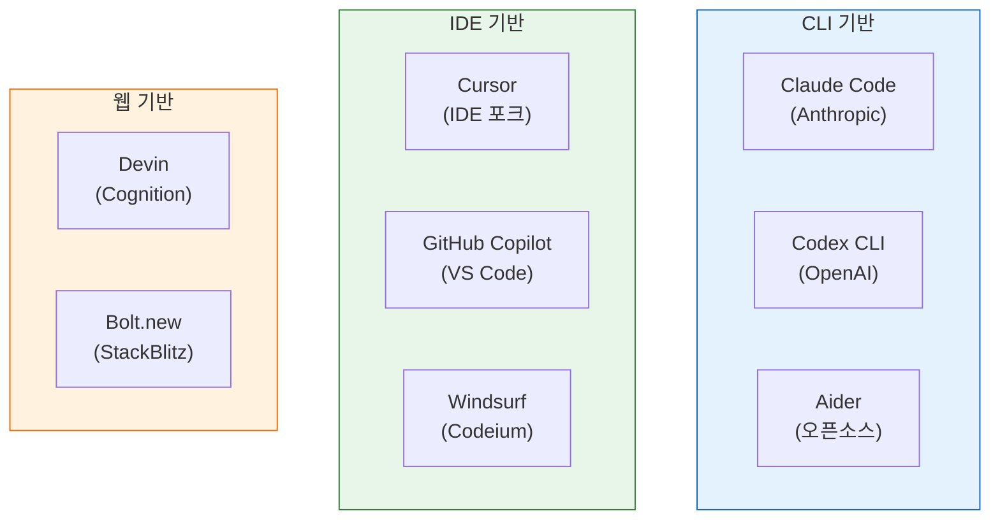
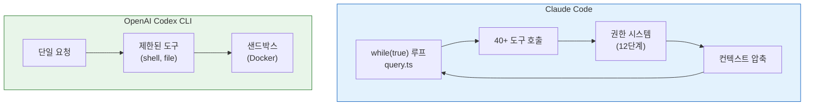
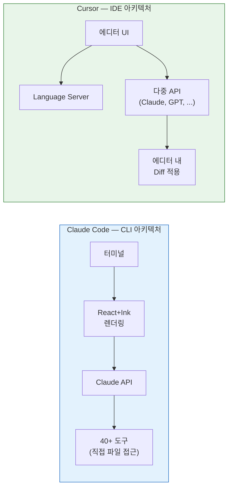
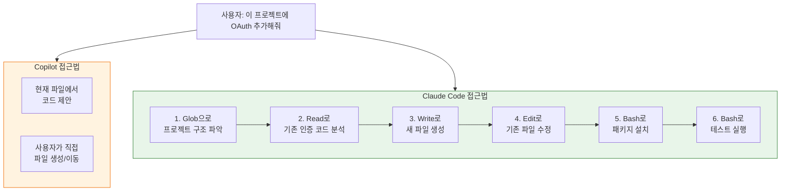
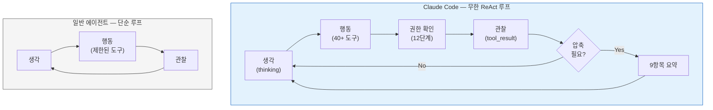
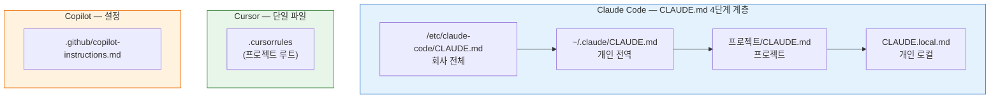
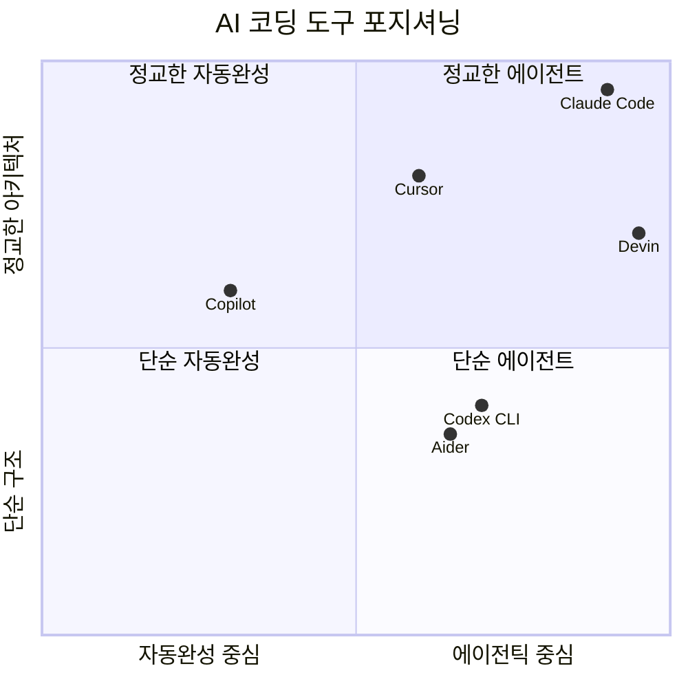

# ⚔️ 다른 코드 에이전트와의 비교 — Claude Code vs Codex vs Cursor vs Others

> 이 장에서는 Claude Code의 소스코드에서 드러난 아키텍처를 기반으로, 주요 AI 코딩 도구들과 **동작 방식의 차이**를 비교 분석합니다.

---

## 🗺️ AI 코딩 도구 생태계 지도

---

## 📊 핵심 비교표

| 특성 | **Claude Code** | **OpenAI Codex CLI** | **Cursor** | **GitHub Copilot** | **Aider** |
|:-----|:---------------|:-------------------|:----------|:-----------------|:---------|
| **유형** | CLI (터미널) | CLI (터미널) | IDE (VS Code 포크) | IDE 확장 | CLI (터미널) |
| **AI 모델** | Claude (Sonnet/Opus) | GPT-4o, o3-mini | 다중 (Claude, GPT 등) | GPT-4o, Claude | 다중 모델 |
| **실행 환경** | 터미널 (React+Ink) | 터미널 | 커스텀 에디터 | VS Code 내장 | 터미널 |
| **도구 시스템** | 40+ 내장 도구 | 제한된 도구 | 에디터 통합 | 에디터 통합 | Git 중심 |
| **에이전트 패턴** | ReAct 루프 | 단순 루프 | Tab 자동완성 + Agent | 자동완성 + Chat | ReAct 루프 |
| **멀티에이전트** | ✅ (6종 + Coordinator) | ❌ | ❌ | ❌ | ❌ |
| **메모리** | ✅ (4종 영속 메모리) | ❌ | 프로젝트 인덱싱 | 제한적 | ❌ |
| **MCP 지원** | ✅ (4 프로토콜) | ❌ | ✅ (제한적) | ❌ | ❌ |
| **권한 시스템** | ✅ (12단계) | 기본 샌드박스 | 에디터 내 확인 | 제한적 | 사용자 확인 |
| **프롬프트 캐싱** | ✅ (경계 분리) | 미공개 | 미공개 | 미공개 | ❌ |
| **오픈소스** | 소스 유출 | ✅ (GitHub) | ❌ | ❌ | ✅ (GitHub) |

---

## 1️⃣ Claude Code vs OpenAI Codex CLI

### 실행 모델 차이

| 차이점 | Claude Code | Codex CLI |
|:-------|:----------|:---------|
| **에이전트 루프** | `while(true)` 무한 루프 — 도구 결과를 보고 다시 생각 | 단일 또는 제한된 턴 |
| **도구 수** | 40+ (File, Bash, Web, Agent, MCP, Task, LSP...) | Shell + File 중심 |
| **멀티에이전트** | 6종 내장 + Coordinator + Swarm | 단일 에이전트 |
| **샌드박싱** | 선택적 (`@anthropic-ai/sandbox-runtime`) | Docker 기본 강제 |
| **권한** | 12단계 결정 체인 + AI 분류기 + 훅 | 기본 확인만 |

**Claude Code의 고유 기술:**

1. **Speculation (예측 실행)**: 사용자가 응답을 읽는 동안 다음 작업을 미리 실행
   - Codex CLI에는 이 개념 자체가 없음
   - 소스: [`src/services/PromptSuggestion/speculation.ts`](../src/services/PromptSuggestion/speculation.ts)

2. **autoDream (자동 기억 정리)**: 24시간마다 과거 세션을 자동 통합
   - Codex CLI는 세션 간 상태를 유지하지 않음
   - 소스: [`src/services/autoDream/autoDream.ts`](../src/services/autoDream/autoDream.ts)

---

## 2️⃣ Claude Code vs Cursor

### 근본적 차이: CLI vs IDE

| 차이점 | Claude Code | Cursor |
|:-------|:----------|:------|
| **상호작용** | 대화형 REPL (자연어 + 슬래시 명령) | 에디터 내 채팅 + Tab 자동완성 |
| **코드 수정** | `Edit` 도구로 문자열 치환 (전체 파일 접근) | 에디터 Diff로 적용 (현재 파일 중심) |
| **컨텍스트** | 프로젝트 전체 (Glob/Grep으로 탐색) | 열린 파일 + 인덱싱된 컨텍스트 |
| **에이전트 모드** | 항상 에이전트 (도구 호출 루프) | Composer Agent (별도 모드) |
| **커스텀 규칙** | CLAUDE.md 계층 (4단계) | `.cursorrules` 파일 |
| **모델 선택** | Claude 전용 (4 프로바이더) | 다중 모델 (Claude, GPT, Gemini) |

**Claude Code만의 차별점:**

1. **프롬프트 캐싱 최적화**: 정적/동적 경계 분리로 비용 절약
   - Cursor는 모델 API를 래핑하지만 캐시 경계를 제어하지 않음
   - 소스: [`src/constants/prompts.ts`](../src/constants/prompts.ts) — `SYSTEM_PROMPT_DYNAMIC_BOUNDARY`

2. **멀티에이전트 오케스트레이션**: Coordinator가 Worker를 병렬 파견
   - Cursor의 Composer Agent는 단일 에이전트
   - 소스: [`src/coordinator/coordinatorMode.ts`](../src/coordinator/coordinatorMode.ts)

3. **MCP 프로토콜**: 4가지 전송 프로토콜로 외부 도구 연결
   - Cursor도 MCP를 지원하지만 Claude Code의 구현이 더 깊음
   - 소스: [`src/services/mcp/client.ts`](../src/services/mcp/client.ts)

---

## 3️⃣ Claude Code vs GitHub Copilot

| 차이점 | Claude Code | GitHub Copilot |
|:-------|:----------|:-------------|
| **핵심 기능** | 에이전틱 코딩 (전체 작업 수행) | 자동완성 + Chat + Agent (제한적) |
| **파일 범위** | 프로젝트 전체 (1,902개 파일 탐색 가능) | 열린 파일 + 관련 파일 |
| **실행 능력** | Bash 명령, 테스트, 빌드 직접 실행 | 제한된 터미널 접근 |
| **프로젝트 이해** | Git 상태, 디렉터리 구조 자동 수집 | 에디터 컨텍스트 중심 |
| **권한 모델** | 세밀한 12단계 (도구별, 패턴별) | 에디터 수준 확인 |

**Copilot이 못 하고 Claude Code가 하는 것:**

---

## 4️⃣ Claude Code vs Aider

Aider는 Claude Code와 가장 비슷한 오픈소스 도구입니다. 둘 다 CLI 기반 에이전틱 코딩 도구예요.

| 차이점 | Claude Code | Aider |
|:-------|:----------|:-----|
| **코드 수정 방식** | `Edit` 도구 (문자열 치환) | Unified Diff 형식 |
| **커밋 관리** | 사용자 요청 시만 커밋 | 자동 커밋 (옵션) |
| **도구 수** | 40+ | Git + 파일 수정 중심 |
| **메모리** | 4종 영속 메모리 시스템 | 채팅 히스토리만 |
| **모델 지원** | Claude 전용 (4 프로바이더) | 다중 (OpenAI, Claude, 로컬 등) |
| **UI** | React+Ink 풀 TUI | 단순 텍스트 REPL |

**Claude Code의 고유 강점:**

1. **Advisor Tool**: 중요 작업 전 더 강력한 모델이 2차 검증
   - Aider에는 이 개념이 없음
   - 소스: [`src/utils/advisor.ts`](../src/utils/advisor.ts)

2. **Explore/Plan 전문 에이전트**: 읽기 전용 경량 에이전트로 빠른 탐색
   - Aider는 단일 에이전트만 사용
   - 소스: [`src/tools/AgentTool/built-in/exploreAgent.ts`](../src/tools/AgentTool/built-in/exploreAgent.ts)

---

## 5️⃣ Claude Code vs Devin

Devin은 "자율 AI 엔지니어"를 표방하는 웹 기반 도구입니다.

| 차이점 | Claude Code | Devin |
|:-------|:----------|:-----|
| **환경** | 로컬 터미널 (사용자 머신) | 클라우드 VM (격리 환경) |
| **자율성** | 도구마다 권한 확인 | 높은 자율성 (VM 내 자유) |
| **피드백** | 실시간 터미널 스트리밍 | 비동기 (작업 후 결과) |
| **비용 모델** | API 토큰 과금 | 시간 기반 과금 |
| **투명성** | 도구 호출이 모두 보임 | 블랙박스에 가까움 |

**핵심 차이:** Claude Code는 **사용자와 함께 작업**하는 도구이고, Devin은 **혼자서 작업하고 결과를 보고**하는 도구예요. Claude Code의 12단계 권한 시스템은 이 "함께 작업" 패러다임을 위해 설계되었습니다.

---

## 🔬 아키텍처 패턴 비교

### 에이전트 루프 구조

Claude Code만의 루프 특징:
- **권한 시스템**이 루프 안에 내장 (매 도구 호출마다)
- **컨텍스트 압축**이 루프 안에 내장 (임계값 초과 시)
- **메모리 추출**이 루프 종료 시 자동 실행
- **Speculation**이 루프 바깥에서 병렬 실행

### 커스텀 규칙 비교

Claude Code의 4단계 계층은 **회사 정책 → 개인 선호 → 프로젝트 규칙 → 로컬 설정**을 자연스럽게 합성할 수 있어요. 다른 도구들은 보통 1~2단계만 지원합니다.

> 소스: [`src/utils/claudemd.ts`](../src/utils/claudemd.ts)

---

## 📊 종합 평가

| 평가 기준 | Claude Code | Codex CLI | Cursor | Copilot | Aider |
|:---------|:----------|:---------|:------|:-------|:-----|
| **에이전트 깊이** | ★★★★★ | ★★★☆☆ | ★★★★☆ | ★★☆☆☆ | ★★★☆☆ |
| **도구 다양성** | ★★★★★ | ★★☆☆☆ | ★★★☆☆ | ★★☆☆☆ | ★★☆☆☆ |
| **보안/권한** | ★★★★★ | ★★★☆☆ | ★★☆☆☆ | ★★☆☆☆ | ★★☆☆☆ |
| **메모리/지속성** | ★★★★★ | ★☆☆☆☆ | ★★★☆☆ | ★☆☆☆☆ | ★☆☆☆☆ |
| **확장성 (MCP)** | ★★★★★ | ★☆☆☆☆ | ★★★☆☆ | ★★☆☆☆ | ★☆☆☆☆ |
| **UX/접근성** | ★★★☆☆ | ★★☆☆☆ | ★★★★★ | ★★★★★ | ★★☆☆☆ |
| **모델 유연성** | ★★☆☆☆ | ★★☆☆☆ | ★★★★★ | ★★★☆☆ | ★★★★★ |
| **비용 최적화** | ★★★★★ | ★★★☆☆ | ★★★☆☆ | ★★★★☆ | ★★★☆☆ |

---

## 🎯 결론: Claude Code는 어떤 위치인가?

Claude Code는 **가장 정교한 에이전틱 아키텍처**를 가진 도구입니다. 소스코드 분석을 통해 밝혀진 40+ 도구, 12단계 권한, 멀티에이전트, 메모리 시스템, 프롬프트 캐싱은 다른 도구에서 찾아보기 어려운 수준이에요.

반면 **IDE 통합 UX**에서는 Cursor나 Copilot이 우세합니다. 이것은 CLI vs IDE라는 근본적 차이에서 오는 것이며, Claude Code는 이를 React+Ink 기반 TUI로 보완하고 있습니다.

---

## 💡 엔지니어를 위한 팁

<b>펼쳐서 기술 심화 내용 보기</b>

### Claude Code에서 배울 수 있는 아키텍처 패턴

다른 에이전트를 만들 때 참고할 수 있는 Claude Code의 패턴들:

1. **도구 자기 진단 패턴** (`isReadOnly`, `isConcurrencySafe`, `isDestructive`)
   - 각 도구가 자신의 위험도를 알려주면 중앙 시스템이 효율적으로 관리 가능
   - 소스: [`src/Tool.ts`](../src/Tool.ts)

2. **프롬프트 캐시 경계 분리**
   - 정적/동적 경계를 명시적으로 표시하면 API 비용 대폭 절약
   - 소스: [`src/constants/prompts.ts`](../src/constants/prompts.ts)

3. **원자적 경합 해결 (ResolveOnce)**
   - 비동기 경합에서 복잡한 잠금 없이 이중 해결 방지
   - 소스: [`src/hooks/toolPermission/PermissionContext.ts`](../src/hooks/toolPermission/PermissionContext.ts)

4. **컨텍스트 압축 9항목**
   - 긴 대화를 압축할 때 보존해야 할 항목 목록
   - 소스: [`src/services/compact/prompt.ts`](../src/services/compact/prompt.ts)

5. **메모이제이션 + 병렬 수집**
   - 비싼 컨텍스트를 1회만 수집하고 병렬로 가져옴
   - 소스: [`src/context.ts`](../src/context.ts)

---

👉 돌아가기: [**튜토리얼 목차**](./README.md) 🗺️
