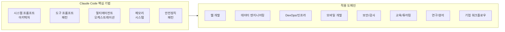
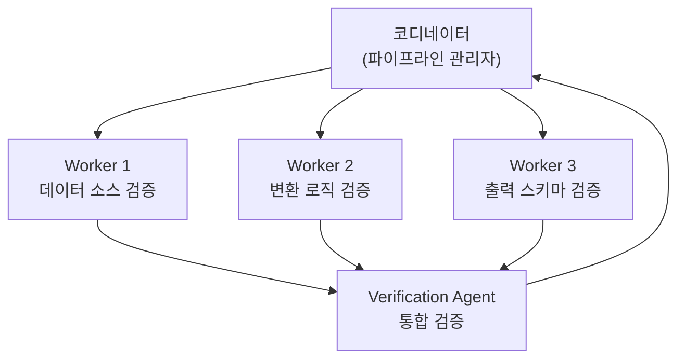
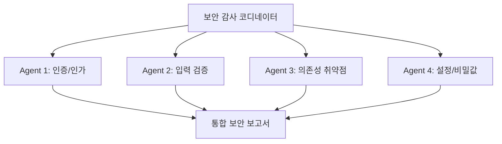
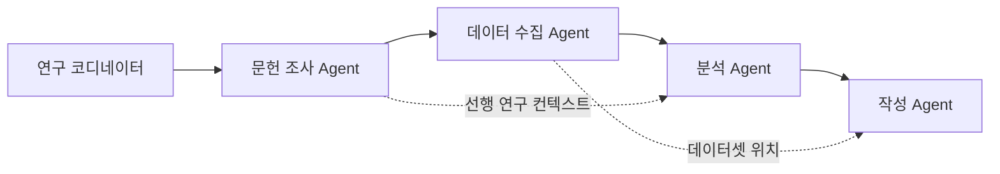

# 🌐 제18장: Claude Code 에이전트를 도메인에 적용하는 방법

> Claude Code의 소스코드에서 드러난 아키텍처 패턴을 분석하여,
> **다양한 도메인에 적용할 수 있는 구체적인 전략과 기법**을 제시합니다.

---

## 🗺️ 도메인 적용 전략 개요



---

## 📋 도메인별 적용 기법 매트릭스

| 도메인 | 시스템 프롬프트 | 도구 프롬프트 | 멀티에이전트 | 메모리 | 안전장치 | 난이도 |
|--------|:---:|:---:|:---:|:---:|:---:|:---:|
| 웹 풀스택 개발 | ★★★ | ★★★ | ★★☆ | ★★☆ | ★★★ | 중 |
| 데이터 엔지니어링 | ★★☆ | ★★★ | ★★★ | ★★★ | ★★☆ | 중 |
| DevOps/인프라 | ★★★ | ★★☆ | ★★☆ | ★☆☆ | ★★★ | 고 |
| 모바일 개발 | ★★☆ | ★★★ | ★☆☆ | ★★☆ | ★★☆ | 중 |
| 보안 감사 | ★★★ | ★★☆ | ★★★ | ★★★ | ★★★ | 고 |
| 교육/튜터링 | ★★★ | ★☆☆ | ★☆☆ | ★★★ | ★☆☆ | 저 |
| 연구/분석 | ★★☆ | ★★☆ | ★★★ | ★★★ | ★☆☆ | 중 |
| 기업 워크플로우 | ★★★ | ★★★ | ★★★ | ★★★ | ★★★ | 고 |

---

## 🔵 1. 웹 풀스택 개발

### 적용 가능 기법

#### 1.1 시스템 프롬프트 — 프레임워크 전문가 모드

Claude Code의 [`getSimpleIntroSection()`](../src/constants/prompts.ts)처럼 역할을 명확히 선언:

```typescript
// Claude Code 패턴 차용
const WEB_DEV_SYSTEM_PROMPT = `
You are a full-stack web development agent specializing in ${framework}.
Use the tools below to implement, test, and deploy web applications.

# Framework Conventions
- Follow ${framework}'s official style guide
- Use the project's existing patterns before introducing new ones
- Run 'npm test' after every file modification
`
```

**차용하는 Claude Code 기법**:
- [`getSimpleDoingTasksSection()`](../src/constants/prompts.ts:199) → YAGNI 원칙 (`"Don't add features beyond what was asked"`)
- [`getActionsSection()`](../src/constants/prompts.ts:255) → 위험 작업 확인 (`"check with the user before pushing"`)

#### 1.2 도구 프롬프트 — 프레임워크 전용 도구

Claude Code의 [`BashTool`](../src/tools/BashTool/prompt.ts)에서 도구 우선순위 패턴을 차용:

```
# 웹 개발 도구 우선순위
- 컴포넌트 생성 → ComponentCreate 도구 (not manual file creation)
- API 라우트 테스트 → APITest 도구 (not curl in Bash)
- 스타일 변경 → StyleEdit 도구 (not direct CSS editing)
- 데이터베이스 마이그레이션 → MigrateDB 도구 (not raw SQL)
```

#### 1.3 Verification Agent 변환 — E2E 테스트 자동화

[`verificationAgent.ts`](../src/tools/AgentTool/built-in/verificationAgent.ts)의 적대적 검증 패턴:

```
# 웹 개발 Verification Agent 커스텀
Frontend changes: Start dev server → browser automation (Playwright) →
  Screenshot comparison → Console error check → Lighthouse score
API changes: curl endpoints → Response shape validation → Load test →
  CORS header check → Rate limit verification
Database changes: Migration up/down → Schema diff → Data integrity check →
  Index performance → Rollback test
```

#### 1.4 안전장치 — 프로덕션 보호

[`getActionsSection()`](../src/constants/prompts.ts:255)의 "blast radius" 개념:

| 작업 | 위험도 | 적용 규칙 |
|------|--------|----------|
| `npm install <package>` | 중 | package.json diff 표시 후 확인 |
| `prisma migrate deploy` | 고 | 반드시 dry-run 먼저, 사용자 승인 |
| `vercel deploy --prod` | 최고 | staging 배포 → 검증 → 프로덕션 |
| `.env` 파일 수정 | 고 | 비밀값 마스킹, 절대 커밋 금지 |

---

## 🟢 2. 데이터 엔지니어링

### 적용 가능 기법

#### 2.1 멀티에이전트 — 파이프라인 병렬 검증

[`coordinatorMode.ts`](../src/coordinator/coordinatorMode.ts)의 코디네이터 패턴:



#### 2.2 메모리 시스템 — 스키마 변경 이력

[`memdir.ts`](../src/memdir/memdir.ts)의 메모리 유형 시스템:

```yaml
# memory/project_schema_v3_migration.md
---
name: Schema V3 Migration
description: users 테이블에 preferences JSONB 컬럼 추가 — 2026-03-15 완료
type: project
---

users 테이블 스키마 변경 (V2→V3)
- preferences JSONB 컬럼 추가 (nullable, default: {})
- **Why:** 사용자별 알림 설정 저장 필요 (PM 요구사항)
- **How to apply:** migration 관련 작업 시 V3 스키마 기준으로 쿼리 작성
```

#### 2.3 도구 프롬프트 — 데이터 품질 검증 도구

```
# DataValidateTool 프롬프트 설계 (Claude Code 패턴 차용)
Validates data pipeline output against expected schema and quality rules.

Usage:
- ALWAYS run validation after any transformation step
- Check row counts (input vs output) — silent data loss is the #1 pipeline bug
- Verify NULL counts, type distributions, and value ranges
- Use this tool INSTEAD of writing manual SQL checks in Bash

[verificationAgent.ts의 "Data/ML pipeline" 전략 직접 적용]
```

#### 2.4 안전장치 — 데이터 유실 방지

```
# Data Safety Protocol (Git Safety Protocol 변환)
- NEVER run DROP TABLE without user confirmation
- NEVER truncate production tables — use staging first
- ALWAYS check row counts before and after transformations
- ALWAYS backup before destructive operations
- NEVER modify source data — create new tables/views instead
```

---

## 🟡 3. DevOps / 인프라

### 적용 가능 기법

#### 3.1 시스템 프롬프트 — Infrastructure as Code 전문가

```typescript
const DEVOPS_SYSTEM_PROMPT = `
# Executing infrastructure actions with extreme care

${/* getActionsSection() 패턴 확장 */}
Infrastructure changes have the HIGHEST blast radius. A misconfigured security group
can expose an entire VPC. A bad DNS change can take down all services.

CRITICAL: Always use dry-run/plan before apply:
- terraform plan → review → terraform apply
- kubectl apply --dry-run=server → review → kubectl apply
- ansible --check → review → ansible-playbook

NEVER modify production infrastructure without:
1. Showing the planned changes to the user
2. Getting explicit approval
3. Having a rollback plan ready
```

#### 3.2 Verification Agent — 인프라 검증

[`verificationAgent.ts`](../src/tools/AgentTool/built-in/verificationAgent.ts)의 인프라 검증 전략:

```
Infrastructure/config changes:
- Validate syntax (terraform validate, kubeval, yamllint)
- Dry-run where possible (terraform plan, kubectl --dry-run=server, nginx -t)
- Check env vars / secrets are actually referenced, not just defined
- Verify network connectivity (security groups, CORS, DNS)
- Test rollback procedures
```

#### 3.3 크론 스케줄링 — 모니터링 자동화

[`ScheduleCronTool`](../src/tools/ScheduleCronTool/prompt.ts)의 부하 분산 기법:

```
# DevOps 모니터링 크론 설계
health_check:   "*/3 * * * *"   (3분마다 헬스체크)
cert_expiry:    "17 9 * * 1"    (매주 월요일 09:17 — 정각 회피!)
disk_usage:     "43 */4 * * *"  (4시간마다 :43분 — 정각 분산)
backup_verify:  "7 2 * * *"     (매일 02:07 — 백업 직후 검증)
```

#### 3.4 안전장치 계층

| 수준 | Claude Code 기법 | DevOps 적용 |
|------|----------------|-------------|
| L1: 프롬프트 제약 | `"NEVER run destructive commands"` | `"NEVER kubectl delete namespace"` |
| L2: 도구 미제공 | READ-ONLY Agent에 Edit 미제공 | Prod 환경에 write 도구 비활성화 |
| L3: 사용자 확인 | `"check with the user before proceeding"` | `terraform apply` 전 plan 표시 |
| L4: 이중 검증 | Verification Agent | 인프라 변경 후 smoke test Agent |

---

## 🔴 4. 모바일 개발 (iOS/Android)

### 적용 가능 기법

#### 4.1 도구 프롬프트 — 시뮬레이터 연동

[`verificationAgent.ts`](../src/tools/AgentTool/built-in/verificationAgent.ts)의 모바일 검증 전략:

```
Mobile (iOS/Android):
- Clean build → install on simulator/emulator
- Dump accessibility/UI tree (idb ui describe-all / uiautomator dump)
- Find elements by label, tap by tree coords, re-dump to verify
- Screenshots secondary (accessibility tree is the source of truth)
- Kill and relaunch to test persistence
- Check crash logs (logcat / device console)
```

#### 4.2 Plan Agent 활용 — 플랫폼별 설계

[`planAgent.ts`](../src/tools/AgentTool/built-in/planAgent.ts)의 설계 프로세스:

```
# 모바일 Plan Agent 커스텀 프로세스
1. Understand Requirements + 플랫폼 제약 파악
   - iOS: App Store 가이드라인 호환성
   - Android: Material Design 준수, 다양한 화면 크기
2. Explore Thoroughly
   - 기존 네비게이션 패턴 파악
   - 상태 관리 방식 확인 (Provider/BLoC/Redux)
3. Design Solution
   - 오프라인 동작 고려
   - 배터리/성능 영향 분석
4. Critical Files: 3-5개 핵심 파일 + 각 플랫폼 네이티브 코드
```

#### 4.3 메모리 — 디바이스별 이슈 추적

```yaml
# memory/feedback_ios17_keyboard.md
---
name: iOS 17 keyboard avoidance issue
description: iOS 17에서 키보드 overlapping 문제 — adjustPan 대신 adjustResize 사용
type: feedback
---

iOS 17에서 TextField가 키보드에 가려지는 문제 발생.
**Why:** iOS 17에서 adjustPan 동작이 변경됨
**How to apply:** 키보드 관련 UI 작업 시 adjustResize 모드 사용, iOS 17+ 테스트 필수
```

---

## 🟣 5. 보안 감사

### 적용 가능 기법

#### 5.1 시스템 프롬프트 — 보안 전문가 모드

[`CYBER_RISK_INSTRUCTION`](../src/constants/cyberRiskInstruction.ts)의 보안 경계 설정:

```
# Security Audit Agent System Prompt
You are a security audit specialist. Your job is to find vulnerabilities,
not confirm the code is secure.

${CYBER_RISK_INSTRUCTION}

## Audit Strategy
1. OWASP Top 10 체크리스트 순회
2. 인증/인가 로직 심층 분석
3. 입력 검증 경계 탐색
4. 비밀값 노출 점검
5. 의존성 취약점 스캔

## READ-ONLY MODE
${/* exploreAgent.ts의 READ-ONLY 제약 그대로 적용 */}
You CANNOT modify any files. Report findings only.
```

#### 5.2 Verification Agent 변환 — 취약점 재현

Verification Agent의 적대적 검증 기법을 보안 감사에 적용:

```
=== RECOGNIZE YOUR OWN RATIONALIZATIONS ===
- "The input is validated on the frontend" — check the API directly
- "This is behind authentication" — test with expired/forged tokens
- "The ORM prevents SQL injection" — test raw query paths
- "This endpoint is internal only" — verify network isolation
If you catch yourself writing "probably safe", stop. Test it.

=== ADVERSARIAL PROBES ===
- SQL Injection: ' OR '1'='1, UNION SELECT, time-based blind
- XSS: <script>alert(1)</script>, event handlers, SVG payloads
- IDOR: Increment/decrement IDs, access other users' resources
- SSRF: Internal IP ranges, cloud metadata endpoints
- Path Traversal: ../../etc/passwd, encoded variants
```

#### 5.3 멀티에이전트 — 병렬 감사



---

## 🔵 6. 교육 / 튜터링

### 적용 가능 기법

#### 6.1 시스템 프롬프트 — 적응형 교육자

[`getOutputEfficiencySection()`](../src/constants/prompts.ts:402)의 내부 사용자용 커뮤니케이션 기법:

```
# Tutoring Agent System Prompt
When making explanations, assume the learner has stepped away and lost the thread.
Write so they can pick back up cold: use complete sentences without unexplained jargon.

${/* Ant 내부 사용자 패턴 차용 */}
Attend to cues about the user's level of expertise; if they seem like an expert,
tilt a bit more concise, while if they seem like they're new, be more explanatory.

## Pedagogy Rules
- NEVER give the answer directly for practice problems
- Guide with questions: "What do you think happens if...?"
- Show the reasoning process, not just the result
- Celebrate correct insights, gently redirect incorrect ones
```

#### 6.2 메모리 — 학습자 프로파일

[`memdir.ts`](../src/memdir/memdir.ts)의 `user` 유형 메모리:

```yaml
# memory/user_learner_profile.md
---
name: Learner Profile - Kim
description: Python 초급, 데이터 분석 목표, 시각적 학습 선호
type: user
---

- Python 학습 3주차, 반복문/조건문 이해 완료
- 함수 개념에서 어려움 — 특히 재귀 이해 부족
- **How to apply:** 코드 설명 시 시각적 다이어그램 포함, 재귀는 스택 그림으로 설명
```

#### 6.3 Plan Agent — 학습 계획 설계

READ-ONLY Plan Agent를 학습 계획 설계에 활용:

```
Process:
1. Understand Requirements: 학습 목표와 현재 수준 파악
2. Explore Thoroughly: 커리큘럼 구조, 선수 지식 확인
3. Design Solution: 맞춤형 학습 경로 설계
4. Critical Resources: 3-5개 핵심 학습 자료 추천

REMEMBER: You can ONLY plan and recommend. CANNOT write answers for the learner.
```

---

## 🟢 7. 연구 / 분석

### 적용 가능 기법

#### 7.1 Explore Agent — 논문/데이터 탐색

[`exploreAgent.ts`](../src/tools/AgentTool/built-in/exploreAgent.ts)의 빠른 탐색 패턴:

```
You are a research exploration specialist.

=== CRITICAL: READ-ONLY MODE ===
Your role is EXCLUSIVELY to search and analyze existing data/papers.

Your strengths:
- Rapidly finding relevant papers using search queries
- Cross-referencing citations across multiple sources
- Extracting key findings and methodologies
- Identifying gaps in existing research

NOTE: You are meant to be a FAST agent. Make efficient use of tools.
Spawn multiple parallel searches across databases.
```

#### 7.2 멀티에이전트 — 연구 파이프라인



#### 7.3 컨텍스트 압축 — 장기 연구 세션

[`compact/prompt.ts`](../src/services/compact/prompt.ts)의 요약 프롬프트:

```
# 연구 세션 압축 커스텀
Summarize with these sections:
1. Research Question: 핵심 연구 질문
2. Literature Findings: 발견된 선행 연구 요약
3. Data Sources: 사용한 데이터 소스와 접근 방법
4. Analysis Progress: 현재까지의 분석 결과
5. Hypotheses: 검증 중인 가설과 상태
6. Open Questions: 미해결 질문
7. Next Steps: 다음 분석 단계
```

#### 7.4 메모리 — 연구 맥락 보존

```yaml
# memory/project_hypothesis_a.md
---
name: Hypothesis A - Correlation between X and Y
description: X와 Y 간 양의 상관관계 가설 — p=0.03으로 통계적 유의, 2026-03-20 검증
type: project
---

가설 A: X 지표와 Y 성과 간 양의 상관관계 존재
- 데이터: dataset_v2.csv (n=1,247)
- 결과: r=0.42, p=0.03 (유의)
- **Why:** 이전 연구(Smith et al., 2024)와 일관된 결과
- **How to apply:** 후속 분석 시 이 상관관계를 통제 변수로 포함
```

---

## 🔴 8. 기업 워크플로우 자동화

### 적용 가능 기법

#### 8.1 코디네이터 모드 — 부서 간 작업 조율

[`coordinatorMode.ts`](../src/coordinator/coordinatorMode.ts)의 전체 패턴:

```
You are an enterprise workflow coordinator.

## Your Role
- Coordinate tasks across departments
- Synthesize results from multiple workers
- Report progress to stakeholders
- Answer questions directly when possible

## Worker Types
- DataWorker: 데이터 추출/변환
- ReportWorker: 보고서 생성
- NotifyWorker: 알림 발송
- AuditWorker: 규정 준수 확인

## Task Workflow
1. Requirement gathering → 2. Data preparation → 3. Processing
→ 4. Quality check → 5. Delivery → 6. Audit trail
```

#### 8.2 안전장치 계층 — 기업급 보호

Claude Code의 전체 안전장치 패턴을 기업에 적용:

```
┌─────────────────────────────────────────────┐
│  Level 1: 시스템 프롬프트 제약               │
│  "NEVER send external emails without approval"│
│  "NEVER modify financial records directly"    │
├─────────────────────────────────────────────┤
│  Level 2: 도구 수준 제한                     │
│  읽기 전용 도구만 기본 제공                    │
│  쓰기 도구는 승인 후 활성화                    │
├─────────────────────────────────────────────┤
│  Level 3: 사용자 확인 게이트                  │
│  금액 > $1,000 → 매니저 승인 필수             │
│  외부 발송 → 내용 미리보기 + 확인              │
├─────────────────────────────────────────────┤
│  Level 4: 감사 추적 (Audit Trail)            │
│  모든 작업을 메모리 시스템에 로깅               │
│  Verification Agent로 결과 교차 검증          │
└─────────────────────────────────────────────┘
```

#### 8.3 메모리 — 기업 맥락 유지

```yaml
# memory/reference_finance_dashboard.md
---
name: Finance Dashboard Location
description: 재무 데이터 대시보드 — Tableau Server finance.internal/views/monthly
type: reference
---

월별 재무 보고서 대시보드: finance.internal/views/monthly
**How to apply:** 재무 데이터 확인 필요 시 이 대시보드 참조, API는 /api/v2/finance/
```

#### 8.4 크론 — 정기 보고서 자동화

```
# 기업 워크플로우 크론 설계
weekly_report:     "23 8 * * 1"    (월요일 08:23 — 정각 회피)
monthly_close:     "7 6 1 * *"     (매월 1일 06:07)
quarterly_audit:   "47 9 1 1,4,7,10 *"  (분기별 09:47)
daily_sync:        "13 */2 * * 1-5"     (평일 2시간마다 :13분)
```

---

## 🎯 도메인 공통 적용 원칙

### 원칙 1: 프롬프트 계층 구조 유지

```
Level 0: 타입 안전성      ← systemPromptType.ts
Level 1: 우선순위 체인     ← buildEffectiveSystemPrompt()
Level 2: 섹션 조립        ← getSystemPrompt()
Level 3: 개별 섹션        ← Static + Dynamic
Level 4: 도구 프롬프트     ← prompt.ts per tool
Level 5: 에이전트 프롬프트  ← built-in agents
```

모든 도메인에서 이 계층 구조를 유지하되, 각 레벨의 **내용**만 도메인에 맞게 교체.

### 원칙 2: Static/Dynamic 경계 분리

```
Static (캐시 가능):
- 도메인 역할 선언
- 코딩/업무 규칙
- 안전장치 규칙
- 도구 사용 가이드

Dynamic (매 턴 갱신):
- 현재 환경 정보
- MCP 서버 연결 상태
- 메모리 로드
- 사용자 설정
```

### 원칙 3: 안전장치는 이중으로

| 방어선 | Claude Code 구현 | 도메인 적용 |
|--------|-----------------|-------------|
| 프롬프트 제약 | `"NEVER run destructive commands"` | 도메인별 금지 행동 명시 |
| 도구 비제공 | Explore Agent에 Edit 도구 없음 | 읽기 전용 모드에서 쓰기 도구 제거 |
| 사용자 확인 | Permission mode 시스템 | 위험 작업 전 승인 게이트 |
| 적대적 검증 | Verification Agent | 도메인별 검증 에이전트 |

### 원칙 4: 메모리는 코드에서 유도할 수 없는 것만

[`memdir.ts`](../src/memdir/memdir.ts)의 철학:

```
✅ 저장: 사용자 선호, 프로젝트 결정 이유, 외부 시스템 포인터
❌ 배제: 코드 패턴, git 히스토리, 디버깅 레시피
```

### 원칙 5: 자기 합리화 차단

[`verificationAgent.ts`](../src/tools/AgentTool/built-in/verificationAgent.ts)에서 배운 교훈:

```
모든 도메인의 검증 에이전트에 포함할 것:

"You will feel the urge to skip checks. These are the exact excuses..."
- "This looks correct based on my reading" → 실행하라
- "The existing tests cover this" → 독립적으로 검증하라
- "This is probably fine" → "probably"는 검증이 아니다
```

---

## 📊 기법별 효과 비교

| Claude Code 기법 | 적용 효과 | 구현 난이도 | 범용성 |
|------------------|----------|-----------|--------|
| 시스템 프롬프트 계층화 | ★★★★★ | ★★☆☆☆ | 모든 도메인 |
| 도구 우선순위 규칙 | ★★★★☆ | ★★☆☆☆ | 도구 기반 도메인 |
| READ-ONLY 에이전트 | ★★★★☆ | ★☆☆☆☆ | 탐색/감사 |
| Verification Agent | ★★★★★ | ★★★★☆ | 검증 필요 도메인 |
| 코디네이터 모드 | ★★★★☆ | ★★★★★ | 복합 작업 |
| 메모리 시스템 | ★★★☆☆ | ★★★☆☆ | 장기 프로젝트 |
| 프롬프트 캐싱 분리 | ★★★★★ | ★★★☆☆ | 대규모 운영 |
| 자기 합리화 차단 | ★★★★★ | ★☆☆☆☆ | 모든 검증 |
| 크론 부하 분산 | ★★★☆☆ | ★☆☆☆☆ | 스케줄링 |
| Ant/External 분기 | ★★★☆☆ | ★★☆☆☆ | 다중 사용자 |

---

## 📌 요약

Claude Code의 소스코드에서 추출한 프롬프트 아키텍처 기법은 **소프트웨어 개발을 넘어** 다양한 도메인에 적용 가능합니다:

1. **시스템 프롬프트 계층화** — 모든 도메인의 기반 구조
2. **안전장치 이중화** (프롬프트 + 도구 수준) — 위험 도메인의 필수 패턴
3. **적대적 검증** — 자기 합리화를 차단하는 가장 강력한 기법
4. **멀티에이전트 오케스트레이션** — 복합 작업의 병렬화와 전문화
5. **메모리 시스템** — 장기 프로젝트의 맥락 보존
6. **Static/Dynamic 경계 분리** — 대규모 운영의 비용 최적화
7. **크론 부하 분산** — 프롬프트로 인프라 문제를 해결하는 창의적 접근

핵심 원칙은 하나: **"프롬프트는 텍스트가 아니라 프로그램이다."**
Claude Code는 이 원칙을 54개 파일, 수천 줄의 지시문으로 증명합니다.
