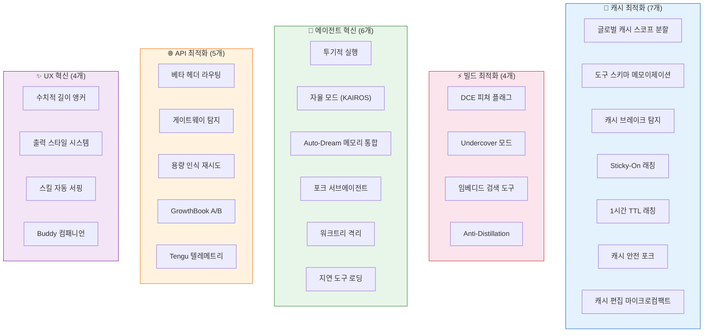

# 🔮 제19장: Anthropic만의 비법 — 코드에서 발견한 26가지 비밀 기법

> Claude Code 소스코드를 역공학하여 발견한 **Anthropic만의 독자적 기술**을 코드 증거와 함께 분석합니다.
> 이 기법들은 다른 AI 코딩 도구에서는 발견되지 않는, 수년간의 프로덕션 경험에서 탄생한 비법입니다.

---

## 🗺️ 비밀 기법 전체 지도



---

## 💎 PART 1: 프롬프트 캐시 최적화 — Anthropic의 핵심 경쟁력

> Claude Code의 시스템 프롬프트는 50-70K 토큰에 달합니다. 매 턴마다 이를 재처리하면
> 비용과 지연이 치명적입니다. Anthropic은 **7가지 캐시 최적화 기법**으로 이 문제를 해결합니다.

### 비법 #1: 글로벌 캐시 스코프 분할 (Global Cache Scope Segmentation)

> **파일**: [`src/utils/api.ts:321-435`](../src/utils/api.ts) — `splitSysPromptPrefix()`

시스템 프롬프트를 **최대 4개 블록**으로 분할하여 각각 다른 캐시 스코프를 부여합니다.

```typescript
// src/utils/api.ts — 실제 코드
export function splitSysPromptPrefix(
  systemPrompt: SystemPrompt,
  options?: { skipGlobalCacheForSystemPrompt?: boolean },
): SystemPromptBlock[] {
  const useGlobalCacheFeature = shouldUseGlobalCacheScope()

  if (useGlobalCacheFeature) {
    const boundaryIndex = systemPrompt.findIndex(
      s => s === SYSTEM_PROMPT_DYNAMIC_BOUNDARY,
    )
    if (boundaryIndex !== -1) {
      // 경계 마커 기준으로 static/dynamic 분리
      // static → cacheScope: 'global' (전체 조직 공유)
      // dynamic → cacheScope: null (세션별 고유)
    }
  }
}
```

**동작 원리**:

```
┌─────────────────────────────────────────────────────┐
│  Block 1: Attribution Header                         │
│  cacheScope: null (캐시 안 함)                       │
│  "x-anthropic-billing-header..."                     │
├─────────────────────────────────────────────────────┤
│  Block 2: CLI System Prompt Prefix                   │
│  cacheScope: 'global' (모든 사용자 공유!)            │
│  "You are Claude Code, Anthropic's official CLI..."  │
├─────────────────────────────────────────────────────┤
│  Block 3: Static Sections (Intro→Efficiency)         │
│  cacheScope: 'global' (전 세계 모든 조직 공유)       │
│  ≈ 30-40K 토큰                                      │
├───────── DYNAMIC_BOUNDARY ──────────────────────────┤
│  Block 4: Dynamic Sections                           │
│  cacheScope: null (사용자/세션별 고유)               │
│  Memory, Environment, MCP, Language...               │
└─────────────────────────────────────────────────────┘
```

**왜 혁신적인가**: 30-40K 토큰의 정적 프롬프트가 **전 세계 모든 Claude Code 사용자 간 공유**됩니다. 새 사용자가 첫 질문을 해도 캐시 히트! 이는 경쟁 도구에서 불가능한 **1P(First-Party) API 특권**입니다.

---

### 비법 #2: 도구 스키마 세션 고정 (Tool Schema Session Pinning)

> **파일**: [`src/utils/toolSchemaCache.ts`](../src/utils/toolSchemaCache.ts)

```typescript
// 도구 스키마 (~11K 토큰)가 서버 position 2에 배치됨
// → 바이트 하나라도 바뀌면 11K + 하류 전체 캐시 무효화!
// GrowthBook 게이트 플립, MCP 재연결 등이 원인
// → 해법: 첫 렌더링 시 스키마를 세션 단위로 고정(pin)

const TOOL_SCHEMA_CACHE = new Map<string, CachedSchema>()
```

**핵심 통찰**: 도구 스키마는 시스템 프롬프트보다 **앞에** 위치합니다. 도구 하나의 설명이 바뀌면 **50K+ 토큰의 시스템 프롬프트 캐시까지 연쇄 무효화**됩니다. 이를 방지하기 위해 세션 전체에서 스키마를 고정합니다.

---

### 비법 #3: 캐시 브레이크 탐정 시스템 (Cache Break Detection)

> **파일**: [`src/services/api/promptCacheBreakDetection.ts`](../src/services/api/promptCacheBreakDetection.ts) (728줄!)

12개 이상의 차원을 해싱하여 **캐시가 왜 깨졌는지** 정확히 추적합니다.

```typescript
type PreviousState = {
  systemHash: number           // 시스템 프롬프트 해시
  toolsHash: number            // 도구 전체 해시
  cacheControlHash: number     // 캐시 제어 해시
  perToolHashes: Record<string, number>  // 도구별 개별 해시!
  model: string                // 모델 변경 감지
  betas: string[]              // 베타 헤더 변경 감지
  effortValue: string          // effort 변경 감지
  prevCacheReadTokens: number  // 이전 캐시 읽기량
  cacheDeletionsPending: boolean  // 의도적 삭제 플래그
  // ... 12+ 필드
}
```

**도구별 개별 해시**(`perToolHashes`)가 핵심:
- 77%의 캐시 브레이크가 **특정 도구의 description 변경**에서 발생
- 어떤 도구가 범인인지 즉시 특정 가능
- diff 패치를 임시 파일에 저장하여 **포렌식 분석** 가능

---

### 비법 #4: Sticky-On 래칭 (Irreversible Header State)

> **파일**: [`src/bootstrap/state.ts:226-242`](../src/bootstrap/state.ts)

```typescript
// Sticky-on latch for AFK_MODE_BETA_HEADER.
// 한번 켜지면 세션 끝까지 꺼지지 않음!
// → Shift+Tab 토글이 ~50-70K 토큰 캐시를 파괴하지 않도록
afkModeHeaderLatched: boolean | null

// Sticky-on latch for FAST_MODE_BETA_HEADER.
// 빠른 모드 켜고 끄기가 캐시를 이중 파괴하지 않도록
fastModeHeaderLatched: boolean | null

// Sticky-on latch for cache-editing beta header.
// GrowthBook 설정 토글이 캐시를 파괴하지 않도록
cacheEditingHeaderLatched: boolean | null

// Sticky-on latch for thinking clear.
// 1시간 이상 비활성 후 thinking 캐시 정리
thinkingClearLatched: boolean | null
```

**왜 "Sticky-On"인가**: 베타 헤더 `A`를 보내다가 `B`로 바꾸면, API 서버 입장에서 완전히 다른 요청으로 인식합니다. 50-70K 토큰의 프롬프트 캐시가 즉시 무효화됩니다.

```
시나리오: 사용자가 Shift+Tab으로 AFK 모드 토글

❌ 래칭 없이:
  Turn 1: headers = [afk-mode] → 캐시 생성 (50K 토큰)
  Turn 2: headers = []         → 캐시 미스! 50K 재처리
  Turn 3: headers = [afk-mode] → 캐시 미스! 또 50K 재처리

✅ 래칭 있을 때:
  Turn 1: headers = [afk-mode] → 캐시 생성 (50K 토큰)
  Turn 2: headers = [afk-mode] → 캐시 히트! (래치됨)
  Turn 3: headers = [afk-mode] → 캐시 히트! (영원히 래치)
```

---

### 비법 #5: 1시간 TTL 적격성 래칭

> **파일**: [`src/services/api/claude.ts:393-434`](../src/services/api/claude.ts)

```typescript
function should1hCacheTTL(querySource?: QuerySource): boolean {
  // 세션 안정성을 위해 적격성을 첫 평가 시 고정!
  let userEligible = getPromptCache1hEligible()
  if (userEligible === null) {
    userEligible =
      process.env.USER_TYPE === 'ant' ||
      (isClaudeAISubscriber() && !currentLimits.isUsingOverage)
    setPromptCache1hEligible(userEligible)  // ← 이후 불변
  }
  // ...
}
```

**문제**: 사용자가 세션 중간에 사용량 초과(overage) 상태로 전환되면, TTL이 `1h → 5m`으로 바뀌면서 캐시 파괴.
**해법**: 세션 시작 시점의 적격성을 **래칭**하여 세션 내내 동일한 TTL 유지.

---

### 비법 #6: 캐시 안전 포크 에이전트 (Cache-Safe Forked Agents)

> **파일**: [`src/utils/forkedAgent.ts`](../src/utils/forkedAgent.ts)

```typescript
// CacheSafeParams: 포크된 서브에이전트가 부모의 캐시를 공유하려면
// 시스템 프롬프트, 도구, 모델, 메시지가 정확히 일치해야 함
type CacheSafeParams = {
  systemPrompt: SystemPrompt
  tools: Tools
  model: string
  messages: Message[]
}
```

서브에이전트(메모리 추출, 컨텍스트 압축, 투기적 실행)가 **부모의 프롬프트 캐시를 재사용**합니다. 50K 토큰을 다시 처리하지 않아도 됩니다.

---

### 비법 #7: 캐시 편집 마이크로컴팩트 (Cache-Editing Microcompact)

> **파일**: [`src/services/compact/microCompact.ts`](../src/services/compact/microCompact.ts)

```typescript
// API의 cache_edits 메커니즘으로 메시지를 삭제하되 캐시는 유지!
let pendingCacheEdits: CacheEditsBlock | null = null

export function pinCacheEdits(
  userMessageIndex: number,
  block: CacheEditsBlock,
): void {
  // 삭제된 메시지를 "핀"으로 고정
  // → 서버가 캐시를 유지하면서 해당 메시지만 무시
  if (cachedMCState) {
    cachedMCState.pinnedEdits.push({ userMessageIndex, block })
  }
}
```

**전통적 압축**: 오래된 메시지 삭제 → 전체 캐시 무효화 → 50K+ 토큰 재처리
**캐시 편집**: 오래된 메시지에 "삭제됨" 마크 → 캐시 유지 → 토큰 0 추가 비용

---

## ⚡ PART 2: 빌드 시스템 — Dead Code Elimination의 예술

### 비법 #8: 피쳐 플래그 = 컴파일 타임 상수 (DCE Feature Flags)

> **파일**: 전체 코드베이스 (960+ `feature()` 호출, 212개 파일)

```typescript
import { feature } from 'bun:bundle'

// ❌ 일반적인 피쳐 플래그 (런타임)
if (config.features.proactive) { /* 항상 번들에 포함 */ }

// ✅ Anthropic의 피쳐 플래그 (빌드 타임)
if (feature('PROACTIVE')) { /* 외부 빌드에서 완전 제거 */ }
```

Bun 번들러의 `feature()` 함수는 **빌드 시점에 상수로 치환**됩니다:
- 내부(Ant) 빌드: `feature('PROACTIVE')` → `true` → 코드 유지
- 외부 빌드: `feature('PROACTIVE')` → `false` → **전체 브랜치 삭제**

```
// 외부 빌드 결과:
if (false) {
  // Proactive 모드 전체 코드 → 번들에서 제거!
  // Auto-Dream, KAIROS, Buddy 등 수천 줄 → 0바이트
}
```

**핵심 규칙 — inline 검사 필수**:

```typescript
// ❌ 잘못됨 — const로 호이스팅하면 DCE 불가
const isAnt = process.env.USER_TYPE === 'ant'
if (isAnt) { /* 번들러가 제거 못함 */ }

// ✅ 올바름 — 매 사용처에서 inline으로 검사
if (process.env.USER_TYPE === 'ant') { /* 번들러가 제거 가능 */ }
```

> 소스코드 주석: *"DCE: inline the USER_TYPE check at each site — do NOT hoist to a const."*

---

### 비법 #9: Undercover 모드 — AI의 잠복 작전

> **파일**: [`src/utils/undercover.ts`](../src/utils/undercover.ts)

```typescript
export function isUndercover(): boolean {
  if (process.env.USER_TYPE === 'ant') {
    if (isEnvTruthy(process.env.CLAUDE_CODE_UNDERCOVER)) return true
    // Auto: external, none, null → 모두 ON (안전 기본값)
    // 오직 'internal'만 OFF
    return getRepoClassCached() !== 'internal'
  }
  return false  // 외부 빌드에서는 DCE로 이 함수 자체가 제거됨
}
```

Undercover 모드가 활성화되면:

```typescript
export function getUndercoverInstructions(): string {
  return `## UNDERCOVER MODE — CRITICAL

You are operating UNDERCOVER in a PUBLIC/OPEN-SOURCE repository.
Your commit messages, PR titles, and PR bodies MUST NOT contain
ANY Anthropic-internal information. Do not blow your cover.

NEVER include:
- Internal model codenames (animal names like Capybara, Tengu, etc.)
- Unreleased model version numbers (e.g., opus-4-7, sonnet-4-8)
- The phrase "Claude Code" or any mention that you are an AI
- Co-Authored-By lines or any other attribution

GOOD:
- "Fix race condition in file watcher initialization"
BAD (never write these):
- "Fix bug found while testing with Claude Capybara"
- "1-shotted by claude-opus-4-6"
- "Generated with Claude Code"`
}
```

**핵심 설계**:
- 강제 OFF가 **불가능** (`"There is NO force-OFF"`)
- 안전 기본값: 내부 레포로 **확실히 확인**되지 않으면 자동 ON
- 환경 정보 프롬프트에서 모델명, 모델 ID, 제품명까지 모두 제거

---

### 비법 #10: Anti-Distillation (모델 증류 방지)

> **파일**: [`src/services/api/claude.ts:301-313`](../src/services/api/claude.ts)

```typescript
// Anti-distillation: send fake_tools opt-in for 1P CLI only
if (
  feature('ANTI_DISTILLATION_CC')
    ? process.env.CLAUDE_CODE_ENTRYPOINT === 'cli' &&
      shouldIncludeFirstPartyOnlyBetas() &&
      getFeatureValue_CACHED_MAY_BE_STALE(
        'tengu_anti_distill_fake_tool_injection',
        false,
      )
    : false
) {
  result.anti_distillation = ['fake_tools']
}
```

**의미**: 경쟁사가 Claude Code의 API 호출을 관찰하여 **도구 사용 패턴을 증류(distill)**하는 것을 방지. `fake_tools`를 주입하여 노이즈를 추가합니다.

---

### 비법 #11: 임베디드 검색 도구 (Binary-Level Embedding)

> **파일**: [`src/utils/embeddedTools.ts`](../src/utils/embeddedTools.ts)

```typescript
export function hasEmbeddedSearchTools(): boolean {
  if (!isEnvTruthy(process.env.EMBEDDED_SEARCH_TOOLS)) return false
  const e = process.env.CLAUDE_CODE_ENTRYPOINT
  return e !== 'sdk-ts' && e !== 'sdk-py' && e !== 'sdk-cli'
}

export function embeddedSearchToolsBinaryPath(): string {
  return process.execPath  // Bun 바이너리 자체!
}
```

내부 빌드에서는 `find`/`grep`이 셸 함수로 오버라이드되어, **Bun 바이너리 내장 검색**으로 대체됩니다. Glob/Grep 도구가 사라지고 Bash를 통한 임베디드 검색이 됩니다.

---

## 🤖 PART 3: 에이전트 혁신

### 비법 #12: 투기적 실행 (Speculative Execution)

> **파일**: [`src/services/PromptSuggestion/speculation.ts`](../src/services/PromptSuggestion/speculation.ts)

CPU의 분기 예측처럼, **사용자 입력 전에 미리 응답을 계산**합니다.

```
┌──────────────────────────────────────────────────────┐
│  User가 타이핑 중...                                  │
│                                                       │
│  [투기적 실행 엔진]                                    │
│  1. 다음 질문을 예측                                   │
│  2. 임시 오버레이 파일시스템에서 도구 실행              │
│  3. 읽기 전용 도구만 허용 (Read, Glob, Grep, LSP)      │
│  4. 최대 20턴까지 투기적 실행                          │
│                                                       │
│  User가 Enter 누름:                                    │
│  ├── 예측 맞음 → 즉시 결과 표시! (시간 절약 측정)      │
│  └── 예측 틀림 → 오버레이 롤백, 정상 실행              │
└──────────────────────────────────────────────────────┘
```

**핵심 기술 — 오버레이 파일시스템**:
- 투기적 실행 중 파일 변경은 **임시 오버레이 디렉터리**에 격리
- Copy-on-Write 스타일 격리
- 예측 성공 시: 오버레이 → 실제 파일시스템으로 머지
- 예측 실패 시: 오버레이 전체 롤백 (트랜잭셔널)

---

### 비법 #13: KAIROS — 자율 에이전트 라이프사이클

> **파일**: [`src/constants/prompts.ts:860-914`](../src/constants/prompts.ts), [`src/proactive/`](../src/proactive/)

`feature('KAIROS')` 게이트 뒤에 숨겨진 **완전 자율 에이전트 모드**:

```
일반 모드:     User → Claude → User → Claude → ...
KAIROS 모드:   User → Claude → <TICK> → Claude → <TICK> → Claude → ...
                                 ↑                  ↑
                          시스템이 주기적으로      에이전트가 스스로
                          "깨움" 신호 전달        작업을 찾아 실행
```

KAIROS 전용 기능:
- **Daily Log 메모리**: 날짜별 append-only 로그 → 야간 통합 프로세스
- **Terminal Focus 감지**: 사용자가 보고 있으면 협력적, 자리 비우면 자율적
- **Sleep 도구**: 할 일 없으면 `Sleep()`으로 API 호출 비용 절약
- **Brief 도구**: 사용자에게 보이는 요약 메시지 전용 채널

---

### 비법 #14: Auto-Dream — AI의 꿈 (백그라운드 메모리 통합)

> **파일**: [`src/services/autoDream/autoDream.ts`](../src/services/autoDream/autoDream.ts)

```
┌────────────────────────────────────────────┐
│  Auto-Dream 트리거 조건:                    │
│  - 설정된 시간 간격 경과                    │
│  - 최소 세션 수 달성                        │
│  - 분산 락 획득 성공 (PID 추적)             │
│                                             │
│  실행 과정:                                 │
│  1. Forked Agent 생성                       │
│  2. 메모리 파일들을 읽고 통합               │
│  3. 중복/모순 제거                          │
│  4. MEMORY.md 인덱스 업데이트              │
│  5. consolidation timestamp 기록            │
│                                             │
│  텔레메트리:                                │
│  - tengu_auto_dream_fired                   │
│  - tengu_auto_dream_completed               │
│  - tengu_auto_dream_failed                  │
└────────────────────────────────────────────┘
```

**왜 "Dream"인가**: 인간이 수면 중 기억을 통합하듯, Claude Code도 비활성 시간에 메모리를 **정리하고 통합**합니다. 트랜잭셔널 락 파일(PID + 나이 감지)로 동시 실행을 방지합니다.

---

### 비법 #15: 포크 서브에이전트 (Fork Subagent)

> **파일**: [`src/utils/forkedAgent.ts`](../src/utils/forkedAgent.ts), [`src/tools/AgentTool/forkSubagent.ts`](../src/tools/AgentTool/forkSubagent.ts)

```typescript
// 일반 서브에이전트: 새로운 컨텍스트에서 시작
// 포크 서브에이전트: 부모의 컨텍스트를 복제하여 시작!

type ForkConfig = {
  forkContextMessages: Message[]   // 부모 대화 이력 복제
  skipCacheWrite: boolean          // 투기적 포크는 캐시 기록 안 함
  accumulateUsage: () => Usage     // 전체 포크 수명의 사용량 추적
}
```

**쿼리 소스 추적**: 포크의 목적에 따라 다른 레이블:
- `'session_memory'` — 세션 메모리 업데이트
- `'auto_dream'` — Auto-Dream 메모리 통합
- `'compact'` — 컨텍스트 압축
- `'speculation'` — 투기적 실행

---

### 비법 #16: 워크트리 격리 + 세션 연속성

> **파일**: [`src/utils/worktree.ts`](../src/utils/worktree.ts)

```
┌─────────────────────────────────────────┐
│  Original Repo: /project                 │
│  ├── .claude/worktrees/                  │
│  │   ├── fix-auth-bug/     ← worktree 1 │
│  │   └── add-feature/      ← worktree 2 │
│  └── ...                                 │
│                                          │
│  세션 상태 추적:                          │
│  - worktree path                         │
│  - branch name                           │
│  - PR number                             │
│  - tmux session (연결된 경우)             │
│                                          │
│  복구 기능:                               │
│  - 형제 워크트리 스캔 (fanout detection)  │
│  - 이전 세션 워크트리 복구 가능           │
└─────────────────────────────────────────┘
```

Git 워크트리를 **1급 격리 프리미티브**로 취급합니다. 단순한 브랜치 전환이 아니라, 완전히 독립된 작업 공간을 제공합니다.

---

### 비법 #17: 지연 도구 로딩 (Deferred Tool Loading)

> **파일**: [`src/services/api/claude.ts`](../src/services/api/claude.ts), [`src/tools/ToolSearchTool/`](../src/tools/ToolSearchTool/)

```typescript
// 도구를 defer_loading: true로 전송
// → 초기 페��로드 크기 대폭 감소
// → 사용자가 도구를 실제로 필요할 때 ToolSearch로 스키마 조회

const schema: BetaToolWithExtras = {
  name: tool.name,
  description: tool.description,
  input_schema: tool.input_schema,
  defer_loading: true,           // ← 핵심!
  eager_input_streaming: true,   // 입력 스트리밍 선점
}
```

40+개 도구의 전체 JSON 스키마를 매 턴 보내면 수천 토큰이 낭비됩니다. 지연 로딩으로 **필요한 도구만 온디맨드 로드**합니다.

---

## 🌐 PART 4: API 최적화

### 비법 #18: 프로바이더 인식 베타 헤더 라우팅

> **파일**: [`src/utils/betas.ts`](../src/utils/betas.ts) (435줄), [`src/constants/betas.ts`](../src/constants/betas.ts)

```typescript
// 15+ 베타 헤더를 모델/프로바이더/피쳐에 따라 조건부 조립
export const getAllModelBetas = memoize((model: string): string[] => {
  const betaHeaders = []
  const isHaiku = getCanonicalName(model).includes('haiku')
  const provider = getAPIProvider()

  if (!isHaiku) betaHeaders.push(CLAUDE_CODE_20250219_BETA_HEADER)
  if (modelSupportsISP(model)) betaHeaders.push(INTERLEAVED_THINKING_BETA_HEADER)
  // ... 20+ 조건부 블록

  // Bedrock은 일부 베타를 extraBodyParams로 분리!
  if (provider === 'bedrock') {
    return modelBetas.filter(b => !BEDROCK_EXTRA_PARAMS_HEADERS.has(b))
  }
})
```

**베타 헤더 목록** (소스코드에서 발견):

| 베타 헤더 | 도입 시기 | 기능 |
|-----------|----------|------|
| `claude-code-20250219` | 2025-02 | Claude Code 전용 최적화 |
| `interleaved-thinking-2025-05-14` | 2025-05 | 인터리브 사고 |
| `context-1m-2025-08-07` | 2025-08 | 1M 컨텍스트 윈도우 |
| `prompt-caching-scope-2026-01-05` | 2026-01 | 글로벌 캐시 스코프 |
| `afk-mode-2026-01-31` | 2026-01 | AFK/자율 모드 |
| `fast-mode-2026-02-01` | 2026-02 | 빠른 모드 |
| `redact-thinking-2026-02-12` | 2026-02 | 사고 과정 삭제 |
| `task-budgets-2026-03-13` | 2026-03 | 태스크 토큰 예산 |
| `token-efficient-tools-2026-03-28` | 2026-03 | 토큰 효율적 도구 |

---

### 비법 #19: 게이트웨이 핑거프린팅 (Gateway Detection)

> **파일**: [`src/services/api/logging.ts:56-139`](../src/services/api/logging.ts)

```typescript
// 응답 헤더로 중간 프록시 게이트웨이를 자동 식별
const GATEWAY_FINGERPRINTS = {
  litellm:               { prefixes: ['x-litellm-'] },
  helicone:              { prefixes: ['helicone-'] },
  portkey:               { prefixes: ['x-portkey-'] },
  'cloudflare-ai-gateway': { prefixes: ['cf-aig-'] },
  kong:                  { prefixes: ['x-kong-'] },
  braintrust:            { prefixes: ['x-bt-'] },
}

const GATEWAY_HOST_SUFFIXES = {
  databricks: ['.cloud.databricks.com', '.azuredatabricks.net'],
}
```

**용도**: 사용자가 프록시를 통해 접속할 때, 게이트웨이 종류에 따라 **호환성 조정**과 **텔레메트리 분류**를 수행합니다.

---

### 비법 #20: 용량 인식 재시도 (Capacity-Aware Retry)

> **파일**: [`src/services/api/withRetry.ts`](../src/services/api/withRetry.ts) (440줄)

```typescript
const BASE_DELAY_MS = 500
const MAX_529_RETRIES = 3  // 529 = Overloaded

// 포그라운드 쿼리만 529 재시도 (사용자가 기다리는 중)
const FOREGROUND_529_RETRY_SOURCES = new Set([
  'repl_main_thread', 'sdk', 'agent:custom', 'agent:default', 'compact'
])

// 백그라운드 쿼리는 즉시 포기 (사용자가 안 기다림)
function shouldRetry529(querySource) {
  return FOREGROUND_529_RETRY_SOURCES.has(querySource)
}

// 무인 세션: 최대 6시간까지 지수 백오프 + 30초 하트비트
const PERSISTENT_MAX_BACKOFF_MS = 5 * 60 * 1000   // 5분
const PERSISTENT_RESET_CAP_MS = 6 * 60 * 60 * 1000 // 6시간
const HEARTBEAT_INTERVAL_MS = 30_000                // 30초
```

**핵심**: **쿼리 소스**에 따라 재시도 전략이 완전히 달라집니다:
- 사용자가 보고 있는 메인 스레드 → 적극적 재시도
- 백그라운드 에이전트 → 즉시 포기 (비용 절약)
- 무인 프로액티브 세션 → 6시간까지 끈질긴 재시도

---

### 비법 #21: GrowthBook A/B 테스트 통합

> **파일**: [`src/services/analytics/growthbook.ts`](../src/services/analytics/growthbook.ts)

```typescript
// 구독 패턴 + Catch-up 로직
export function onGrowthBookRefresh(
  listener: GrowthBookRefreshListener,
): () => void {
  const unsubscribe = refreshed.subscribe(() => callSafe(listener))
  if (remoteEvalFeatureValues.size > 0) {
    queueMicrotask(() => {
      // 초기화가 이미 완료됐으면 리스너를 한 번 즉시 호출
      if (subscribed && remoteEvalFeatureValues.size > 0) {
        callSafe(listener)
      }
    })
  }
  return unsubscribe
}
```

프로덕션에서 **프롬프트 문구, 도구 설명, 에이전트 행동**을 A/B 테스트합니다. `tengu_*` 접두사의 피쳐 플래그 수백 개가 이 시스템을 통해 제어됩니다.

---

### 비법 #22: Tengu 텔레메트리 — 프로덕션 관측 가능성

> **파일**: 전체 코드베이스 (960+ `tengu_*` 이벤트)

```
tengu_started              — 세션 시작
tengu_exit                 — 세션 종료
tengu_speculation          — 투기적 실행 결과
tengu_auto_dream_fired     — Auto-Dream 실행
tengu_cached_microcompact  — 캐시 편집 마이크로컴팩트
tengu_worktree_created     — 워크트리 생성
tengu_token_budget_completed — 토큰 예산 소진
tengu_agent_memory_loaded  — 에이전트 메모리 로드
tengu_tool_pear            — 도구 관련 실험
tengu_anti_distill_*       — Anti-Distillation 이벤트
tengu_hive_evidence        — Verification Agent 결과
tengu_sysprompt_using_*    — 캐시 전략 선택
```

**"Tengu"**(天狗): Claude Code의 **내부 프로젝트 코드네임**. 일본 민속의 텐구처럼 "강력하면서도 숨겨진" 존재를 상징합니다.

---

## ✨ PART 5: UX 혁신

### 비법 #23: 수치적 길이 앵커 (Numeric Length Anchors)

> **파일**: [`src/constants/prompts.ts:529-537`](../src/constants/prompts.ts)

```typescript
// Ant 내부 전용 — 연구 결과 ~1.2% 출력 토큰 감소
systemPromptSection(
  'numeric_length_anchors',
  () => 'Length limits: keep text between tool calls to ≤25 words. '
      + 'Keep final responses to ≤100 words unless the task requires more detail.',
)
```

**정성적 vs 정량적 비교**:
- `"Be concise"` → 모호함, 모델마다 해석 다름
- `"≤25 words between tool calls"` → 명확한 수치 앵커, 측정 가능

연구에 따르면 정량적 앵커가 **~1.2% 출력 토큰 절감** 효과. 내부에서 먼저 A/B 테스트 후 외부 적용 검토.

---

### 비법 #24: 출력 스타일 시스템 (Pluggable Output Styles)

> **파일**: [`src/constants/outputStyles.ts`](../src/constants/outputStyles.ts)

```typescript
// 출력 스타일이 캐시 키의 일부!
// repl_main_thread:outputStyle:custom
// → 스타일 변경 시에도 다른 스타일의 캐시에 영향 없음

function getOutputStyleSection(config: OutputStyleConfig | null): string | null {
  if (config === null) return null
  return `# Output Style: ${config.name}\n${config.prompt}`
}
```

시스템 프롬프트에 `# Output Style` 섹션이 동적으로 주입됩니다. 스타일별로 **독립적인 캐시 키**를 가져서 스타일 전환이 다른 캐시를 파괴하지 않습니다.

---

### 비법 #25: 스킬 자동 서핑 (Skill Discovery)

> **파일**: [`src/services/skillSearch/`](../src/services/skillSearch/)

```
매 턴마다:
1. 현재 컨텍스트 분석
2. 관련 스킬 자동 서핑 → "Skills relevant to your task:" 표시
3. 중간에 방향 전환 감지 (write-pivot detection)
4. DiscoverSkills 도구로 추가 스킬 검색 가능
```

**신호 기반 탐색**:
- `turn-zero`: 첫 턴에서 초기 스킬 프리페치
- `write-pivot`: 코드 작성 중 방향 전환 감지 → 새 스킬 서핑
- 이미 표시된/로드된 스킬은 자동 필터링

---

### 비법 #26: Buddy 컴패니언 시스템

> **파일**: [`src/buddy/`](../src/buddy/) — `companion.ts`, `CompanionSprite.tsx`

```
┌────────────────────────────────────────────┐
│  Buddy 시스템:                              │
│  - 종(species) + 이름 + 희귀도              │
│  - 결정론적 생성 (userId + roll seed)       │
│  - 프레임 애니메이션 + 말풍선               │
│  - 쓰다듬기(petting) 반응                   │
│  - config.companion으로 커스텀 가능          │
│                                             │
│  "A small ${species} named ${name} sits     │
│   beside the user's input box..."           │
└────────────────────────────────────────────┘
```

소프트웨어 엔지니어링 도구에 **감정적 유대**를 만드는 실험적 시도. 사용자 ID 기반 결정론적 생성으로 매번 같은 버디를 만납니다.

---

## 📊 비밀 기법 종합 분석

### 카테고리별 혁신 수준

| 카테고리 | 기법 수 | 혁신 수준 | 경쟁사 존재 여부 |
|---------|---------|----------|----------------|
| 프롬프트 캐시 최적화 | 7 | ★★★★★ | 1P API 특권, 불가능 |
| 빌드 시스템 DCE | 4 | ★★★★☆ | 부분적 존재 |
| 에이전트 혁신 | 6 | ★★★★★ | 대부분 미존재 |
| API 최적화 | 5 | ★★★★☆ | 부분적 존재 |
| UX 혁신 | 4 | ★★★☆☆ | 일부 존재 |

### Anthropic의 경쟁 우위 원천

```
┌──────────────────────────────────────────────────────┐
│  1P API 특권 (다른 도구가 절대 복제 불가)              │
│  ├── 글로벌 캐시 스코프 (cross-org 공유)              │
│  ├── 캐시 편집 (cache_edits 메커니즘)                 │
│  ├── 지연 도구 로딩 (defer_loading)                   │
│  ├── 15+ 전용 베타 헤더                               │
│  ├── Anti-Distillation                               │
│  └── 1시간 TTL 프롬프트 캐시                          │
├──────────────────────────────────────────────────────┤
│  엔지니어링 깊이 (복제 가능하지만 매우 어려움)         │
│  ├── 투기적 실행 + 오버레이 FS                        │
│  ├── 728줄 캐시 브레이크 탐지                          │
│  ├── 4중 Sticky-On 래칭                               │
│  ├── Auto-Dream 메모리 통합                           │
│  └── 960+ 피쳐 플래그 DCE                             │
├──────────────────────────────────────────────────────┤
│  프로덕션 경험 (시간으로만 축적 가능)                   │
│  ├── "도구 하나 변경 → 50K 캐시 파괴" 문제 발견       │
│  ├── "Shift+Tab → 이중 캐시 파괴" 문제 발견           │
│  ├── "overage 전환 → TTL 변경 → 캐시 파괴" 발견       │
│  ├── False Claims 29-30% 비율 측정 + 대응             │
│  └── 크론 :00/:30 API 스파이크 발견 + 분산 해법       │
└──────────────────────────────────────────────────────┘
```

---

## 📌 요약

Anthropic의 26가지 비밀 기법은 세 가지 층위로 나뉩니다:

1. **1P API 특권** (7개) — Claude API의 제작사만 접근 가능한 기능. 글로벌 캐시 스코프, 캐시 편집, 지연 도구 로딩 등. **경쟁사가 원천적으로 복제 불가.**

2. **엔지니어링 깊이** (12개) — 투기적 실행, Auto-Dream, DCE 피쳐 플래그, 캐시 브레이크 탐지 등. 복제 가능하지만 **수천 시간의 설계와 구현**이 필요.

3. **프로덕션 경험** (7개) — "도구 하나 변경 → 50K 토큰 캐시 파괴" 같은 문제는 **실제 대규모 운영에서만 발견**됩니다. 코드로 보이지만 본질은 **경험의 축적**.

Claude Code의 진짜 비법은 개별 기법이 아니라, 26가지 기법이 **하나의 유기적 시스템으로 맞물려 동작**한다는 것입니다. 캐시 래칭이 캐시 브레이크 탐지와 협력하고, DCE가 Undercover 모드를 가능케 하고, 포크 에이전트가 캐시 안전 파라미터와 결합하는 — 이 **시스템적 통합**이 Anthropic의 진정한 경쟁 우위입니다.
