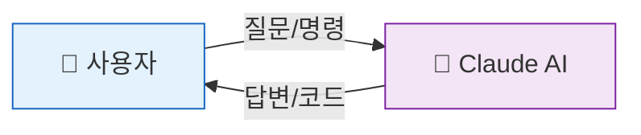
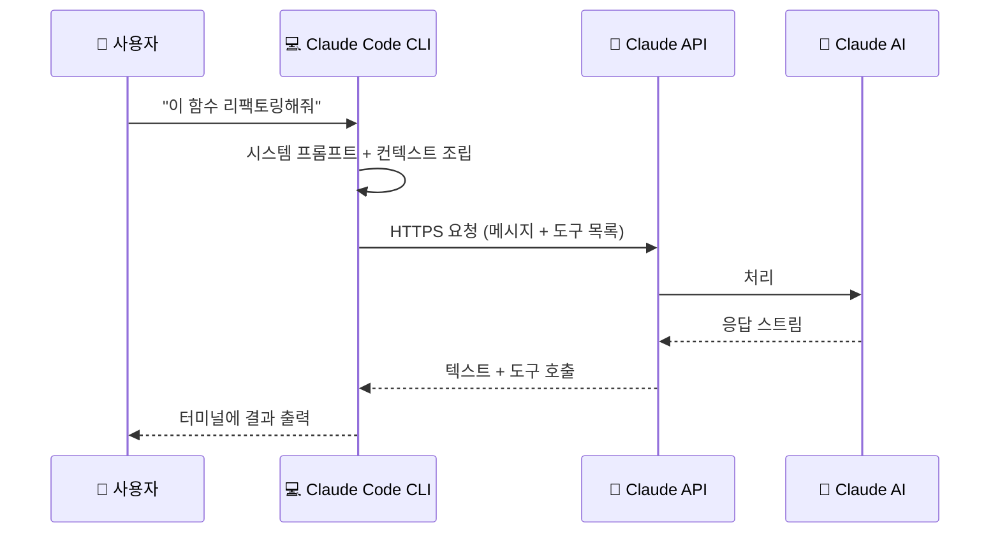
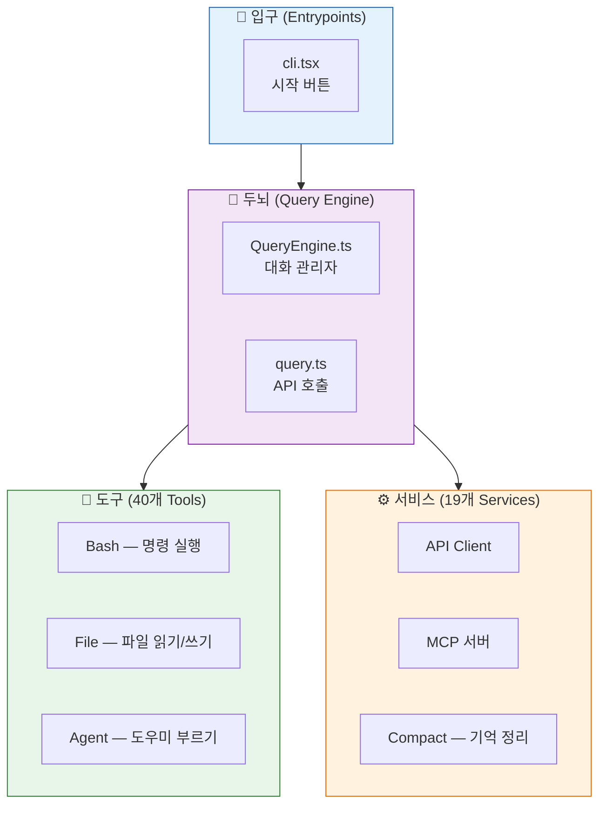
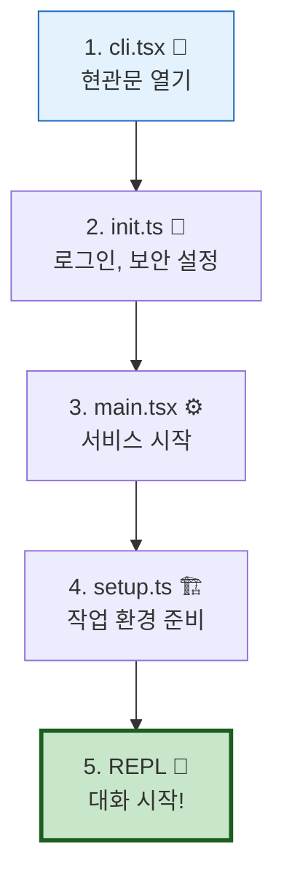
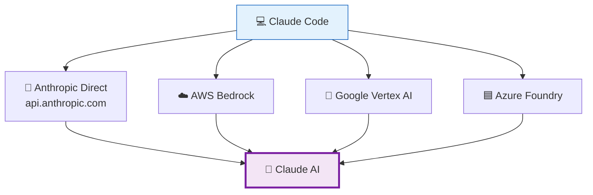

# 🤖 우리의 똑똑한 친구, Claude를 소개합니다!

> 이 장에서는 Claude Code의 두뇌인 **Claude**가 무엇인지, 초보자 눈높이에서 설명합니다.

## 🍕 Claude를 한마디로 설명하면?

여러분이 피자를 주문할 때를 생각해 보세요:

1. 메뉴판을 보고 ("페퍼로니 피자 주세요!")
2. 주방장이 만들고
3. 완성된 피자가 나옵니다

**Claude**도 비슷해요!

1. 여러분이 질문을 보내면 ("이 코드의 버그를 찾아줘!")
2. Claude가 생각하고 (AI 두뇌가 열심히 돌아가요 🧠)
3. 답변이 돌아옵니다

## 🏠 Claude Code는 Claude의 '집'이에요

**Claude**는 Anthropic이 만든 AI 모델이에요. 그런데 이 AI가 살 수 있는 '집'이 여러 채 있답니다:

| 집 이름 | 어디서 사용하나요? | 특징 |
|:--------|:----------------|:-----|
| **claude.ai** | 웹 브라우저 | 채팅처럼 대화 |
| **Claude Code (CLI)** | 터미널/명령줄 | 💻 코드를 직접 읽고 쓸 수 있음! |
| **IDE 확장** | VS Code, JetBrains | 에디터 안에서 바로 사용 |

이 프로젝트에서 분석하는 것은 바로 두 번째, **Claude Code CLI**예요!

## 🔌 Claude Code가 Claude AI와 대화하는 방법

Claude Code는 Claude AI에게 **API(에이피아이)**라는 전화선으로 말을 걸어요. 편지를 보내는 것과 비슷하죠:

여기서 중요한 건, Claude Code가 그냥 질문만 보내는 게 아니라 **아주 정교한 편지(프롬프트)**를 작성해서 보낸다는 거예요. 이건 [3장: 프롬프트 마법](./3_Prompt_Magic.md)에서 자세히 알아볼게요!

## 🧩 Claude Code의 4가지 핵심 부품

Claude Code를 레고에 비유하면, 4가지 큰 블록으로 이루어져 있어요:

| 부품 | 비유 | 실제 파일 |
|:-----|:-----|:---------|
| 🚪 입구 | 현관문을 열고 들어가는 것 | [`src/entrypoints/cli.tsx`](../src/entrypoints/cli.tsx) |
| 🧠 두뇌 | 생각하고 판단하는 머리 | [`src/QueryEngine.ts`](../src/QueryEngine.ts), [`src/query.ts`](../src/query.ts) |
| 🔧 도구 | 망치, 드라이버 같은 연장 | [`src/tools/`](../src/tools/) (184개 파일) |
| ⚙️ 서비스 | 전기, 수도 같은 인프라 | [`src/services/`](../src/services/) (130개 파일) |

## 🎬 Claude Code가 시작되는 순서

컴퓨터를 켤 때 부팅이 필요하듯, Claude Code도 순서대로 준비를 해요:

실제 코드에서 확인하고 싶다면:
- 시작점: [`src/entrypoints/cli.tsx`](../src/entrypoints/cli.tsx)
- 초기화: [`src/entrypoints/init.ts`](../src/entrypoints/init.ts)
- 메인: [`src/main.tsx`](../src/main.tsx)
- 세션 설정: [`src/setup.ts`](../src/setup.ts)

## 🌐 Claude는 혼자가 아니에요 — 4개의 API 제공자

Claude Code는 똑같은 Claude AI를 4가지 경로로 만날 수 있어요. 마치 같은 친구에게 전화, 문자, 이메일, 편지로 연락하는 것처럼요!

> 어떤 경로를 쓰든 결국 같은 Claude와 대화하는 거예요! 소스코드는 [`src/services/api/client.ts`](../src/services/api/client.ts)에서 확인할 수 있어요.

---

## 💡 엔지니어를 위한 팁

<b>펼쳐서 기술 심화 내용 보기</b>

### API 클라이언트 생성 (src/services/api/client.ts)

Claude Code는 `@anthropic-ai/sdk`, `@anthropic-ai/bedrock-sdk`, `@anthropic-ai/vertex-sdk`, `@anthropic-ai/foundry-sdk` 4개의 SDK를 사용합니다. 프로바이더 감지는 환경 변수와 설정에 따라 자동으로 이루어집니다.

### 메시지 스트리밍 (src/services/api/claude.ts)

API 호출은 항상 `stream: true`로 이루어지며, `anthropic.beta.messages.create()`를 통해 실행됩니다. 응답은 delta 이벤트로 스트리밍되어 실시간으로 터미널에 표시됩니다.

### 주요 파일 참조

| 파일 | 라인 | 내용 |
|:-----|:-----|:-----|
| [`src/services/api/client.ts`](../src/services/api/client.ts) | ~390줄 | 프로바이더 감지 및 클라이언트 생성 |
| [`src/services/api/claude.ts`](../src/services/api/claude.ts) | ~1800줄 | queryModel(), paramsFromContext() |
| [`src/services/api/withRetry.ts`](../src/services/api/withRetry.ts) | 중형 | 재시도 로직, 에러 핸들링 |

---

👉 다음 장: [**2장: 스스로 생각하는 로봇, 에이전트의 비밀**](./2_What_is_Agent.md) 🕵️
