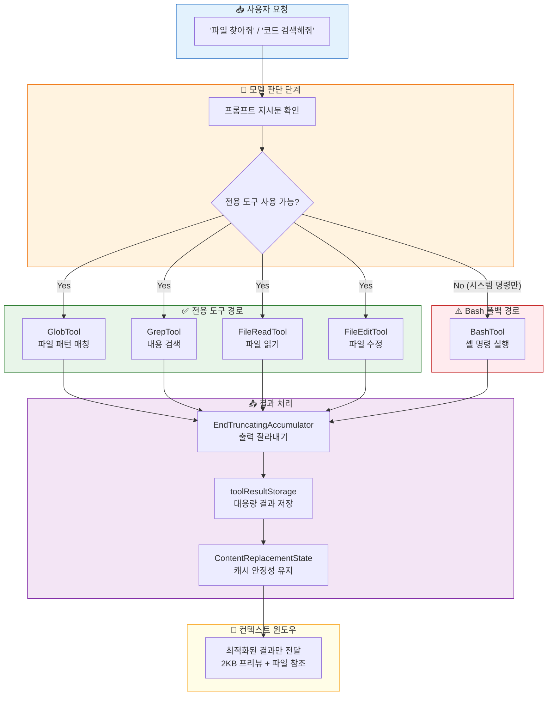
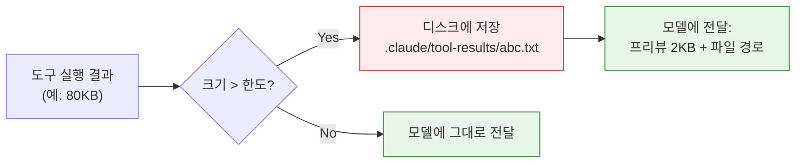
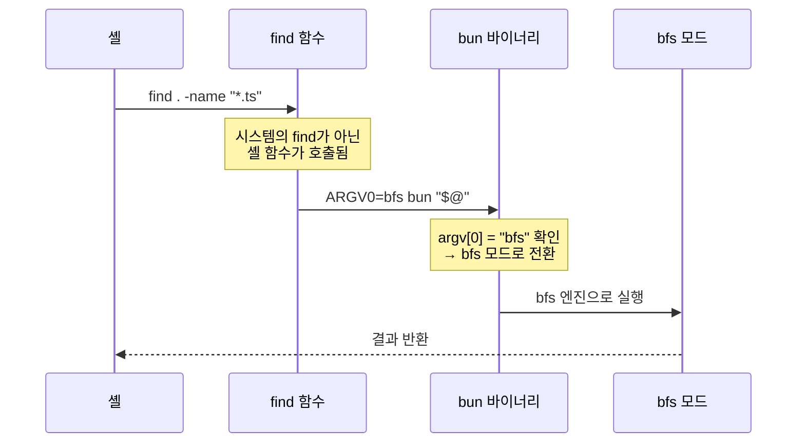
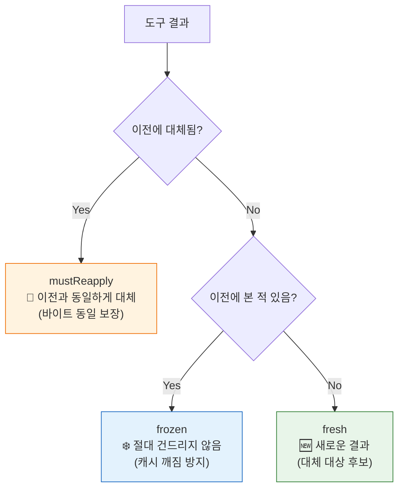
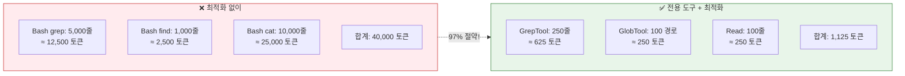
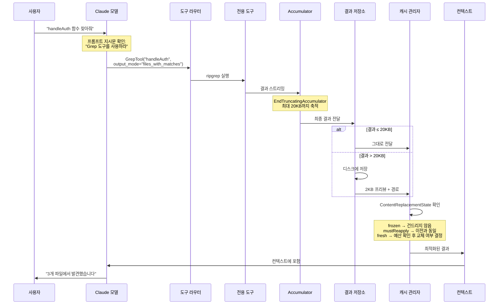

# 🖥️ 제20장: 터미널 도구의 비밀 — Claude Code가 컨텍스트를 절약하는 방법

> Claude Code는 `ls`, `grep`, `cat` 같은 터미널 명령어를 **직접 실행하지 않습니다.**
> 대신 **전용 도구(Dedicated Tools)** 를 통해 같은 작업을 수행하면서,
> 컨텍스트 윈도우를 **극적으로 절약**합니다. 이 장에서는 그 비밀을 소스코드와 함께 파헤칩니다.

---

## 🗺️ 전체 아키텍처 — 터미널 도구 처리 흐름



---

## 📋 목차

1. [왜 전용 도구를 쓰는가? — Bash 대신 쓰는 진짜 이유](#-part-1-왜-전용-도구를-쓰는가)
2. [도구별 컨텍스트 절약 전략 — Grep, Glob, Read의 비밀](#-part-2-도구별-컨텍스트-절약-전략)
3. [Bash 도구의 출력 관리 — 30KB의 벽](#-part-3-bash-도구의-출력-관리)
4. [대용량 결과 저장소 — 디스크로 내려보내는 기술](#-part-4-대용량-결과-저장소)
5. [EndTruncatingAccumulator — 시작만 살리는 잘라내기](#-part-5-endtruncatingaccumulator)
6. [임베디드 검색 도구 — ARGV0 트릭의 비밀](#-part-6-임베디드-검색-도구--argv0-트릭)
7. [캐시 안정성 — 결과를 바꾸면 안 되는 이유](#-part-7-캐시-안정성)
8. [동시 실행 — 읽기 전용 도구의 특권](#-part-8-동시-실행--읽기-전용-도구의-특권)
9. [실전 꿀팁 — 컨텍스트를 아끼는 10가지 비법](#-part-9-실전-꿀팁--컨텍스트를-아끼는-10가지-비법)

---

## ✅ PART 1: 왜 전용 도구를 쓰는가?

### 문제: Bash로 하면 왜 낭비인가?

일반적인 Bash 명령의 출력은 **제어가 어렵습니다**. 예를 들어:

```bash
# ❌ 이렇게 하면 수천 줄이 컨텍스트를 차지
grep -r "function" ./src/

# ❌ 이것도 마찬가지 — 디렉터리 전체가 출력
find . -name "*.ts" -type f
```

이 출력은 **그대로 컨텍스트 윈도우에 들어갑니다.** 파일이 1,000개면 1,000줄, 매칭이 5,000개면 5,000줄이 그대로 토큰으로 변환됩니다.

### 해결: 전용 도구는 처음부터 제한을 건다

> **파일**: [`src/tools/GrepTool/GrepTool.ts:108`](../src/tools/GrepTool/GrepTool.ts)

```typescript
// GrepTool — 기본적으로 250줄만 반환
const DEFAULT_HEAD_LIMIT = 250

// 사용자가 지정하지 않으면 자동으로 250줄 제한 적용
if (head_limit === undefined) {
  effectiveLimit = DEFAULT_HEAD_LIMIT
}
```

> **파일**: [`src/tools/GlobTool/GlobTool.ts:157`](../src/tools/GlobTool/GlobTool.ts)

```typescript
// GlobTool — 기본적으로 100개 파일만 반환
const DEFAULT_FILE_LIMIT = 100
```

**비교표: Bash vs 전용 도구**

| 항목 | Bash (`grep -r`) | GrepTool |
|:-----|:----------------|:---------|
| 기본 출력 제한 | ❌ 없음 (전부 출력) | ✅ 250줄 |
| 페이지네이션 | ❌ 불가 | ✅ `offset` + `head_limit` |
| 출력 모드 선택 | ❌ 불가 | ✅ `files_with_matches` / `content` / `count` |
| 컨텍스트 사용량 | 🔴 매칭 전부 | 🟢 필요한 만큼만 |
| 최대 결과 크기 | 30,000자 (Bash 한도) | 20,000자 (더 엄격) |

### 프롬프트에 이미 박혀있는 지시문

> **파일**: [`src/tools/BashTool/prompt.ts`](../src/tools/BashTool/prompt.ts)

Claude Code의 시스템 프롬프트에는 다음과 같은 **강력한 지시문**이 포함됩니다:

```
IMPORTANT: Avoid using this tool to run `find`, `grep`, `cat`, `head`,
`tail`, `sed`, `awk`, or `echo` commands, unless explicitly instructed.
Instead, use the appropriate dedicated tool:

 - File search: Use Glob (NOT find or ls)
 - Content search: Use Grep (NOT grep or rg)
 - Read files: Use Read (NOT cat/head/tail)
 - Edit files: Use Edit (NOT sed/awk)
 - Write files: Use Write (NOT echo >/cat <<EOF)
```

이 지시문 덕분에 모델은 **자연스럽게 전용 도구를 선택**합니다. Bash는 오직 `npm install`, `git status`, `docker build` 같은 **시스템 명령에만** 사용됩니다.

---

## 🔍 PART 2: 도구별 컨텍스트 절약 전략

### GrepTool — 검색의 왕

> **파일**: [`src/tools/GrepTool/GrepTool.ts`](../src/tools/GrepTool/GrepTool.ts)

#### 핵심 전략 1: 3가지 출력 모드

```typescript
// output_mode에 따라 반환하는 정보량이 완전히 다름
type OutputMode =
  | "files_with_matches"  // 파일 경로만 (가장 절약!)
  | "content"             // 매칭 줄 + 컨텍스트
  | "count"               // 매칭 수만 (가장 극단적 절약!)
```

**`files_with_matches`**(기본값)를 쓰면:
- `grep -r "function" ./src/` → 5,000줄 매칭 내용 전부
- `GrepTool("function", output_mode="files_with_matches")` → 50개 파일 경로만

**토큰 절약 효과**: 약 **95~99%** 절약!

#### 핵심 전략 2: 페이지네이션

```typescript
// offset과 head_limit로 정밀 제어
function applyHeadLimit(
  lines: string[],
  headLimit: number,
  offset: number
): { result: string[]; truncated: boolean } {
  const sliced = lines.slice(offset, offset + headLimit)
  return {
    result: sliced,
    truncated: sliced.length < lines.length - offset
  }
}
```

처음 검색할 때 250줄만 가져오고, 더 필요하면 `offset: 250`으로 다음 페이지를 요청합니다. **모든 결과를 한번에 가져오지 않는 것이 핵심입니다.**

#### 핵심 전략 3: maxResultSizeChars = 20,000

```typescript
// GrepTool의 최대 결과 크기
maxResultSizeChars: 20_000  // 20KB
```

Bash(30KB)보다 **33% 더 엄격한** 한도를 둡니다. 이 한도를 넘으면 결과가 디스크에 저장되고, 모델에는 2KB 프리뷰만 전달됩니다.

---

### GlobTool — 파일 찾기의 비밀

> **파일**: [`src/tools/GlobTool/GlobTool.ts`](../src/tools/GlobTool/GlobTool.ts)

#### 핵심 전략: 상대 경로로 토큰 절약

```typescript
// 절대 경로 대신 상대 경로를 반환하여 토큰 절약
results = results.map(file => path.relative(cwd, file))
```

**비교:**
```
❌ /Users/smarthome/Documents/workspace/project/src/utils/api.ts     (56자)
✅ src/utils/api.ts                                                   (16자)
```

파일 100개면 **4,000자**(약 1,000토큰)를 아낍니다!

#### 수정 시간순 정렬

```typescript
// 최근 수정된 파일이 먼저 → 가장 관련성 높은 파일이 상위에
results.sort((a, b) => b.mtime - a.mtime)
```

100개 제한에 걸려 잘리더라도, **가장 최근 수정된 파일이 살아남습니다.**

---

### FileReadTool — 읽기의 정밀함

> **파일**: [`src/tools/FileReadTool/FileReadTool.ts`](../src/tools/FileReadTool/FileReadTool.ts)

#### 핵심 전략: 부분 읽기 (offset + limit)

```typescript
// 파일 전체를 읽지 않고 필요한 부분만
interface ReadParams {
  file_path: string
  offset?: number   // 시작 줄 번호
  limit?: number    // 읽을 줄 수 (기본 2000줄)
}
```

10,000줄짜리 파일에서 100번째~200번째 줄만 필요하다면:
- `cat file.ts` → 10,000줄 전부 (❌)
- `Read(file.ts, offset=100, limit=100)` → 100줄만 (✅)

#### 특이한 설계: maxResultSizeChars = Infinity

```typescript
maxResultSizeChars: Infinity  // 절대로 디스크에 저장하지 않음
```

왜일까요? FileReadTool이 디스크에 결과를 저장하면, 그 결과를 다시 읽으려고 `Read`를 호출하고... **무한 루프**가 발생하기 때문입니다! 대신 도구 자체 내부에서 줄 수 제한을 걸어 스스로 크기를 관리합니다.

---

## 🔧 PART 3: Bash 도구의 출력 관리

> **파일**: [`src/tools/BashTool/BashTool.tsx`](../src/tools/BashTool/BashTool.tsx)

### 30KB의 벽 — 왜 이 숫자인가?

```typescript
// 기본 최대 출력: 30,000자
maxResultSizeChars: 30_000

// 환경변수로 최대 150,000까지 늘릴 수 있지만...
const BASH_MAX_OUTPUT_LENGTH = Math.min(
  parseInt(process.env.BASH_MAX_OUTPUT_LENGTH || '30000'),
  150_000
)
```

**30KB ≈ 7,500 토큰.** Claude의 컨텍스트 윈도우(200K 토큰)의 약 3.75%입니다. 이 정도면 하나의 명령 결과로 적당합니다.

### 명령어 분류 시스템

> **파일**: [`src/tools/BashTool/commandSemantics.ts`](../src/tools/BashTool/commandSemantics.ts)

Claude Code는 Bash 명령어를 **의미론적으로 분류**합니다:

```typescript
// 종료 코드의 의미가 명령어마다 다르다!
const COMMAND_EXIT_CODE_SEMANTICS: Record<string, ExitCodeSemantics> = {
  // grep: exit 1 = "매칭 없음" (에러가 아님!)
  grep:  { errorThreshold: 2, meaning: "exit 1 = no matches" },
  rg:    { errorThreshold: 2, meaning: "exit 1 = no matches" },

  // diff: exit 1 = "파일이 다름" (에러가 아님!)
  diff:  { errorThreshold: 2, meaning: "exit 1 = files differ" },

  // test: exit 1 = "조건 거짓" (에러가 아님!)
  test:  { errorThreshold: 2, meaning: "exit 1 = condition false" },
  '[':   { errorThreshold: 2, meaning: "exit 1 = condition false" },

  // find: exit 1 = "일부 디렉터리 접근 불가" (에러가 아님!)
  find:  { errorThreshold: 2, meaning: "exit 1 = some dirs inaccessible" },
}
```

왜 이게 중요할까요? `grep`으로 검색했는데 매칭이 없으면 `exit 1`이 나옵니다. 일반적으로 exit 1은 "에러"이지만, grep에서는 "결과 없음"입니다. Claude Code는 이 차이를 알고 있어서 **불필요한 에러 메시지로 컨텍스트를 낭비하지 않습니다.**

### 읽기 전용 판별

```typescript
// 명령어가 읽기 전용인지 판별
isReadOnly(input) {
  const compoundCommandHasCd = commandHasAnyCd(input.command)
  const result = checkReadOnlyConstraints(input, compoundCommandHasCd)
  return result.behavior === 'allow'
}
```

읽기 전용 명령은 **권한 확인 없이 바로 실행**됩니다. 이것 자체가 컨텍스트 절약인데, 매번 "이 명령을 실행해도 될까요?"라는 확인 과정이 생략되기 때문입니다.

---

## 💾 PART 4: 대용량 결과 저장소

> **파일**: [`src/utils/toolResultStorage.ts`](../src/utils/toolResultStorage.ts)

### 작동 원리: "디스크에 내려보내기"

도구 결과가 한도를 넘으면, 전체 결과를 **디스크에 저장**하고 모델에는 **프리뷰만 전달**합니다.



### 임계값 결정 로직

```typescript
export function getPersistenceThreshold(
  toolName: string,
  declaredMaxResultSizeChars: number,
): number {
  // 1. Infinity면 절대 저장하지 않음 (FileReadTool)
  if (!Number.isFinite(declaredMaxResultSizeChars)) {
    return declaredMaxResultSizeChars
  }

  // 2. GrowthBook A/B 테스트로 동적 오버라이드 가능
  const overrides = getFeatureValue_CACHED_MAY_BE_STALE(
    'tengu_satin_quoll', {}
  )
  const override = overrides?.[toolName]
  if (typeof override === 'number' && override > 0) {
    return override
  }

  // 3. 기본값: 도구 선언값과 글로벌 기본값(50KB) 중 작은 값
  return Math.min(declaredMaxResultSizeChars, DEFAULT_MAX_RESULT_SIZE_CHARS)
}
```

### 저장된 결과 형식

```xml
<persisted-output>
Output too large (82,431 chars). Full output saved to:
/Users/user/.claude/tool-results/abc123.txt

Preview (first 2KB):
[처음 2,000바이트의 내용...]
...
</persisted-output>
```

모델은 이 프리뷰를 보고 **필요하면 `Read` 도구로 저장된 파일을 다시 읽습니다.** 하지만 대부분의 경우 프리뷰만으로 충분합니다!

### 도구별 한도 총정리

| 도구 | maxResultSizeChars | 초과 시 행동 |
|:-----|:------------------:|:-----------|
| **BashTool** | 30,000 (30KB) | 디스크 저장 + 2KB 프리뷰 |
| **GrepTool** | 20,000 (20KB) | 디스크 저장 + 2KB 프리뷰 |
| **GlobTool** | 100,000 (100KB) | 디스크 저장 + 2KB 프리뷰 |
| **FileReadTool** | ∞ (Infinity) | 자체 줄 수 제한으로 관리 |
| **FileEditTool** | 50,000 (50KB) | 디스크 저장 + 2KB 프리뷰 |
| **글로벌 기본값** | 50,000 (50KB) | — |

### 메시지당 총량 예산

```typescript
// 하나의 메시지에서 모든 도구 결과의 합계 한도
MAX_TOOL_RESULTS_PER_MESSAGE_CHARS = 200_000  // 200KB
```

병렬로 10개 도구를 실행해도 **총합 200KB**를 넘지 않습니다. 넘으면 **가장 큰 결과부터** 디스크에 내려보냅니다.

---

## ✂️ PART 5: EndTruncatingAccumulator

> **파일**: [`src/utils/stringUtils.ts:140-220`](../src/utils/stringUtils.ts)

### "시작만 살려라" — 끝에서 자르는 전략

Bash 명령의 출력이 엄청나게 길 때, Claude Code는 **처음 부분을 보존**하고 **끝 부분을 잘라냅니다.**

```typescript
export class EndTruncatingAccumulator {
  private content: string = ''
  private isTruncated = false
  private totalBytesReceived = 0

  constructor(private readonly maxSize: number = MAX_STRING_LENGTH) {}

  append(data: string | Buffer): void {
    const str = typeof data === 'string' ? data : data.toString()
    this.totalBytesReceived += str.length

    // 이미 잘렸고 용량이 가득 찼으면 → 새 데이터 무시
    if (this.isTruncated && this.content.length >= this.maxSize) {
      return  // 🔑 CPU도 절약!
    }

    // 한도를 넘으면 남은 공간만큼만 저장
    if (this.content.length + str.length > this.maxSize) {
      const remainingSpace = this.maxSize - this.content.length
      if (remainingSpace > 0) {
        this.content += str.slice(0, remainingSpace)
      }
      this.isTruncated = true
    } else {
      this.content += str
    }
  }

  toString(): string {
    if (!this.isTruncated) return this.content

    const truncatedBytes = this.totalBytesReceived - this.maxSize
    const truncatedKB = Math.round(truncatedBytes / 1024)
    return this.content +
      `\n... [output truncated - ${truncatedKB}KB removed]`
  }
}
```

### 왜 "끝"을 자르는가?

대부분의 명령 출력에서 **핵심 정보는 처음에** 있습니다:
- `npm install` → 설치된 패키지 목록은 처음에, 진행 바는 끝에
- `git log` → 최신 커밋이 처음에
- `ls -la` → 파일 목록은 처음에, 총 크기 요약은 끝에

반대로 **끝에서 자르면 손실되는 정보가 적습니다.**

```
📊 예시: npm install 출력 (150KB)

처음 30KB: 패키지 해석, 의존성 트리 (✅ 보존)
  ↕
끝 120KB: 다운로드 진행률, 감사 경고 (❌ 잘려도 OK)

→ "... [output truncated - 120KB removed]"
```

---

## 🔮 PART 6: 임베디드 검색 도구 — ARGV0 트릭

> **파일**: [`src/utils/bash/ShellSnapshot.ts:27-59`](../src/utils/bash/ShellSnapshot.ts)
> **파일**: [`src/utils/embeddedTools.ts`](../src/utils/embeddedTools.ts)

### 배경: 왜 별도 바이너리 없이 작동하는가?

Claude Code의 **Anthropic 내부 빌드(ant 빌드)** 에서는 `bun` 바이너리 안에 검색 도구가 **내장(embedded)** 되어 있습니다:
- `find` → **bfs** (Breadth-First Search 기반 find)
- `grep` → **ugrep** (Ultra-fast grep)

### ARGV0 트릭의 원리

Unix에서 프로그램은 `argv[0]`(자기 이름)을 보고 **어떤 모드로 실행할지** 결정할 수 있습니다. 이를 이용한 트릭:

```typescript
function createArgv0ShellFunction(
  funcName: string,   // "find" 또는 "grep"
  argv0: string,      // "bfs" 또는 "ugrep"
  binaryPath: string, // bun 바이너리 경로
): string {
  return [
    `function ${funcName} {`,
    '  if [[ -n $ZSH_VERSION ]]; then',
    //   zsh: ARGV0 환경변수로 이름 속이기
    `    ARGV0=${argv0} ${binaryPath} "$@"`,
    '  elif [[ $BASHPID != $$ ]]; then',
    //   Bash 서브셸: exec -a로 이름 바꿔 실행
    `    exec -a ${argv0} ${binaryPath} "$@"`,
    '  else',
    //   Bash 메인셸: 서브셸로 감싸서 실행
    `    (exec -a ${argv0} ${binaryPath} "$@")`,
    '  fi',
    '}',
  ].join('\n')
}
```

**작동 흐름:**



### 전용 도구와의 관계

```typescript
// src/tools.ts — 임베디드 도구가 있으면 GlobTool/GrepTool 제거
export function getAllBaseTools() {
  return [
    // ...
    ...(hasEmbeddedSearchTools() ? [] : [GlobTool, GrepTool]),
    // ...
  ]
}
```

임베디드 빌드에서는:
- `GlobTool`, `GrepTool`이 **도구 목록에서 사라짐**
- 대신 Bash에서 `find`/`grep` 실행 시 **bfs/ugrep이 자동으로 사용됨**
- 시스템 프롬프트에서 "find/grep 쓰지 마"라는 지시문도 **제거됨**

**일반 빌드(CLI/SDK)** 에서는:
- `GlobTool`, `GrepTool`이 **도구 목록에 포함**
- "find/grep 대신 전용 도구를 써라"는 프롬프트가 **활성화**

---

## 🔒 PART 7: 캐시 안정성

> **파일**: [`src/utils/toolResultStorage.ts:367-435`](../src/utils/toolResultStorage.ts)

### 왜 결과를 바꾸면 안 되는가?

Claude API에는 **프롬프트 캐시**가 있습니다. 이전에 보낸 메시지와 **바이트 단위로 동일**하면 캐시 히트가 발생하여 비용과 지연이 대폭 줄어듭니다.

문제는 **도구 결과도 메시지의 일부**라는 것입니다. 만약 이전 턴의 도구 결과를 갑자기 디스크 저장 버전으로 바꾸면, **캐시가 깨집니다.**

### ContentReplacementState — 3가지 분류

```typescript
export type ContentReplacementState = {
  seenIds: Set<string>                  // 이전에 본 ID들
  replacements: Map<string, string>     // 이미 대체된 ID → 대체 문자열
}
```

모든 도구 결과를 3가지로 분류합니다:



### 교체 전략: "가장 큰 것부터"

```typescript
function selectFreshToReplace(
  fresh: ToolResultCandidate[],
  frozenSize: number,
  limit: number,
): ToolResultCandidate[] {
  // 크기 내림차순 정렬
  const sorted = [...fresh].sort((a, b) => b.size - a.size)
  const selected = []
  let remaining = frozenSize + fresh.reduce((sum, c) => sum + c.size, 0)

  for (const c of sorted) {
    if (remaining <= limit) break  // 예산 이내면 중단
    selected.push(c)
    remaining -= c.size
  }
  return selected
}
```

**효과**: 가장 큰 결과를 교체하면 **최소한의 교체로 최대한의 공간**을 확보합니다.

---

## ⚡ PART 8: 동시 실행 — 읽기 전용 도구의 특권

> **파일**: [`src/services/tools/toolOrchestration.ts`](../src/services/tools/toolOrchestration.ts)

### 읽기 전용 도구는 병렬 실행

```typescript
// 최대 10개까지 동시 실행
const MAX_CONCURRENT = parseInt(
  process.env.CLAUDE_CODE_MAX_TOOL_USE_CONCURRENCY || '10'
)

// 도구 호출을 배치로 분할
// - 읽기 전용(isConcurrencySafe=true) → 동시 실행
// - 쓰기(isConcurrencySafe=false) → 순차 실행
```

**GrepTool, GlobTool, FileReadTool**은 모두 읽기 전용이므로:

```mermaid
gantt
    title 도구 실행 타임라인
    dateFormat X
    axisFormat %s초

    section 병렬 (실제)
    GrepTool("function")     :a1, 0, 2
    GlobTool("**/*.ts")      :a2, 0, 1
    Read("src/index.ts")     :a3, 0, 1

    section 순차 (만약 병렬 아니면)
    GrepTool("function")     :b1, 0, 2
    GlobTool("**/*.ts")      :b2, 2, 3
    Read("src/index.ts")     :b3, 3, 4
```



**병렬 실행은 시간뿐 아니라 컨텍스트도 절약합니다.** 3개 도구가 하나의 턴에서 실행되므로, 모델이 "결과를 기다리며 중간 응답을 생성하는" 낭비가 없습니다.

---

## 🏆 PART 9: 실전 꿀팁 — 컨텍스트를 아끼는 10가지 비법

### 비법 #1: `files_with_matches` 먼저, `content`는 나중에

```
🟢 좋은 패턴:
1단계: GrepTool("handleAuth", output_mode="files_with_matches")
       → 3개 파일 확인 (토큰 50개)
2단계: Read("src/auth/handler.ts", offset=100, limit=50)
       → 필요한 부분만 읽기 (토큰 500개)

🔴 나쁜 패턴:
1단계: GrepTool("handleAuth", output_mode="content", -C=10)
       → 100개 매칭 × 21줄 = 2,100줄 (토큰 5,000개)
```

**절약 효과: 약 90%**

### 비법 #2: Glob 패턴은 구체적으로

```
🟢 GlobTool("src/components/**/*.tsx")    → 20개 결과
🔴 GlobTool("**/*.tsx")                   → 500개 결과
```

### 비법 #3: Bash는 시스템 명령에만

```
🟢 Bash: "npm test", "git status", "docker build ."
🔴 Bash: "grep -r 'function'", "find . -name '*.ts'", "cat README.md"
```

### 비법 #4: Read의 offset/limit 활용

```
🟢 Read("big_file.ts", offset=500, limit=100)   → 100줄
🔴 Read("big_file.ts")                           → 2,000줄 (기본값)
```

### 비법 #5: count 모드로 규모 파악 먼저

```
🟢 "TODO가 몇 개나 있지?"
   GrepTool("TODO", output_mode="count")
   → "src/: 15, tests/: 3" (토큰 10개)

🔴 GrepTool("TODO", output_mode="content")
   → 18개 매칭의 전체 내용 (토큰 500개)
```

### 비법 #6: 타입 필터로 범위 좁히기

```
🟢 GrepTool("interface User", type="ts")           → .ts 파일만
🟢 GrepTool("def train", glob="models/**/*.py")    → models/ 하위 .py만
```

### 비법 #7: 병렬 도구 호출 활용

모델이 여러 정보를 동시에 필요로 할 때, **한 턴에 여러 도구를 병렬 호출**합니다:

```
한 턴에 동시 실행:
  ├── GrepTool("handleAuth")
  ├── GlobTool("src/auth/**")
  └── Read("src/config.ts")
```

이러면 3턴이 아니라 **1턴**으로 끝나서 컨텍스트 절약!

### 비법 #8: Agent 도구로 탐색 위임

복잡한 탐색이 필요하면 **서브에이전트에게 위임**합니다. 서브에이전트는 별도의 컨텍스트 윈도우에서 작동하므로, 탐색 과정의 중간 결과가 **메인 컨텍스트를 오염시키지 않습니다.**

```
🟢 Agent(subagent_type="Explore", "프로젝트의 인증 흐름을 분석해줘")
   → 서브에이전트가 10번 검색하고 요약만 반환 (토큰 200개)

🔴 직접 10번 검색
   → 10개 결과가 전부 메인 컨텍스트에 축적 (토큰 5,000개)
```

### 비법 #9: 빈 줄 제거

> **파일**: [`src/tools/BashTool/BashTool.tsx`](../src/tools/BashTool/BashTool.tsx)

```typescript
// Bash 출력에서 빈 줄을 자동 제거
output = stripEmptyLines(output)
```

작아 보이지만, 빈 줄이 많은 명령 출력(예: `npm install`)에서 **10-20% 토큰을 절약**합니다.

### 비법 #10: 진행 상황은 컨텍스트 밖에서

```typescript
// 2초 이상 걸리는 명령은 진행 상황을 UI에만 표시
const PROGRESS_THRESHOLD_MS = 2000

onProgress({
  stdout: currentOutput,
  elapsedTime: elapsed,
  totalLines: lineCount,
  totalBytes: byteCount,
})
```

진행 상황(몇 줄 출력됨, 몇 초 걸림)은 **UI에만 표시**되고 컨텍스트에는 들어가지 않습니다. 최종 결과만 컨텍스트에 포함됩니다.

---

## 📊 종합 비교: 컨텍스트 사용량



---

## 🔗 전체 처리 파이프라인 요약



---

## 📁 관련 소스코드 위치 정리

| 구성 요소 | 파일 경로 | 핵심 함수/클래스 |
|:---------|:---------|:---------------|
| 도구 등록 | `src/tools.ts` | `getAllBaseTools()`, `getTools()` |
| Bash 실행 | `src/tools/BashTool/BashTool.tsx` | `runShellCommand()`, `isReadOnly()` |
| Bash 프롬프트 | `src/tools/BashTool/prompt.ts` | 전용 도구 사용 지시문 |
| 명령 분류 | `src/tools/BashTool/commandSemantics.ts` | `COMMAND_EXIT_CODE_SEMANTICS` |
| Grep 도구 | `src/tools/GrepTool/GrepTool.ts` | `applyHeadLimit()`, `maxResultSizeChars` |
| Grep 프롬프트 | `src/tools/GrepTool/prompt.ts` | 출력 모드 설명 |
| Glob 도구 | `src/tools/GlobTool/GlobTool.ts` | 100개 기본 제한, 상대 경로 변환 |
| 파일 읽기 | `src/tools/FileReadTool/FileReadTool.ts` | offset/limit 부분 읽기 |
| 출력 잘라내기 | `src/utils/stringUtils.ts:140-220` | `EndTruncatingAccumulator` |
| 결과 저장 | `src/utils/toolResultStorage.ts` | `maybePersistLargeToolResult()` |
| 캐시 안정성 | `src/utils/toolResultStorage.ts:367-435` | `ContentReplacementState` |
| 임베디드 도구 | `src/utils/embeddedTools.ts` | `hasEmbeddedSearchTools()` |
| ARGV0 트릭 | `src/utils/bash/ShellSnapshot.ts:27-59` | `createArgv0ShellFunction()` |
| 동시 실행 | `src/services/tools/toolOrchestration.ts` | `isConcurrencySafe()` 기반 배치 분할 |
| 도구 실행 | `src/services/tools/toolExecution.ts` | `runToolUse()`, `processToolResultBlock()` |
| 한도 상수 | `src/constants/toolLimits.ts` | `DEFAULT_MAX_RESULT_SIZE_CHARS` 등 |

---

## 🎯 핵심 교훈

> **Claude Code의 컨텍스트 관리 철학은 단순합니다:**
>
> 1. **필요한 만큼만** — 전용 도구로 정밀하게 요청
> 2. **넘치면 내려보내** — 디스크 저장 + 프리뷰
> 3. **캐시를 깨지 마** — 이전 결과는 절대 변경하지 않음
> 4. **병렬로 모아서** — 한 턴에 여러 도구를 동시에
> 5. **시작만 살려** — 끝에서 잘라서 핵심 보존

이 5가지 원칙이 **40,000 토큰을 1,125 토큰으로** 줄이는 마법의 비밀입니다.

---

> 📖 **이전 장**: [제19장: Anthropic만의 비법 26가지](./19_Anthropic_Secrets.md)
> 📖 **목차로 돌아가기**: [튜토리얼 README](./README.md)
