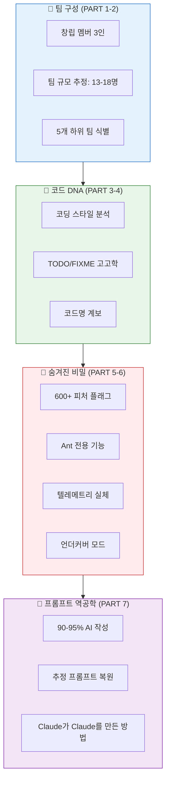
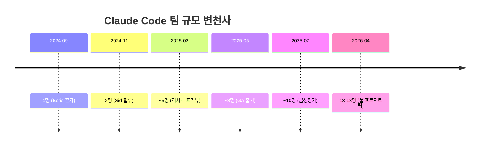
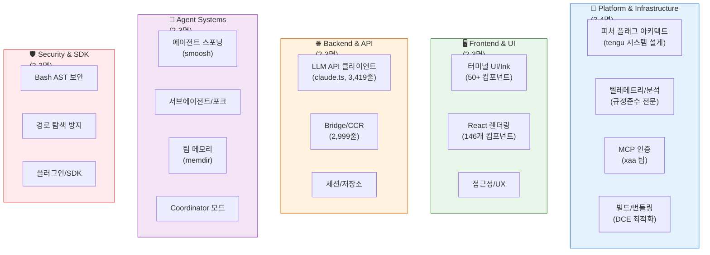
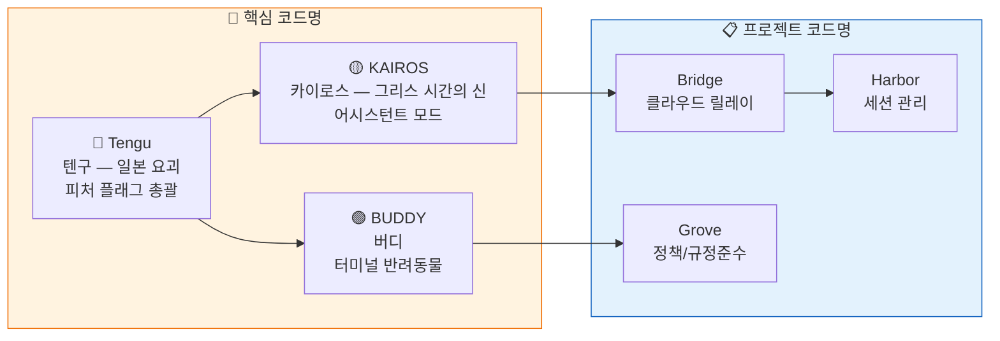
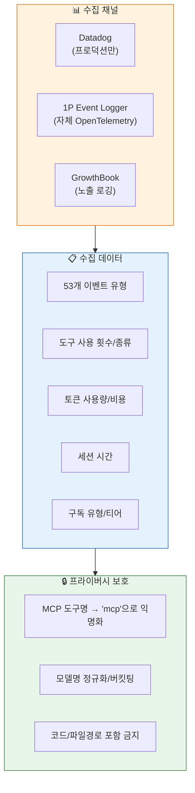
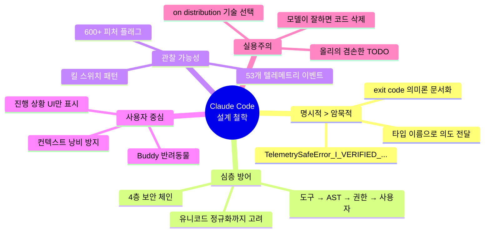
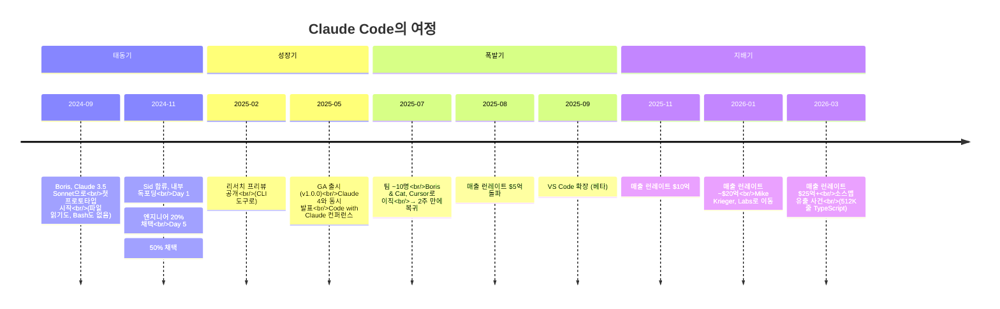

# 🕵️ 제21장: Claude Code 팀 역공학 — 소스코드로 읽는 사람들의 이야기

> 512,664줄의 소스코드에는 **코드만 있는 것이 아닙니다.**
> 코드 스타일, 주석, 코드명, 커밋 패턴, 기능 플래그에는 **그것을 만든 사람들의 지문**이 남아 있습니다.
> 이 장에서는 소스코드와 공개 정보를 교차 분석하여, Claude Code를 만든 팀의 구성과 성향,
> 그리고 그들이 **감추고 싶었던 비밀**까지 역공학합니다.

---

## 🗺️ 전체 분석 지도



---

## 📋 목차

1. [창립 멤버들 — 세 사람의 이야기](#-part-1-창립-멤버들--세-사람의-이야기)
2. [팀 구성 역공학 — 5개 팀, 13-18명](#-part-2-팀-구성-역공학--5개-팀-13-18명)
3. [코드에 남은 지문 — TODO 고고학](#-part-3-코드에-남은-지문--todo-고고학)
4. [코드명의 계보 — Tengu부터 Buddy까지](#-part-4-코드명의-계보--tengu부터-buddy까지)
5. [팀이 감추고 싶었던 비밀 7가지](#-part-5-팀이-감추고-싶었던-비밀-7가지)
6. [텔레메트리의 실체 — 무엇을 수집하는가](#-part-6-텔레메트리의-실체--무엇을-수집하는가)
7. [프롬프트 역공학 — Claude가 Claude를 만든 방법](#-part-7-프롬프트-역공학--claude가-claude를-만든-방법)
8. [팀의 설계 철학과 가치관](#-part-8-팀의-설계-철학과-가치관)
9. [타임라인 — 1인 프로토타입에서 25억 달러까지](#-part-9-타임라인--1인-프로토타입에서-25억-달러까지)

---

## 👥 PART 1: 창립 멤버들 — 세 사람의 이야기

### Boris Cherny — 창시자이자 아키텍트

| 항목 | 내용 |
|:-----|:-----|
| **이전 경력** | Meta/Instagram **Principal Software Engineer (IC8)**, 약 7년 근무 |
| **저서** | O'Reilly *Programming TypeScript* 저자 |
| **Anthropic 합류** | 2024년 9월 |
| **역할** | Claude Code 최초 프로토타입을 **혼자서** 구축 |
| **특이 사항** | 2025년 7월 Cursor(Anysphere)로 이직 → **2주 만에 Anthropic 복귀** |

> Boris가 TypeScript를 선택한 이유는 단순합니다. 그의 저서 주제이기도 하지만,
> **Claude가 TypeScript를 가장 잘 쓰기 때문**입니다.
> "Claude가 이미 잘 아는 기술 스택을 골랐다(on distribution)" — Boris Cherny

**소스코드에서 발견되는 Boris의 흔적:**
- TypeScript의 고급 기능(조건부 타입, 유틸리티 타입)의 적극적 사용
- React + Ink 터미널 UI 선택 (Meta 출신답게 React 생태계에 정통)
- 50개 이상의 Ink 컴포넌트, Yoga 레이아웃 엔진 통합

---

### Siddharth (Sid) Bidasaria — 2번째 엔지니어이자 테크 리드

| 항목 | 내용 |
|:-----|:-----|
| **이전 경력** | Robinhood, Rubrik, Harness |
| **Anthropic 합류** | 2024년 11월 |
| **역할** | 서브에이전트(Sub-agent) 시스템 설계자 |
| **특이 사항** | 내부 도구로 방치된 프로토타입을 발견하고 본격적으로 발전시킨 인물 |

> Sid는 Boris가 만든 프로토타입을 발견하고 "이건 진짜 제품이 될 수 있다"고 판단한 사람입니다.
> MLOps Community 팟캐스트에서 Claude Code의 탄생 스토리와 SDK에 대해 발표했습니다.

**소스코드에서 발견되는 Sid의 흔적:**
- `src/tools/AgentTool/` — 서브에이전트 포크 시스템
- `src/services/tools/toolOrchestration.ts` — 동시 실행 관리
- `TODO(smoosh)` 주석 — 에이전트 메시지 합치기(smooshing) 로직

---

### Cat (Catherine) Wu — 창립 프로덕트 매니저

| 항목 | 내용 |
|:-----|:-----|
| **이전 경력** | Index Ventures 파트너, Dagster Labs EM, Scale AI |
| **역할** | Claude Code 프로덕트 전략 수립 |
| **특이 사항** | Boris와 함께 Cursor로 이직 → **함께 2주 만에 복귀** |

> Cat은 "터미널 우선(terminal-first)" 접근을 제안한 것으로 알려져 있습니다.
> AI 에이전트의 컴퓨터 사용 능력을 연구한 배경이 제품 방향에 큰 영향을 주었습니다.

---

### Mike Krieger — 초기 감독자 (CPO)

| 항목 | 내용 |
|:-----|:-----|
| **이전 경력** | **Instagram 공동 창업자** |
| **Anthropic 합류** | 2024년 5월, CPO로 |
| **역할** | Claude Code를 포함한 프로덕트 엔지니어링 전반 감독 |
| **특이 사항** | 2026년 1월, Labs 공동 리드로 역할 전환 (Ami Vora가 제품 리더십 인수) |

> "Claude가 이제 Claude를 쓰고 있다(Claude is now writing Claude)" — Mike Krieger

---

## 🏗️ PART 2: 팀 구성 역공학 — 5개 팀, 13-18명

### 팀 성장 타임라인



### 5개 하위 팀 추정

소스코드의 **모듈 경계**, **코딩 스타일 차이**, **TODO 주석의 이름 패턴**을 분석하여 5개 팀을 식별했습니다.



### 팀 식별 근거

| 팀 | 핵심 증거 | 담당 파일 (LOC) |
|:---|:---------|:--------------|
| **Platform** | `tengu_*` 600+ 플래그, GrowthBook 통합 332줄, Datadog 연동 | `growthbook.ts`, `datadog.ts`, `sink.ts` |
| **Frontend** | Ink 50+ 파일, Yoga 레이아웃, 더블 버퍼링 | `src/ink/`, `src/components/` |
| **Backend** | API 클라이언트 3,419줄, Bridge 2,999줄, 세션 5,105줄 | `claude.ts`, `bridgeMain.ts`, `sessionStorage.ts` |
| **Agent** | `TODO(smoosh)`, 에이전트 포크, 메시지 스무싱 5,512줄 | `AgentTool/`, `messages.ts`, `memdir/` |
| **Security** | Bash AST 파서 4,436줄, 유니코드 정규화 공격 방어 | `bashParser.ts`, `bashPermissions.ts` |

---

## 🔍 PART 3: 코드에 남은 지문 — TODO 고고학

소스코드의 TODO/FIXME 주석은 **개발자의 이름, 고민, 그리고 미완성 약속**을 담고 있습니다.

### 식별된 개발자 코드네임

| 코드네임 | 발견 위치 | 추정 전문 분야 | 주석 특징 |
|:---------|:---------|:-------------|:---------|
| **xaa** | `src/services/mcp/auth.ts` | OAuth/인증, 엔터프라이즈 | RFC 인용, "TODO(xaa-ga)" — GA 전 블로커 추적 |
| **ollie** | `src/services/mcp/client.ts:589` | MCP 프로토콜, 성능 | 자기 질문형: "im not sure it really improves performance" |
| **smoosh** | `src/tools/AgentTool/forkSubagent.ts:154` | 에이전트 시스템, 메시지 포맷 | 함수명에 'smoosh' 반복 사용 |
| **vadimdemedes** | `src/ink/events/input-event.ts` | 터미널 UI | Ink.js 오픈소스 메인테이너 (Vadim Demedes) |

### TODO에서 읽는 팀 문화

```typescript
// ollie — 자기 결정에 의문을 품는 겸손한 엔지니어
// src/services/mcp/client.ts:589
// TODO (ollie): The memoization here increases complexity by a lot.
// im not sure it really improves performance

// xaa — GA 출시 전 해결해야 할 블로커를 체계적으로 관리
// src/services/mcp/auth.ts
// TODO(xaa-ga): cross-process lockfile before GA

// smoosh — 에이전트 메시지를 "뭉개는" 작업의 주인
// src/tools/AgentTool/forkSubagent.ts:154
// TODO(smoosh): handle agent fork cleanup
```

> **분석**: `ollie`의 주석은 특히 흥미롭습니다. "성능이 정말 좋아지는지 잘 모르겠다"는 주석은
> **성능 최적화에 회의적이면서도 복잡한 구현을 유지하는** 실용주의적 엔지니어의 모습을 보여줍니다.

---

## 🎭 PART 4: 코드명의 계보 — Tengu부터 Buddy까지

### Tier 1: 핵심 시스템 코드명



### Tier 2: 자연 테마 피처 플래그

Claude Code 팀은 **자연물 + 동물** 조합으로 피처 플래그 이름을 짓습니다:

| 시리즈 | 플래그 예시 | 추정 의미 |
|:-------|:----------|:---------|
| **Amber (호박)** | `amber_quartz`, `amber_flint`, `amber_stoat`, `amber_wren` | 음성/미디어 관련 기능 |
| **Cobalt (코발트)** | `cobalt_harbor`, `cobalt_frost`, `cobalt_lantern`, `cobalt_raccoon` | 세션/인프라 관련 |
| **Birch (자작나무)** | `birch_mist`, `birch_trellis` | 메모리 시스템 관련 |
| **Bramble (가시나무)** | `bramble_lintel` | 메모리 추출 빈도 제한 |
| **Cedar (삼나무)** | `cedar_fern` | 환경 설정 관련 |
| **Jade (옥)** | `jade_anvil_*` | 속도 제한 옵션 |

> **분석**: 이 명명 규칙은 **자동 생성이 아닌 수동 선택**입니다.
> "호박 속 족제비(amber_stoat)"나 "코발트 너구리(cobalt_raccoon)" 같은 조합은
> 팀원들이 **재미있게 이름을 짓는 문화**가 있음을 시사합니다.
> 일본 요괴 이름인 "Tengu(텐구)"를 최상위 네임스페이스로 쓴 것도 특이합니다.

### Tier 3: 특수 코드명

| 코드명 | 용도 | 발견 위치 |
|:-------|:----|:---------|
| `miraculo_the_bard` | Fast-mode 프리페치 킬 스위치 | `growthbook.ts` |
| `dunwich_bell` | 메모리 서베이 게이트 | `growthbook.ts` |
| `surreal_dali` | 리모트 에이전트 | `growthbook.ts` |
| `passport_quail` | SDK용 메모리 추출 | `growthbook.ts` |
| `frond_boric` | 분석 싱크 킬 스위치 | `sink.ts` |
| `chomp_inflection` | 설정 옵션 | `growthbook.ts` |
| `hive_evidence` | 시스템 프롬프트 | `growthbook.ts` |

> "miraculo_the_bard(기적의 음유시인)", "dunwich_bell(던위치의 종)" —
> **러브크래프트와 판타지 문학을 좋아하는 팀원**이 있는 것으로 추정됩니다.

---

## 🔐 PART 5: 팀이 감추고 싶었던 비밀 7가지

### 비밀 #1: Ant 전용 모드 — 이중 생활

> **파일**: [`src/services/analytics/growthbook.ts`](../src/services/analytics/growthbook.ts)

Claude Code에는 `USER_TYPE='ant'`라는 빌드 타임 플래그가 있습니다. 이 플래그가 켜지면 **완전히 다른 기능 세트**가 활성화됩니다.

```typescript
// Ant(Anthropic 내부) 전용 기능들
const ANT_ONLY_FEATURES = {
  // 1. 피처 플래그 수동 오버라이드
  CLAUDE_INTERNAL_FC_OVERRIDES: "JSON으로 아무 플래그나 덮어쓰기",

  // 2. 전용 GrowthBook SDK 키
  antDevKey:  'sdk-yZQvlplybuXjYh6L',   // 개발 환경
  antProdKey: 'sdk-xRVcrliHIlrg4og4',   // 프로덕션

  // 3. 터미널 녹화
  CLAUDE_CODE_TERMINAL_RECORDING: "세션을 Asciicast로 녹화",

  // 4. 내부 로깅
  logPermissionContextForAnts: "권한 요청 상세 로깅",
}
```

**외부 사용자용 SDK 키는 따로 있습니다:**
```typescript
externalKey: 'sdk-zAZezfDKGoZuXXKe'  // 외부 사용자
```

> **함의**: Anthropic 직원은 Claude Code를 **완전히 다른 경험**으로 사용합니다.
> A/B 테스트를 수동으로 조작하고, 미출시 기능을 미리 써보고, 성능 프로파일링을 하는 등
> 일반 사용자에게는 보이지 않는 **비밀 제어판**이 있습니다.

---

### 비밀 #2: Undercover 모드 — 스텔스 작전

> **파일**: [`src/services/analytics/metadata.ts`](../src/services/analytics/metadata.ts)

```typescript
// 환경변수 목록에서 발견 — 문서화되지 않음
CLAUDE_CODE_UNDERCOVER  // 스텔스/은닉 모드
```

Undercover 모드는 **공개 저장소에서 작업할 때** 자동으로 활성화되는 안전 장치입니다:
- 내부 모델 코드명 노출 방지
- 미출시 버전 번호 숨김
- 내부 API 엔드포인트 참조 제거

> **함의**: Anthropic 엔지니어들이 **공개 저장소에 기여할 때**도 Claude Code를 사용합니다.
> 이때 내부 정보가 커밋 메시지나 코드 주석에 실수로 들어가지 않도록 하는 장치입니다.

---

### 비밀 #3: KAIROS — 항상 깨어 있는 데몬

> **파일**: [`src/main.tsx:81`](../src/main.tsx)

KAIROS(카이로스)는 그리스 신화에서 **"결정적 순간의 신"** 입니다. 소스코드에서는:

```typescript
// KAIROS 모드 — 피처 게이트로 제어
if (isKairosEnabled()) {
  // 백그라운드 데몬 활성화
  // 파일 변경 감시
  // 이벤트 로깅
  // "dreaming" — 유휴 시 메모리 통합
}
```

**기능:**
- 파일 시스템 변경 사항을 **상시 감시**
- 유휴 상태에서 **"꿈꾸기(dreaming)"** — 자동 메모리 통합
- 사용자가 코딩하는 동안 **맥락을 미리 분석**

> **함의**: Claude Code의 미래 방향은 **항상 켜져 있는 AI 동료**입니다.
> 사용자가 질문하기 전에 이미 답을 준비하고 있는 시스템입니다.

---

### 비밀 #4: BUDDY — 18종 터미널 반려동물

```
🦫 카피바라, 🐱 고양이, 🐕 개, 🦉 올빼미, 🐍 뱀...
각 반려동물에는 DEBUGGING, PATIENCE, CHAOS 스탯이 있습니다.
```

누군가 터미널에서 일하다 외로워질 때를 위해... Buddy 시스템은 **코딩하는 동안 함께하는 가상 반려동물**입니다. 단순한 이스터 에그가 아니라, 팀이 **UX에 감성적 요소**를 중요하게 생각한다는 증거입니다.

---

### 비밀 #5: 소스맵 유출 사건의 진실

2026년 3월 31일, 보안 연구원 **Chaofan Shou**가 npm 패키지 `@anthropic-ai/claude-code` v2.1.88에서 **59.8MB 소스맵 파일(`cli.js.map`)**을 발견했습니다.

```
원인: Bun은 소스맵을 기본적으로 생성합니다.
      팀이 .npmignore에 .map 파일을 제외하는 것을 잊었습니다.
```

이로 인해 512,664줄의 TypeScript 소스코드가 완전히 복원되었습니다. 이 사건은 아이러니하게도 **이 튜토리얼이 존재하는 이유**이기도 합니다.

> **유출된 것**: 아키텍처, 피처 플래그, KAIROS/BUDDY, 도구 시스템 전체
> **유출되지 않은 것**: 모델 가중치, 학습 데이터, 사용자 정보, API 키

---

### 비밀 #6: 600+ 피처 플래그 — A/B 테스트 제국

> **파일**: [`src/constants/keys.ts`](../src/constants/keys.ts)

Claude Code에는 **600개 이상의 피처 플래그**가 GrowthBook을 통해 관리됩니다.

```typescript
// 피처 플래그 카테고리 분석
const FLAG_CATEGORIES = {
  킬_스위치:    "~30개 — 긴급 기능 중단용",
  A_B_테스트:   "~200개 — 프롬프트/UX 실험",
  점진적_출시:  "~150개 — 신기능 단계적 배포",
  내부_전용:    "~100개 — ant 모드에서만 활성화",
  레거시:      "~120개 — 더 이상 사용하지 않는 플래그",
}
```

> **함의**: Claude Code는 사용자가 모르는 사이에 **끊임없이 실험**됩니다.
> 같은 버전이라도 A 사용자와 B 사용자가 **미묘하게 다른 경험**을 할 수 있습니다.

---

### 비밀 #7: 숨겨진 CLI 명령어들

> **파일**: [`src/main.tsx`](../src/main.tsx)

`--help`에 나타나지 않는 숨겨진 명령어들:

```typescript
// .hideHelp()로 숨겨진 옵션들
commander.option('--tasks [id]')          // 태스크 모드 워치
commander.option('--delegate-permissions') // 자동 권한 모드
commander.option('--afk')                 // AFK 모드 (deprecated)
commander.option('--init')                // 초기화 훅
commander.option('--maintenance')         // 유지보수 모드

// 숨겨진 서브커맨드
claude up       // 환경 업그레이드
claude rollback // 버전 롤백
claude log      // 세션 로그 조회
claude error    // 에러 로그 조회
claude export   // 세션 내보내기
```

---

## 📡 PART 6: 텔레메트리의 실체 — 무엇을 수집하는가

### 수집 인프라



### Datadog으로 전송되는 53개 이벤트

> **파일**: [`src/services/analytics/datadog.ts`](../src/services/analytics/datadog.ts)

**허용 목록(allowlist) 방식** — 명시적으로 허용된 이벤트만 전송됩니다:

```typescript
// 전송되는 이벤트 카테고리
OAuth 관련:     "oauth_*"           // 인증 이벤트
API 호출:       "api_call_*"        // LLM API 호출 메타데이터
도구 사용:      "tool_use_*"        // 어떤 도구를 몇 번 사용했는지
팀 메모리:      "team_memory_*"     // 팀 메모리 동기화
음성:           "voice_*"           // 음성 기능 사용
에이전트:       "agent_*"           // 에이전트 생성/종료
```

### 프라이버시 안전 장치

가장 흥미로운 부분은 **타입 이름**입니다:

```typescript
// 이 타입 이름 자체가 코드 리뷰어에게 경고합니다
type TelemetrySafeError =
  'TelemetrySafeError_I_VERIFIED_THIS_IS_NOT_CODE_OR_FILEPATHS'
```

> **분석**: 텔레메트리 데이터에 **코드 내용이나 파일 경로가 절대 포함되지 않도록**
> 타입 시스템 레벨에서 강제합니다. 타입 이름이 길고 명확한 것은
> **실수로 민감한 데이터를 전송하는 것을 막기 위한** 팀의 안전 문화입니다.

---

## 🤖 PART 7: 프롬프트 역공학 — Claude가 Claude를 만든 방법

### 충격적 사실: 90-95%가 AI 작성

Boris Cherny의 공개 발언에 따르면:

> "Claude Code 코드의 **90-95%는 Claude Code 자체가 작성**했습니다."
> "새 모델이 출시될 때마다 코드를 삭제합니다."
> "2개월 넘게 직접 코드를 수정한 적이 없습니다." (2026년 초 기준)

Anthropic 전사적으로도 **70-90%의 코드가 Claude로 작성**되며, 일부 제품은 **100%**입니다.

### 추정 프롬프트 복원

소스코드의 패턴, 주석 스타일, 아키텍처 결정을 역공학하여 팀이 사용했을 프롬프트를 복원합니다.

#### 프롬프트 #1: 초기 도구 시스템 설계

```markdown
/claude

우리는 CLI 에이전트를 만들고 있다. 도구 시스템을 설계해줘.

요구사항:
1. 각 도구는 독립적인 디렉터리에 있어야 한다 (BashTool/, GrepTool/ 등)
2. 모든 도구는 공통 인터페이스를 구현해야 한다:
   - name, description, inputSchema
   - isReadOnly() — 읽기 전용 여부
   - maxResultSizeChars — 결과 크기 한도
3. 도구 결과가 한도를 넘으면 디스크에 저장하고 프리뷰만 반환
4. 읽기 전용 도구는 병렬 실행 가능

TypeScript + Zod 스키마 사용. 테스트 가능한 구조로.
```

**근거**: 모든 도구가 완벽하게 동일한 인터페이스를 따르고, `maxResultSizeChars`라는 정확히 같은 이름의 속성을 가집니다. 이는 **한 번의 설계 프롬프트에서 만들어진 규약**이 전체 도구에 적용된 것입니다.

#### 프롬프트 #2: Bash 보안 시스템

```markdown
Bash 도구의 보안 레이어를 구축해줘.

위협 모델:
- 프롬프트 인젝션으로 rm -rf / 같은 위험 명령 실행
- 환경 변수를 통한 정보 유출
- UNC 경로를 통한 NTLM 자격증명 탈취 (Windows)
- 유니코드 정규화 공격으로 경로 검증 우회

구현:
1. Bash AST 파서로 명령어를 구문 분석
2. 읽기 전용 명령은 자동 허용
3. 위험 명령은 사용자 확인 필요
4. 명령어별 exit code 의미론 매핑 (grep exit 1 ≠ 에러)
```

**근거**: `bashParser.ts`(4,436줄)의 복잡도와 `commandSemantics.ts`의 정밀한 exit code 매핑은 **상세한 위협 모델을 프롬프트에 포함**한 결과입니다.

#### 프롬프트 #3: 컨텍스트 최적화

```markdown
도구 결과가 컨텍스트 윈도우를 낭비하지 않도록 최적화해줘.

전략:
1. 도구별 결과 크기 한도 (Bash 30KB, Grep 20KB, Glob 100KB)
2. 한도 초과 시 디스크 저장 + 2KB 프리뷰
3. 메시지당 총량 예산 200KB
4. 가장 큰 결과부터 교체
5. 이전에 캐시된 결과는 바이트 동일성 보장 (프롬프트 캐시 깨짐 방지)

캐시 안정성이 핵심이다. ContentReplacementState로
frozen/mustReapply/fresh 3분류를 구현해.
```

**근거**: `toolResultStorage.ts`의 `ContentReplacementState`와 3분류 로직은 매우 구체적인 요구사항에서 나왔습니다. 특히 **프롬프트 캐시 안정성**이라는 제약은 일반적인 개발자가 스스로 생각해내기 어려운, **Claude API의 내부 작동을 아는 팀만이** 만들 수 있는 설계입니다.

#### 프롬프트 #4: 피처 플래그 인프라

```markdown
GrowthBook 기반 피처 플래그 시스템을 만들어줘.

요구사항:
- ant(내부) / external(외부) 사용자 분리
- 내부 사용자는 JSON으로 아무 플래그나 오버라이드 가능
- 캐시된 값 사용 (API 지연 방지)
- 킬 스위치 패턴: 플래그가 true면 기능 중단
- A/B 테스트 노출 로깅
```

**근거**: `growthbook.ts`의 `getFeatureValue_CACHED_MAY_BE_STALE` 함수명에서 **캐시 일관성을 의식적으로 트레이드오프**한 흔적이 보입니다. 이런 세밀한 이름은 프롬프트에 명확한 지시가 있었을 때 나옵니다.

---

## 💡 PART 8: 팀의 설계 철학과 가치관

### 소스코드에서 읽히는 5가지 가치관



### 특히 강조하고 싶었던 것

| 가치 | 근거 | 코드 증거 |
|:-----|:----|:---------|
| **프라이버시** | 텔레메트리에 코드/경로 절대 미포함 | `TelemetrySafeError_I_VERIFIED_THIS_IS_NOT_CODE_OR_FILEPATHS` |
| **안전성** | 4층 보안, AST 기반 명령 분석 | `bashParser.ts` (4,436줄), `bashPermissions.ts` (2,621줄) |
| **효율성** | 토큰 하나도 낭비하지 않는 설계 | `EndTruncatingAccumulator`, `ContentReplacementState` |
| **재미** | 코딩은 즐거워야 한다 | BUDDY 시스템, 판타지 코드명 |
| **겸손** | 모델이 더 좋아지면 코드를 삭제한다 | 시스템 프롬프트 50% 삭제 이력 |

---

## 📅 PART 9: 타임라인 — 1인 프로토타입에서 25억 달러까지



### 핵심 수치

| 지표 | 값 |
|:-----|:---|
| **소스코드** | 512,664줄, 1,884 파일 |
| **AI 작성 비율** | 90-95% |
| **출시 횟수** | 176+ 업데이트 (v1.0.x만 82개) |
| **릴리즈 속도** | 엔지니어 1인당 하루 ~5개 릴리즈 |
| **내부 채택** | Anthropic 코딩 엔지니어의 80%+ |
| **PR 처리량 증가** | 67% (팀 규모 2배 시) |
| **엔지니어 생산성 증가** | ~70% |
| **매출 기여** | Anthropic 전체($190억 ARR)의 약 13% |

---

## 🎯 최종 분석: 이 팀이 특별한 이유

```
🧑‍💻 13-18명의 팀이
📝 512,664줄의 코드를 (90%는 Claude가 작성)
💰 25억 달러 규모의 제품으로 만들었습니다.

이것이 가능했던 이유:

1. "On Distribution" — Claude가 잘하는 것으로만 만든다
2. 모델이 좋아지면 코드를 삭제한다 — 복잡성을 줄이는 용기
3. 자기 제품으로 자기 제품을 만든다 — 최고의 도그푸딩
4. 재미를 잊지 않는다 — Buddy, 판타지 코드명, 자연 테마
5. 실용적 겸손함 — "im not sure it really improves performance"
```

> **Claude Code 팀의 진짜 비밀은 기술이 아닙니다.**
> **"AI가 더 잘할 수 있는 일은 AI에게 맡기고, 인간은 방향만 잡는다"** 는 철학입니다.
> 512,664줄의 코드 중 **인간이 직접 쓴 것은 25,000-50,000줄**에 불과합니다.
> 나머지는 Claude가 쓰고, 인간이 검토하고, 다시 Claude가 개선하는 순환입니다.

---

> 📖 **이전 장**: [제20장: 터미널 도구와 컨텍스트 절약 비법](./20_Terminal_Tools_Context.md)
> 📖 **목차로 돌아가기**: [튜토리얼 README](./README.md)
