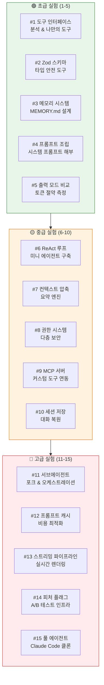
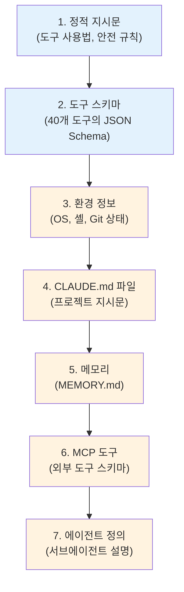
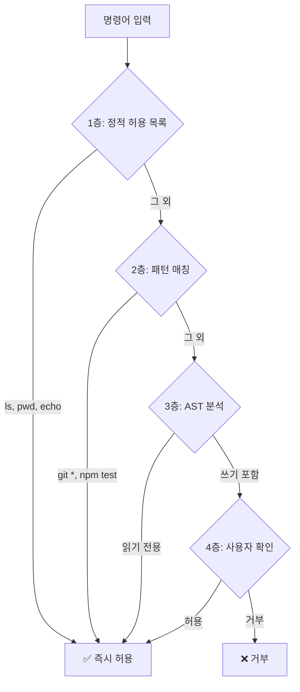
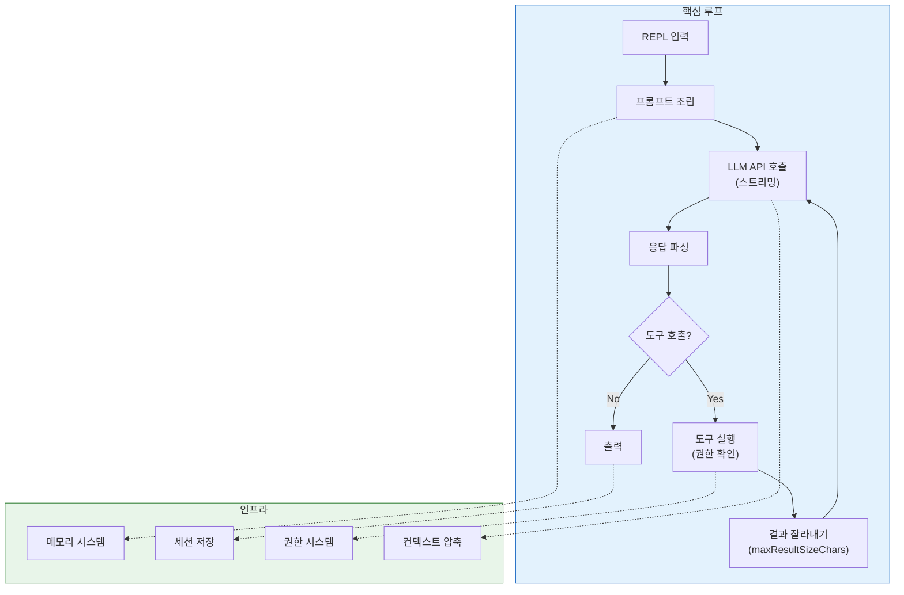

# 🧪 제22장: AI 엔지니어를 위한 실전 실험 가이드

> 512,664줄의 소스코드를 **읽기만** 하는 것은 절반입니다.
> 진짜 학습은 **직접 뜯어보고, 수정하고, 실험해볼 때** 일어납니다.
> 이 장에서는 AI 엔지니어가 Claude Code의 소스코드로 시도해볼 만한
> **15가지 실험 과제**를 난이도별로 정리합니다.

---

## 🗺️ 실험 과제 전체 지도



---

## 📋 목차

- [PART 1: 초급 실험 — 핵심 패턴 체험](#-part-1-초급-실험--핵심-패턴-체험)
- [PART 2: 중급 실험 — 시스템 구축](#-part-2-중급-실험--시스템-구축)
- [PART 3: 고급 실험 — 프로덕션 아키텍처](#-part-3-고급-실험--프로덕션-아키텍처)
- [부록: 참고 소스코드 맵](#-부록-참고-소스코드-맵)

---

## 🟢 PART 1: 초급 실험 — 핵심 패턴 체험

### 실험 #1: 도구 인터페이스 분석 & 나만의 도구 만들기

> **난이도**: ★☆☆☆☆ | **소요 시간**: 1-2시간
> **참고 파일**: [`src/Tool.ts`](../src/Tool.ts), [`src/tools/GrepTool/GrepTool.ts`](../src/tools/GrepTool/GrepTool.ts)

#### 배경

Claude Code의 40개 이상의 도구는 모두 **동일한 인터페이스**를 따릅니다. 이 인터페이스를 이해하면 어떤 AI 에이전트에든 도구를 추가할 수 있습니다.

#### 해볼 것

**1단계: 도구 인터페이스 추출**

`src/Tool.ts`에서 핵심 타입을 복사하여 분석합니다:

```typescript
// Claude Code의 도구 인터페이스 핵심
interface Tool<Input, Output> {
  name: string
  description: string | ((input: Input) => string)
  inputSchema: () => ZodType<Input>

  call(input: Input, context: ToolUseContext): Promise<ToolResult<Output>>

  isReadOnly(input: Input): boolean
  isConcurrencySafe(input: Input): boolean
  maxResultSizeChars: number
}
```

**2단계: 미니 도구 만들어보기**

위 인터페이스를 따라 자신만의 도구를 만들어봅니다:

```typescript
// 실험: 웹페이지 제목 가져오기 도구
const FetchTitleTool = {
  name: 'FetchTitle',
  description: 'URL에서 웹페이지 제목을 가져옵니다',
  inputSchema: () => z.object({
    url: z.string().url().describe('가져올 URL'),
  }),

  async call({ url }) {
    const res = await fetch(url)
    const html = await res.text()
    const match = html.match(/<title>(.*?)<\/title>/i)
    return { data: match?.[1] ?? '제목 없음' }
  },

  isReadOnly: () => true,
  isConcurrencySafe: () => true,
  maxResultSizeChars: 1_000,
}
```

**3단계: 질문에 답하기**

- `maxResultSizeChars`를 왜 도구마다 다르게 설정하는가?
- `isReadOnly`가 `true`이면 어떤 이점이 있는가?
- `isConcurrencySafe`가 `false`인 도구는 무엇이고 왜 그런가?

#### 학습 포인트

| 개념 | Claude Code에서 배우는 것 |
|:-----|:----------------------|
| **도구 합성** | 40개 도구가 하나의 인터페이스로 통합 |
| **메타데이터 활용** | `isReadOnly`, `isConcurrencySafe`로 실행 전략 결정 |
| **크기 제한** | `maxResultSizeChars`로 컨텍스트 폭발 방지 |

---

### 실험 #2: Zod 스키마로 타입 안전한 도구 만들기

> **난이도**: ★☆☆☆☆ | **소요 시간**: 1시간
> **참고 파일**: [`src/tools/FileReadTool/FileReadTool.ts`](../src/tools/FileReadTool/FileReadTool.ts)

#### 배경

Claude Code는 모든 도구 입력을 **Zod 스키마**로 검증합니다. 이는 LLM이 생성한 JSON이 항상 올바른 형태인지 보장합니다.

#### 해볼 것

```typescript
import { z } from 'zod'

// 1. 기본 스키마 — .describe()로 LLM에게 힌트 제공
const SearchSchema = z.object({
  query: z.string().describe('검색할 키워드'),
  max_results: z.number().int().positive().default(10)
    .describe('반환할 최대 결과 수'),
  type: z.enum(['code', 'file', 'content'])
    .describe('검색 유형'),
})

// 2. 판별 유니온 — FileReadTool이 사용하는 패턴
const OutputSchema = z.discriminatedUnion('type', [
  z.object({
    type: z.literal('text'),
    content: z.string(),
    lineCount: z.number(),
  }),
  z.object({
    type: z.literal('image'),
    base64: z.string(),
    mimeType: z.enum(['image/jpeg', 'image/png']),
  }),
  z.object({
    type: z.literal('error'),
    message: z.string(),
    code: z.number(),
  }),
])

// 3. 지연 스키마 — Claude Code의 성능 최적화 트릭
const lazySchema = <T>(fn: () => z.ZodType<T>) => fn
const mySchema = lazySchema(() => z.object({ /* 비싼 스키마 */ }))

// 4. LLM이 보낸 JSON 검증
const rawInput = JSON.parse(llmOutput)
const validated = SearchSchema.safeParse(rawInput)
if (!validated.success) {
  console.error('스키마 불일치:', validated.error.issues)
}
```

#### 실험 과제

1. `z.strictObject()`와 `z.object()`의 차이를 테스트해보세요 — LLM이 엉뚱한 필드를 추가했을 때 어떻게 되는가?
2. `.describe()` 체인이 OpenAI/Anthropic 함수 호출에서 어떻게 변환되는지 확인해보세요
3. 지연 스키마(`lazySchema`)를 100개 도구에 적용했을 때 모듈 로딩 시간 차이를 측정해보세요

---

### 실험 #3: 메모리 시스템 설계

> **난이도**: ★★☆☆☆ | **소요 시간**: 2-3시간
> **참고 파일**: [`src/memdir/memdir.ts`](../src/memdir/memdir.ts), [`src/memdir/memoryTypes.ts`](../src/memdir/memoryTypes.ts)

#### 배경

Claude Code는 대화 간 지식을 유지하기 위해 **파일 기반 메모리 시스템**을 사용합니다. 복잡한 벡터 DB가 아니라 단순한 **마크다운 파일**입니다.

#### 해볼 것

**1단계: 메모리 구조 분석**

```
~/.claude/memory/
├── MEMORY.md          ← 인덱스 (최대 200줄, 25KB)
├── user_role.md       ← 개별 메모리 파일
├── feedback_testing.md
├── project_auth.md
└── reference_linear.md
```

**2단계: 나만의 메모리 시스템 구현**

```typescript
// Claude Code의 memdir.ts 핵심 패턴을 추출하여 구현
class SimpleMemory {
  constructor(private memoryDir: string) {}

  // 인덱스 로드 (MEMORY.md)
  async loadIndex(): Promise<string> {
    const indexPath = path.join(this.memoryDir, 'MEMORY.md')
    const content = await fs.readFile(indexPath, 'utf-8')
    // Claude Code는 200줄까지만 로드
    return content.split('\n').slice(0, 200).join('\n')
  }

  // 메모리 저장 (프론트매터 + 본문)
  async saveMemory(name: string, meta: MemoryMeta, body: string) {
    const frontmatter = [
      '---',
      `name: ${meta.name}`,
      `description: ${meta.description}`,
      `type: ${meta.type}`,  // user | feedback | project | reference
      '---',
      '',
      body,
    ].join('\n')
    await fs.writeFile(path.join(this.memoryDir, `${name}.md`), frontmatter)
    await this.updateIndex(name, meta.description)
  }

  // 인덱스 업데이트
  private async updateIndex(name: string, description: string) {
    const indexPath = path.join(this.memoryDir, 'MEMORY.md')
    await fs.appendFile(indexPath, `\n- [${name}](${name}.md) — ${description}`)
  }
}
```

**3단계: 시스템 프롬프트에 메모리 주입**

```typescript
// Claude Code가 메모리를 프롬프트에 주입하는 방식
async function buildSystemPromptWithMemory(basePrompt: string): Promise<string> {
  const memory = new SimpleMemory('~/.my-agent/memory')
  const index = await memory.loadIndex()

  return `${basePrompt}

# Memory
You have persistent memory stored in files:

${index}

When you learn something new about the user, save it to memory.`
}
```

#### 실험 과제

1. 벡터 DB 대신 마크다운 파일을 쓰는 장단점을 정리해보세요
2. 메모리가 100개가 넘었을 때, `MEMORY.md` 인덱스로 관련 메모리를 찾는 전략을 설계해보세요
3. `findRelevantMemories.ts`의 로직을 분석하고, 더 나은 검색 방법을 제안해보세요

---

### 실험 #4: 시스템 프롬프트 조립 파이프라인 해부

> **난이도**: ★★☆☆☆ | **소요 시간**: 2-3시간
> **참고 파일**: [`src/constants/prompts.ts`](../src/constants/prompts.ts), [`src/utils/api.ts`](../src/utils/api.ts)

#### 배경

Claude Code의 시스템 프롬프트는 **50-70K 토큰**에 달합니다. 이것이 하나의 문자열이 아니라 **모듈별로 조립**됩니다.

#### 해볼 것

**프롬프트 조립 순서 분석:**



**핵심 패턴: 캐시 경계 분리**

```typescript
// Claude Code는 프롬프트를 정적/동적 영역으로 나눕니다
const SYSTEM_PROMPT_DYNAMIC_BOUNDARY = '__SYSTEM_PROMPT_DYNAMIC_BOUNDARY__'

// 정적 영역: 모든 사용자에게 동일 → 글로벌 캐시
// (도구 사용 규칙, 안전 가이드라인, 모델 능력)
const staticBlocks = [
  toolUsageInstructions,
  safetyGuidelines,
  modelCapabilities,
]

// 동적 영역: 사용자/세션마다 다름 → 세션 캐시
// (메모리, 환경 변수, MCP 도구, CLAUDE.md)
const dynamicBlocks = [
  memoryPrompt,
  environmentDetails,
  mcpInstructions,
  claudeMdContent,
]
```

#### 실험 과제

1. `prompts.ts`에서 각 섹션의 토큰 수를 측정해보세요 (tiktoken 또는 Anthropic tokenizer 사용)
2. 어떤 섹션이 가장 많은 토큰을 차지하는지 파이 차트로 그려보세요
3. 캐시 경계를 어디에 두느냐에 따라 캐시 히트율이 어떻게 변하는지 시뮬레이션해보세요

---

### 실험 #5: 출력 모드별 토큰 절약 측정

> **난이도**: ★☆☆☆☆ | **소요 시간**: 1시간
> **참고 파일**: [`src/tools/GrepTool/GrepTool.ts`](../src/tools/GrepTool/GrepTool.ts)

#### 해볼 것

실제 코드베이스에서 같은 검색을 3가지 모드로 실행하고 토큰 수를 비교합니다:

```bash
# 모드 1: files_with_matches (기본값)
# → 파일 경로만 반환
rg --files-with-matches "function" ./src/

# 모드 2: count
# → 파일당 매칭 수만 반환
rg --count "function" ./src/

# 모드 3: content
# → 매칭 줄 전체 반환
rg "function" ./src/
```

**측정 스크립트:**

```python
import tiktoken

enc = tiktoken.encoding_for_model("cl100k_base")

# 각 모드의 출력을 파일에 저장한 후
for mode in ['files', 'count', 'content']:
    with open(f'output_{mode}.txt') as f:
        text = f.read()
    tokens = len(enc.encode(text))
    print(f'{mode}: {tokens:,} 토큰 ({len(text):,} 바이트)')

# 예상 결과:
# files:   250 토큰 (2KB)
# count:   100 토큰 (800B)
# content: 12,500 토큰 (50KB)
```

#### 핵심 인사이트

| 모드 | 예상 토큰 | 절약율 | 적합한 상황 |
|:-----|:---------|:------|:----------|
| `count` | ~100 | 99% | "몇 개나 있지?" |
| `files_with_matches` | ~250 | 98% | "어느 파일에 있지?" |
| `content` + `head_limit=50` | ~500 | 96% | "처음 몇 개만 보자" |
| `content` (무제한) | ~12,500 | 0% | 거의 쓸 일 없음 |

---

## 🟡 PART 2: 중급 실험 — 시스템 구축

### 실험 #6: 미니 ReAct 에이전트 구축

> **난이도**: ★★★☆☆ | **소요 시간**: 4-6시간
> **참고 파일**: [`src/query.ts`](../src/query.ts), [`src/services/tools/toolOrchestration.ts`](../src/services/tools/toolOrchestration.ts)

#### 배경

Claude Code의 핵심은 **ReAct(Reasoning + Acting) 루프**입니다. 사용자 입력 → LLM 추론 → 도구 실행 → 결과 피드백의 순환입니다.

#### 해볼 것

Claude Code의 `query.ts`를 참고하여 미니 에이전트를 구축합니다:

```typescript
import Anthropic from '@anthropic-ai/sdk'

const client = new Anthropic()

// 1. 도구 정의
const tools = [
  {
    name: 'read_file',
    description: '파일 내용을 읽습니다',
    input_schema: {
      type: 'object',
      properties: {
        path: { type: 'string', description: '파일 경로' },
        offset: { type: 'number', description: '시작 줄 번호' },
        limit: { type: 'number', description: '읽을 줄 수' },
      },
      required: ['path'],
    },
  },
  {
    name: 'search',
    description: '파일 내용을 검색합니다',
    input_schema: {
      type: 'object',
      properties: {
        pattern: { type: 'string' },
        path: { type: 'string' },
      },
      required: ['pattern'],
    },
  },
]

// 2. ReAct 루프 — Claude Code의 query.ts 핵심 패턴
async function reactLoop(userMessage: string) {
  const messages: any[] = [{ role: 'user', content: userMessage }]

  while (true) {
    // LLM 호출
    const response = await client.messages.create({
      model: 'claude-sonnet-4-5-20250514',
      max_tokens: 4096,
      tools,
      messages,
    })

    // 응답을 메시지 히스토리에 추가
    messages.push({ role: 'assistant', content: response.content })

    // 종료 조건: 도구 호출이 없으면 끝
    if (response.stop_reason === 'end_turn') {
      const textBlock = response.content.find(b => b.type === 'text')
      return textBlock?.text ?? ''
    }

    // 도구 실행 — Claude Code의 toolOrchestration.ts 패턴
    const toolResults = []
    for (const block of response.content) {
      if (block.type !== 'tool_use') continue

      const result = await executeTool(block.name, block.input)
      toolResults.push({
        type: 'tool_result',
        tool_use_id: block.id,
        content: truncateResult(result, 20_000), // maxResultSizeChars!
      })
    }

    messages.push({ role: 'user', content: toolResults })
  }
}

// 3. 도구 실행 + 결과 크기 제한 (Claude Code 패턴)
async function executeTool(name: string, input: any): Promise<string> {
  switch (name) {
    case 'read_file': {
      const content = await fs.readFile(input.path, 'utf-8')
      const lines = content.split('\n')
      const start = input.offset ?? 0
      const end = start + (input.limit ?? 2000)  // 기본 2000줄
      return lines.slice(start, end)
        .map((line, i) => `${start + i + 1}\t${line}`)
        .join('\n')
    }
    case 'search': {
      const { execSync } = require('child_process')
      const result = execSync(
        `rg --files-with-matches "${input.pattern}" ${input.path ?? '.'}`,
        { encoding: 'utf-8', timeout: 10000 }
      )
      return result
    }
    default:
      return `Unknown tool: ${name}`
  }
}

// 4. EndTruncatingAccumulator 패턴
function truncateResult(result: string, maxChars: number): string {
  if (result.length <= maxChars) return result
  const truncated = result.slice(0, maxChars)
  const removedKB = Math.round((result.length - maxChars) / 1024)
  return truncated + `\n... [output truncated - ${removedKB}KB removed]`
}
```

#### 확장 과제

1. **읽기 전용 도구 병렬 실행** 추가: `isConcurrencySafe`한 도구들을 `Promise.all()`로 묶기
2. **결과 디스크 저장** 추가: 한도 초과 시 파일에 저장하고 프리뷰만 반환
3. **루프 제한** 추가: 무한 루프 방지를 위한 최대 턴 수 설정

---

### 실험 #7: 컨텍스트 압축 엔진 구현

> **난이도**: ★★★☆☆ | **소요 시간**: 3-5시간
> **참고 파일**: [`src/services/compact/compact.ts`](../src/services/compact/compact.ts), [`src/services/compact/microCompact.ts`](../src/services/compact/microCompact.ts)

#### 배경

대화가 길어지면 컨텍스트 윈도우가 가득 찹니다. Claude Code는 **3가지 압축 전략**으로 이를 관리합니다.

#### 해볼 것

```typescript
// Claude Code의 3가지 압축 전략을 직접 구현

// 전략 1: 전체 압축 (Full Compaction)
// 전체 대화를 요약하고, 최근 메시지만 보존
async function fullCompact(messages: Message[], client: Anthropic) {
  const summary = await client.messages.create({
    model: 'claude-sonnet-4-5-20250514',
    max_tokens: 2048,
    messages: [{
      role: 'user',
      content: `다음 대화를 핵심만 요약해줘. 코드 변경 사항, 결정 사항, 미완료 작업을 포함해:\n\n${
        messages.map(m => `[${m.role}]: ${m.content}`).join('\n')
      }`,
    }],
  })

  return [
    { role: 'assistant', content: `[이전 대화 요약]\n${summary.content[0].text}` },
    ...messages.slice(-5),  // 최근 5개 메시지 보존
  ]
}

// 전략 2: 마이크로 압축 (Micro Compaction)
// API 호출 없이 큰 메시지를 로컬에서 축소
function microCompact(message: Message): Message {
  if (message.content.length < 10_000) return message

  // 도구 결과 중 큰 것을 요약으로 교체
  const compacted = message.content.replace(
    /```[\s\S]{5000,}?```/g,  // 5000자 이상 코드 블록
    '[코드 블록 생략 - 원문은 세션 파일 참조]'
  )
  return { ...message, content: compacted }
}

// 전략 3: 세션 메모리 추출 (Session Memory Compact)
// 대화에서 중요한 학습 내용을 메모리로 추출
async function extractMemories(messages: Message[], client: Anthropic) {
  const response = await client.messages.create({
    model: 'claude-haiku-4-5-20251001',  // 비용 절약을 위해 작은 모델
    max_tokens: 1024,
    messages: [{
      role: 'user',
      content: `다음 대화에서 나중에 유용할 사실들을 추출해줘:
- 사용자 선호도
- 프로젝트 관련 결정사항
- 기술적 제약조건

대화:\n${messages.map(m => `[${m.role}]: ${m.content}`).join('\n')}`,
    }],
  })

  // 메모리 파일에 저장
  await fs.appendFile('memory/extracted.md', response.content[0].text)
}
```

#### 핵심 질문

- 압축 시점은 언제가 최적인가? (Claude Code는 토큰 수 기반 트리거)
- 요약 시 보존해야 할 것과 버려도 되는 것의 기준은?
- 마이크로 압축은 왜 API 호출 없이 하는가? (비용 + 지연 절약)

---

### 실험 #8: 다층 권한 시스템 구축

> **난이도**: ★★★☆☆ | **소요 시간**: 3-4시간
> **참고 파일**: [`src/tools/BashTool/bashPermissions.ts`](../src/tools/BashTool/bashPermissions.ts), [`src/tools/BashTool/bashSecurity.ts`](../src/tools/BashTool/bashSecurity.ts)

#### 배경

AI 에이전트에게 Bash 실행 권한을 주는 것은 **매우 위험**합니다. Claude Code는 4층 방어로 이를 해결합니다.

#### 해볼 것



```typescript
// 4층 권한 시스템 구현
type PermissionResult =
  | { behavior: 'allow'; reason: string }
  | { behavior: 'deny'; reason: string }
  | { behavior: 'ask'; question: string }

async function checkPermission(command: string): Promise<PermissionResult> {
  // 1층: 정적 허용 목록
  const SAFE_COMMANDS = ['ls', 'pwd', 'echo', 'cat', 'head', 'tail', 'wc']
  const firstWord = command.split(/\s/)[0]
  if (SAFE_COMMANDS.includes(firstWord)) {
    return { behavior: 'allow', reason: '안전한 명령' }
  }

  // 2층: 사용자 정의 패턴 (settings.json)
  const rules = loadPermissionRules()
  for (const rule of rules) {
    if (matchGlob(command, rule.pattern)) {
      return { behavior: rule.allow ? 'allow' : 'deny', reason: rule.reason }
    }
  }

  // 3층: 읽기 전용 분석
  if (isReadOnlyCommand(command)) {
    return { behavior: 'allow', reason: '읽기 전용 명령' }
  }

  // 4층: 사용자에게 물어보기
  return {
    behavior: 'ask',
    question: `이 명령을 실행할까요?\n$ ${command}`,
  }
}

// 읽기 전용 판별 — 리다이렉트, 파이프, 세미콜론 확인
function isReadOnlyCommand(command: string): boolean {
  // Claude Code의 bashSecurity.ts 패턴
  const WRITE_INDICATORS = ['>', '>>', '|', 'rm', 'mv', 'cp', 'mkdir', 'touch']
  return !WRITE_INDICATORS.some(ind => command.includes(ind))
}
```

#### 확장 과제

1. **명령어 의미론** 추가: `grep`의 exit 1은 에러가 아님 (`commandSemantics.ts` 참고)
2. **경로 검증** 추가: `..` 탐색, 유니코드 정규화 공격 방어
3. **규칙 학습**: 사용자가 한번 허용한 패턴을 자동으로 규칙에 추가

---

### 실험 #9: MCP 서버 만들어서 연동하기

> **난이도**: ★★★☆☆ | **소요 시간**: 3-4시간
> **참고 파일**: [`src/services/mcp/client.ts`](../src/services/mcp/client.ts)

#### 배경

MCP(Model Context Protocol)는 AI 에이전트에 **외부 도구를 플러그인**하는 표준입니다. Claude Code는 MCP 클라이언트로서 외부 서버의 도구를 자동으로 발견하고 사용합니다.

#### 해볼 것

**1단계: 간단한 MCP 서버 작성**

```typescript
// my-mcp-server.ts — 날씨 도구를 제공하는 MCP 서버
import { Server } from '@modelcontextprotocol/sdk/server/index.js'
import { StdioServerTransport } from '@modelcontextprotocol/sdk/server/stdio.js'

const server = new Server({
  name: 'weather-server',
  version: '1.0.0',
}, {
  capabilities: { tools: {} },
})

// 도구 목록 제공
server.setRequestHandler('tools/list', async () => ({
  tools: [{
    name: 'get_weather',
    description: '도시의 현재 날씨를 가져옵니다',
    inputSchema: {
      type: 'object',
      properties: {
        city: { type: 'string', description: '도시명' },
      },
      required: ['city'],
    },
  }],
}))

// 도구 실행
server.setRequestHandler('tools/call', async (request) => {
  if (request.params.name === 'get_weather') {
    const city = request.params.arguments.city
    return {
      content: [{ type: 'text', text: `${city}: 맑음, 22°C` }],
    }
  }
})

// 서버 시작
const transport = new StdioServerTransport()
await server.connect(transport)
```

**2단계: Claude Code에 연결**

```json
// ~/.claude/settings.json
{
  "mcpServers": {
    "weather": {
      "command": "npx",
      "args": ["tsx", "my-mcp-server.ts"]
    }
  }
}
```

**3단계: 자동 도구 발견 확인**

Claude Code가 MCP 서버의 도구를 자동으로 발견하여 `mcp__weather__get_weather`로 등록하는 과정을 확인합니다.

#### 확장 과제

1. **리소스** 추가: 도구뿐 아니라 읽기 가능한 데이터(리소스)를 제공해보세요
2. **OAuth 인증** 추가: `src/services/mcp/auth.ts`의 패턴을 참고하여 보호된 MCP 서버 만들기
3. **SSE/WebSocket 전송**: stdio 대신 네트워크 기반 전송으로 전환

---

### 실험 #10: 세션 저장 및 복원

> **난이도**: ★★★☆☆ | **소요 시간**: 2-3시간
> **참고 파일**: [`src/utils/sessionStorage.ts`](../src/utils/sessionStorage.ts), [`src/utils/toolResultStorage.ts`](../src/utils/toolResultStorage.ts)

#### 배경

Claude Code는 대화를 **JSONL(JSON Lines)** 형식으로 저장하여 세션을 복원할 수 있습니다. 도구 결과는 **별도 파일**에 저장하여 메모리를 절약합니다.

#### 해볼 것

```typescript
// Claude Code의 세션 저장 패턴

// 1. JSONL 방식 — 한 줄에 하나의 메시지
class SessionStore {
  private transcriptPath: string

  constructor(sessionId: string) {
    this.transcriptPath = `~/.my-agent/sessions/${sessionId}/transcript.jsonl`
  }

  // 메시지 추가 (append-only — 원자적 쓰기)
  async append(entry: Message): Promise<void> {
    await fs.appendFile(
      this.transcriptPath,
      JSON.stringify(entry) + '\n'
    )
  }

  // 전체 세션 로드
  async load(): Promise<Message[]> {
    const content = await fs.readFile(this.transcriptPath, 'utf-8')
    return content.trim().split('\n').map(line => JSON.parse(line))
  }
}

// 2. 도구 결과 외부화 — 큰 결과는 별도 파일에
class ToolResultStore {
  async persist(toolUseId: string, result: string): Promise<string> {
    const resultPath = `~/.my-agent/tool-results/${toolUseId}.txt`
    await fs.writeFile(resultPath, result)

    // 모델에 전달할 프리뷰 생성
    const preview = result.slice(0, 2000)
    return `<persisted-output>
Output too large (${result.length} chars). Saved to: ${resultPath}

Preview (first 2KB):
${preview}
</persisted-output>`
  }
}
```

#### 핵심 인사이트

왜 JSONL인가? (SQLite, JSON 배열이 아닌 이유)

| 방식 | 장점 | 단점 |
|:-----|:----|:----|
| **JSONL** (Claude Code 선택) | 원자적 append, 중간 크래시에도 안전 | 수정/삭제 어려움 |
| JSON 배열 | 쿼리 쉬움 | 전체 파일 다시 써야 함 |
| SQLite | 쿼리/인덱스 가능 | 복잡, 파일 잠금 |

---

## 🔴 PART 3: 고급 실험 — 프로덕션 아키텍처

### 실험 #11: 서브에이전트 포크 & 오케스트레이션

> **난이도**: ★★★★☆ | **소요 시간**: 6-8시간
> **참고 파일**: [`src/tools/AgentTool/AgentTool.tsx`](../src/tools/AgentTool/AgentTool.tsx), [`src/tools/AgentTool/forkSubagent.ts`](../src/tools/AgentTool/forkSubagent.ts)

#### 배경

Claude Code의 가장 강력한 기능 중 하나는 **자기 자신을 복제**하여 병렬 작업을 수행하는 것입니다. 메인 에이전트의 컨텍스트를 오염시키지 않으면서 탐색, 연구, 코드 수정을 위임합니다.

#### 해볼 것

```typescript
// 서브에이전트 시스템 설계

interface AgentDefinition {
  name: string
  description: string
  tools: string[]           // 이 에이전트가 쓸 수 있는 도구
  model?: string            // 모델 오버라이드
  systemPrompt?: string     // 커스텀 시스템 프롬프트
  isolation?: 'worktree'    // Git 워크트리 격리
}

// 에이전트 타입 정의 (마크다운 프론트매터)
const AGENT_TYPES: Record<string, AgentDefinition> = {
  'Explore': {
    name: 'Explore',
    description: '코드베이스 탐색 전문',
    tools: ['Grep', 'Glob', 'Read'],  // 읽기 전용만
    model: 'haiku',                    // 비용 절약
  },
  'Plan': {
    name: 'Plan',
    description: '구현 계획 수립',
    tools: ['Grep', 'Glob', 'Read', 'WebSearch'],
  },
  'general-purpose': {
    name: 'general-purpose',
    description: '범용 작업 수행',
    tools: ['*'],  // 모든 도구
    isolation: 'worktree',  // 파일 수정 시 격리
  },
}

// 서브에이전트 실행
async function spawnSubagent(
  type: string,
  prompt: string,
  parentContext: Context,
): Promise<string> {
  const definition = AGENT_TYPES[type]

  // 워크트리 격리가 필요하면 생성
  let workDir = parentContext.cwd
  if (definition.isolation === 'worktree') {
    workDir = await createGitWorktree(parentContext.cwd)
  }

  // 서브에이전트용 컨텍스트 (부모와 독립)
  const subContext = {
    ...parentContext,
    cwd: workDir,
    tools: filterTools(parentContext.tools, definition.tools),
  }

  // ReAct 루프 실행 (별도 컨텍스트 윈도우)
  const result = await reactLoop(prompt, subContext, definition.model)

  // 워크트리 정리
  if (definition.isolation === 'worktree') {
    const hasChanges = await checkWorktreeChanges(workDir)
    if (!hasChanges) await cleanupWorktree(workDir)
  }

  return result  // 요약만 부모에게 반환
}
```

#### 핵심 설계 결정

1. **왜 별도 컨텍스트 윈도우인가?** — 탐색 과정의 중간 결과가 부모를 오염시키지 않음
2. **왜 워크트리 격리인가?** — 서브에이전트가 파일을 수정해도 메인 작업에 영향 없음
3. **왜 모델을 바꿀 수 있는가?** — 탐색은 Haiku(빠르고 저렴), 코딩은 Opus(정확)

---

### 실험 #12: 프롬프트 캐시 비용 최적화

> **난이도**: ★★★★☆ | **소요 시간**: 4-6시간
> **참고 파일**: [`src/utils/api.ts`](../src/utils/api.ts), [`src/utils/toolResultStorage.ts`](../src/utils/toolResultStorage.ts)

#### 배경

Anthropic API의 프롬프트 캐시는 **바이트 단위 동일성**이 필요합니다. 이전 요청과 정확히 같은 접두사는 캐시에서 읽혀 비용이 90% 절감됩니다.

#### 해볼 것

```typescript
// 캐시 안정성 유지 시스템

// 문제: 도구 결과를 압축하면 캐시가 깨진다
// 해결: ContentReplacementState로 3분류 관리

type ContentReplacementState = {
  seenIds: Set<string>               // 이전에 본 결과 ID
  replacements: Map<string, string>  // 이미 교체된 결과의 정확한 문자열
}

function processToolResults(
  results: ToolResult[],
  state: ContentReplacementState,
  budget: number,  // 200KB per message
): ToolResult[] {
  const categorized = results.map(r => {
    if (state.replacements.has(r.id)) {
      // mustReapply: 이전과 동일한 교체 문자열 사용
      return { ...r, category: 'mustReapply' as const }
    }
    if (state.seenIds.has(r.id)) {
      // frozen: 절대 변경하지 않음 (캐시 보호)
      return { ...r, category: 'frozen' as const }
    }
    // fresh: 새로운 결과 (교체 대상 후보)
    return { ...r, category: 'fresh' as const }
  })

  // 예산 초과 시 가장 큰 fresh 결과부터 교체
  const totalSize = categorized.reduce((sum, r) => sum + r.content.length, 0)
  if (totalSize > budget) {
    const fresh = categorized
      .filter(r => r.category === 'fresh')
      .sort((a, b) => b.content.length - a.content.length)

    let remaining = totalSize
    for (const r of fresh) {
      if (remaining <= budget) break
      const preview = persistAndGetPreview(r)
      state.replacements.set(r.id, preview)
      remaining -= r.content.length
    }
  }

  return categorized.map(r => {
    if (state.replacements.has(r.id)) {
      return { ...r, content: state.replacements.get(r.id)! }
    }
    state.seenIds.add(r.id)
    return r
  })
}
```

#### 실험: 캐시 절약 시뮬레이션

```python
# 10턴 대화에서 캐시 절약 효과 시뮬레이션
import random

def simulate_cache_savings(turns=10, sys_prompt_tokens=60000):
    """캐시 안정성이 비용에 미치는 영향을 시뮬레이션"""
    total_input_cost = 0
    total_cache_cost = 0

    for turn in range(turns):
        new_tokens = random.randint(500, 2000)  # 새 메시지
        cached_tokens = sys_prompt_tokens + turn * 1500  # 누적 히스토리

        # 캐시 미사용 비용 (전부 input token)
        total_input_cost += (cached_tokens + new_tokens) * 0.003 / 1000

        # 캐시 사용 비용 (캐시된 부분 90% 할인)
        total_cache_cost += (
            cached_tokens * 0.0003 / 1000 +  # 캐시 읽기 (90% 할인)
            new_tokens * 0.003 / 1000          # 새 토큰 (정가)
        )

    savings = (1 - total_cache_cost / total_input_cost) * 100
    print(f"캐시 없이: ${total_input_cost:.4f}")
    print(f"캐시 사용: ${total_cache_cost:.4f}")
    print(f"절약: {savings:.1f}%")

simulate_cache_savings()
# 예상 결과: ~85% 비용 절약
```

---

### 실험 #13: 스트리밍 파이프라인 구축

> **난이도**: ★★★★☆ | **소요 시간**: 4-6시간
> **참고 파일**: [`src/services/api/claude.ts`](../src/services/api/claude.ts)

#### 배경

Claude Code는 LLM 응답을 **토큰 단위로 스트리밍**하면서 동시에 **도구 호출을 파싱**합니다. 이 파이프라인을 이해하면 반응성 좋은 AI 앱을 만들 수 있습니다.

#### 해볼 것

```typescript
// 스트리밍 + 점진적 도구 파싱

async function* streamingReactLoop(
  messages: Message[],
  tools: Tool[],
): AsyncGenerator<StreamEvent> {
  const stream = await client.messages.stream({
    model: 'claude-sonnet-4-5-20250514',
    max_tokens: 4096,
    tools: tools.map(t => t.schema),
    messages,
  })

  // 텍스트 델타를 즉시 yield
  for await (const event of stream) {
    switch (event.type) {
      case 'content_block_delta':
        if (event.delta.type === 'text_delta') {
          yield { type: 'text', text: event.delta.text }
        }
        break

      case 'content_block_stop':
        // 도구 호출 블록이 완성되면 즉시 실행 시작
        if (event.content_block.type === 'tool_use') {
          yield { type: 'tool_start', tool: event.content_block }

          // 도구 실행 (스트리밍과 병렬)
          const result = await executeTool(
            event.content_block.name,
            event.content_block.input,
          )

          yield { type: 'tool_result', id: event.content_block.id, result }
        }
        break

      case 'message_stop':
        yield { type: 'done' }
        break
    }
  }
}

// 사용 예시
for await (const event of streamingReactLoop(messages, tools)) {
  switch (event.type) {
    case 'text':
      process.stdout.write(event.text)  // 즉시 출력
      break
    case 'tool_start':
      console.log(`\n⚙️ ${event.tool.name} 실행 중...`)
      break
    case 'tool_result':
      console.log(`✅ 완료 (${event.result.length}자)`)
      break
  }
}
```

---

### 실험 #14: 피처 플래그 & A/B 테스트 인프라

> **난이도**: ★★★★☆ | **소요 시간**: 3-5시간
> **참고 파일**: [`src/services/analytics/growthbook.ts`](../src/services/analytics/growthbook.ts)

#### 배경

Claude Code는 **600개 이상의 피처 플래그**로 기능을 제어합니다. 프로덕션 AI 제품에서 이런 인프라는 필수입니다.

#### 해볼 것

```typescript
// 미니 피처 플래그 시스템

class FeatureFlagSystem {
  private flags: Map<string, any> = new Map()
  private overrides: Map<string, any> = new Map()  // 로컬 오버라이드
  private cache: Map<string, { value: any; timestamp: number }> = new Map()

  // Claude Code 패턴: CACHED_MAY_BE_STALE
  // 즉시 캐시된 값을 반환하되, 백그라운드에서 갱신
  getFeatureValue<T>(key: string, defaultValue: T): T {
    // 1. 로컬 오버라이드 우선 (개발/테스트용)
    if (this.overrides.has(key)) return this.overrides.get(key)

    // 2. 캐시된 값 반환 (stale 가능)
    const cached = this.cache.get(key)
    if (cached) {
      // 백그라운드에서 갱신 (사용자를 기다리게 하지 않음)
      if (Date.now() - cached.timestamp > 60_000) {
        this.refreshInBackground(key)
      }
      return cached.value as T
    }

    // 3. 기본값 반환
    return defaultValue
  }

  // 킬 스위치 패턴 — true이면 기능 중단
  isKilled(feature: string): boolean {
    return this.getFeatureValue(`killswitch_${feature}`, false)
  }

  // A/B 테스트 — 노출 로깅 포함
  getExperimentVariant(experiment: string, userId: string): string {
    const variant = this.assignVariant(experiment, userId)
    this.logExposure(experiment, variant, userId)  // 분석용
    return variant
  }

  private assignVariant(experiment: string, userId: string): string {
    // 일관된 할당 (같은 사용자 = 같은 변형)
    const hash = hashCode(`${experiment}:${userId}`)
    return hash % 2 === 0 ? 'control' : 'treatment'
  }
}
```

#### 활용 시나리오

```typescript
const flags = new FeatureFlagSystem()

// 1. 새 프롬프트 전략 A/B 테스트
const promptStrategy = flags.getExperimentVariant('prompt_v2', userId)
const systemPrompt = promptStrategy === 'treatment'
  ? '당신은 친절한 코딩 어시스턴트입니다...'
  : '당신은 전문 소프트웨어 엔지니어입니다...'

// 2. 위험한 기능의 점진적 출시
if (!flags.isKilled('new_tool_system')) {
  const rolloutPercentage = flags.getFeatureValue('new_tool_rollout', 0)
  if (userBucket <= rolloutPercentage) {
    enableNewToolSystem()
  }
}

// 3. 긴급 중단 (킬 스위치)
if (flags.isKilled('all_bash_commands')) {
  return { error: '시스템 점검 중입니다' }
}
```

---

### 실험 #15: 풀 에이전트 시스템 — 미니 Claude Code 클론

> **난이도**: ★★★★★ | **소요 시간**: 2-3일
> **참고 파일**: 이 튜토리얼의 모든 장

#### 배경

모든 실험을 통합하여 **미니 Claude Code**를 만들어봅니다. 실제 512K줄은 아니지만, 핵심 아키텍처를 1,000줄 이내로 구현합니다.

#### 아키텍처



#### 구현 체크리스트

```
Phase 1: 기본 루프 (실험 #6)
  □ REPL 입력 처리
  □ Anthropic API 호출 (스트리밍)
  □ 도구 호출 파싱 & 실행
  □ 결과 피드백 루프

Phase 2: 도구 시스템 (실험 #1, #2)
  □ Read, Grep, Glob, Bash 도구
  □ Zod 스키마 검증
  □ maxResultSizeChars 제한
  □ 읽기 전용 도구 병렬 실행

Phase 3: 안전 장치 (실험 #8)
  □ Bash 명령 권한 확인
  □ 정적 허용 목록
  □ 패턴 매칭 규칙
  □ 사용자 확인 프롬프트

Phase 4: 컨텍스트 관리 (실험 #5, #7)
  □ 출력 잘라내기 (EndTruncatingAccumulator)
  □ 대용량 결과 디스크 저장
  □ 컨텍스트 압축 (토큰 한도 도달 시)

Phase 5: 지속성 (실험 #3, #10)
  □ 세션 JSONL 저장
  □ 메모리 시스템 (MEMORY.md)
  □ 세션 복원

Phase 6: 확장 (실험 #9, #11)
  □ MCP 서버 연동
  □ 서브에이전트 포크
  □ 피처 플래그
```

#### 예상 코드 규모

| 모듈 | 예상 줄 수 | 참고 |
|:-----|:---------|:----|
| ReAct 루프 | ~100줄 | `query.ts` 핵심 패턴 |
| 도구 시스템 | ~200줄 | `Tool.ts` + 4개 도구 |
| 권한 시스템 | ~100줄 | `bashPermissions.ts` 간소화 |
| 결과 관리 | ~80줄 | `toolResultStorage.ts` |
| 세션 저장 | ~60줄 | `sessionStorage.ts` JSONL |
| 메모리 | ~60줄 | `memdir.ts` 핵심 |
| 컨텍스트 압축 | ~80줄 | `compact.ts` 전체 압축만 |
| REPL + UI | ~100줄 | readline 기반 |
| **합계** | **~780줄** | Claude Code의 0.15% |

> **780줄로 Claude Code의 핵심을 재현**할 수 있습니다.
> 나머지 511,884줄은 **엣지 케이스, 보안, UX, 피처 플래그, 테스트, 최적화**입니다.
> 이것이 소프트웨어 엔지니어링의 현실입니다.

---

## 📊 난이도별 학습 경로

```mermaid
journey
    title AI 엔지니어 학습 경로
    section 1주차: 기초
      도구 인터페이스 분석: 5: 초급
      Zod 스키마 실험: 5: 초급
      메모리 시스템 설계: 4: 초급
      프롬프트 조립 해부: 4: 초급
      출력 모드 비교: 5: 초급
    section 2주차: 시스템
      미니 ReAct 에이전트: 3: 중급
      컨텍스트 압축: 3: 중급
      권한 시스템: 4: 중급
      MCP 서버 연동: 4: 중급
      세션 저장/복원: 4: 중급
    section 3주차: 프로덕션
      서브에이전트 포크: 2: 고급
      프롬프트 캐시 최적화: 3: 고급
      스트리밍 파이프라인: 3: 고급
      피처 플래그 인프라: 3: 고급
      풀 에이전트 시스템: 2: 고급
```

---

## 📁 부록: 참고 소스코드 맵

| 실험 | 핵심 참고 파일 | 주요 패턴 |
|:-----|:-------------|:---------|
| #1 도구 인터페이스 | `src/Tool.ts`, `src/tools/*/` | `buildTool()` 팩토리 |
| #2 Zod 스키마 | `src/tools/FileReadTool/FileReadTool.ts` | 판별 유니온, `lazySchema` |
| #3 메모리 시스템 | `src/memdir/memdir.ts` | 마크다운 인덱스 + 프론트매터 |
| #4 프롬프트 조립 | `src/constants/prompts.ts`, `src/utils/api.ts` | 캐시 경계 분리 |
| #5 출력 모드 | `src/tools/GrepTool/GrepTool.ts` | `head_limit`, `output_mode` |
| #6 ReAct 루프 | `src/query.ts`, `src/services/tools/toolOrchestration.ts` | 제너레이터 기반 비동기 루프 |
| #7 컨텍스트 압축 | `src/services/compact/compact.ts` | 3가지 압축 전략 |
| #8 권한 시스템 | `src/tools/BashTool/bashPermissions.ts` | 4층 방어 스택 |
| #9 MCP 서버 | `src/services/mcp/client.ts` | 다중 전송, 자동 발견 |
| #10 세션 저장 | `src/utils/sessionStorage.ts` | JSONL append-only |
| #11 서브에이전트 | `src/tools/AgentTool/AgentTool.tsx` | 포크, 워크트리 격리 |
| #12 프롬프트 캐시 | `src/utils/toolResultStorage.ts` | `ContentReplacementState` |
| #13 스트리밍 | `src/services/api/claude.ts` | 점진적 파싱 |
| #14 피처 플래그 | `src/services/analytics/growthbook.ts` | 킬 스위치, A/B |
| #15 풀 에이전트 | 모든 파일 | 통합 아키텍처 |

---

## 🎯 마무리: 왜 이 실험들이 중요한가

```
Claude Code의 소스코드는 단순한 "AI 코딩 도구"의 코드가 아닙니다.

이것은 다음 질문에 대한 Anthropic의 답입니다:

  "LLM 에이전트를 프로덕션에서 안전하고 효율적으로
   실행하려면 어떤 시스템이 필요한가?"

15가지 실험을 통해 배우는 것:

  #1-5:   도구를 어떻게 안전하게 정의하고 효율적으로 쓰는가
  #6-10:  에이전트 루프를 어떻게 안정적으로 운영하는가
  #11-15: 프로덕션 품질의 AI 시스템에는 무엇이 더 필요한가

이 코드에서 가장 중요한 교훈은 이것입니다:

  "좋은 AI 에이전트의 90%는 LLM이 아니라 주변 시스템이다."

  컨텍스트 관리, 도구 안전성, 세션 지속성, 캐시 최적화 —
  이것들이 Claude Code를 $25억 제품으로 만든 진짜 비밀입니다.
```

---

> 📖 **이전 장**: [제21장: Claude Code 팀 역공학](./21_Team_Reverse_Engineering.md)
> 📖 **목차로 돌아가기**: [튜토리얼 README](./README.md)
