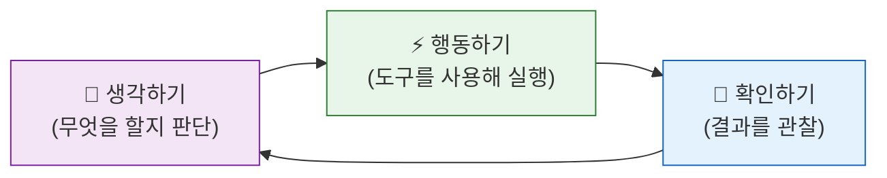
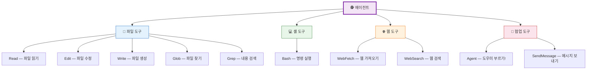
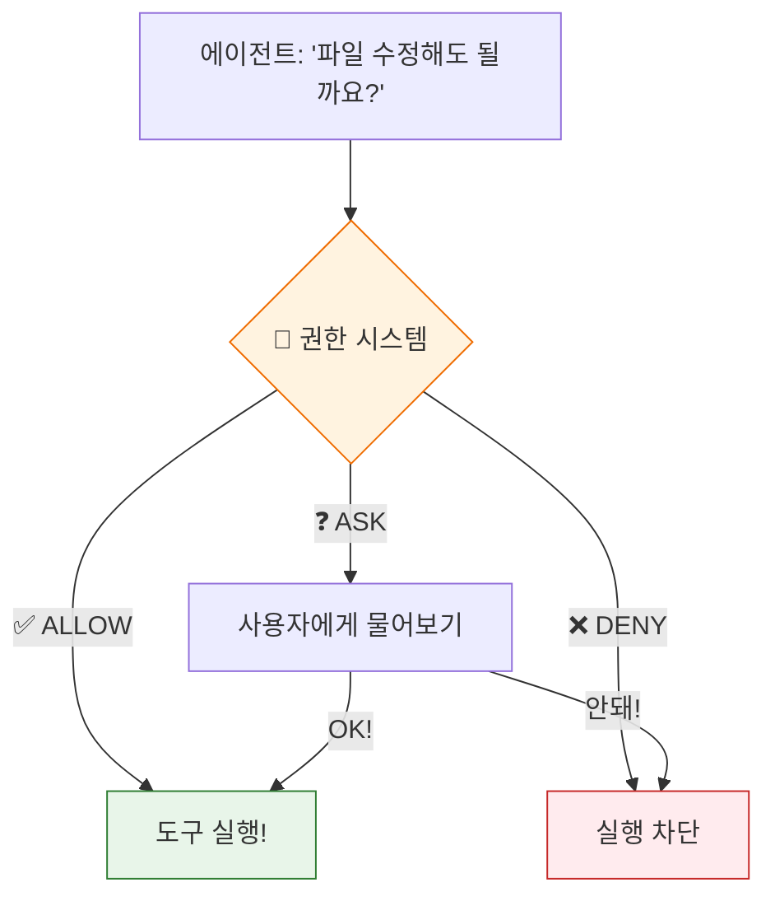
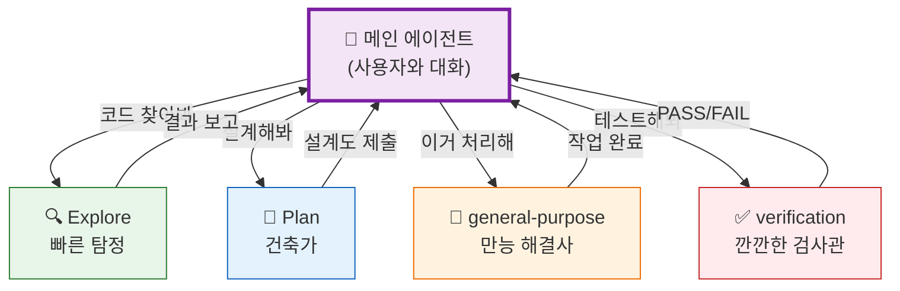
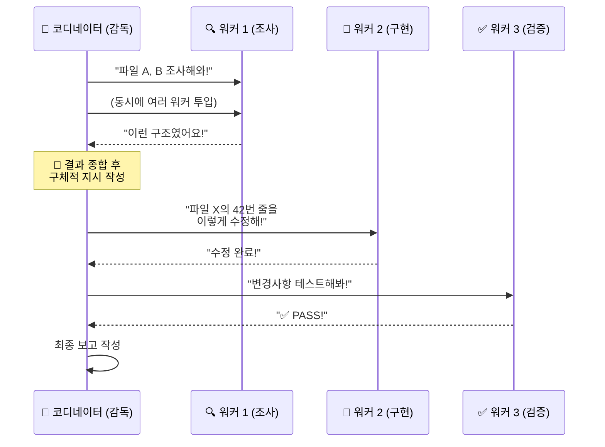

# 🕵️ 스스로 생각하는 로봇, 에이전트의 비밀

> 이 장에서는 일반 프로그램과 **에이전트**의 차이를 알아보고, Claude Code에 내장된 6가지 에이전트를 만나봅니다.

## 🤖 프로그램 vs 에이전트 — 뭐가 다를까?

### 일반 프로그램 = 시키는 대로만 하는 인형 🪆

```
"파일 열어" → 파일을 열었습니다.
"저장해" → 저장했습니다.
```

한 번에 하나씩, 시킨 것만 해요. 스스로 판단하지 못해요.

### 에이전트 = 스스로 생각해서 숙제를 끝내는 친구 🧠

```
"이 프로젝트의 버그를 찾아서 고쳐줘"
→ 🤔 "먼저 코드를 살펴봐야겠다"
→ 🔍 파일을 읽어봄
→ 💡 "아, 여기에 문제가 있네!"
→ 🔧 코드를 수정함
→ ✅ "테스트도 통과했어!"
→ 📋 "이렇게 고쳤어요" 보고
```

**생각 → 행동 → 확인**을 반복하면서 스스로 작업을 완료해요!



이것이 AI 분야에서 말하는 **ReAct (Reasoning and Acting)** 패턴이에요!

## 🔧 에이전트의 '도구 상자' — 40개의 도구

에이전트가 똑똑해도 **도구**가 없으면 아무것도 못 해요. 마치 요리사에게 칼과 냄비가 필요한 것처럼요!

Claude Code 에이전트에게는 **40개의 도구**가 있어요:



모든 도구는 [`src/tools/`](../src/tools/) 폴더에 있어요:
- 파일 읽기: [`src/tools/FileReadTool/`](../src/tools/FileReadTool/)
- Bash 실행: [`src/tools/BashTool/`](../src/tools/BashTool/)
- 에이전트 생성: [`src/tools/AgentTool/`](../src/tools/AgentTool/)

## 🚦 에이전트에게도 '교통법규'가 있어요 — 권한 시스템

에이전트가 아무거나 마음대로 하면 위험하겠죠? 그래서 **도구를 쓰기 전에 반드시 허락을 받아야** 해요!



이 허락 시스템은 [`src/utils/permissions/`](../src/utils/permissions/) 폴더에 26개 파일로 구현되어 있어요. 규칙 기반 검사와 AI 분류기가 함께 판단해요.

## 👥 Claude Code의 6가지 내장 에이전트

Claude Code에는 각각 다른 성격의 에이전트 6명이 살고 있어요! 마치 학교에서 각자 잘하는 과목이 다른 친구들처럼요:

| 에이전트 | 별명 | 잘하는 것 | 못하는 것 |
|:---------|:-----|:---------|:---------|
| 🔧 **general-purpose** | 만능 해결사 | 뭐든지! 코드 분석, 파일 수정, 테스트 | 없음 (모든 도구 사용 가능) |
| 🔍 **Explore** | 빠른 탐정 | 파일 찾기, 코드 검색 (초고속!) | 파일 수정 ❌ (읽기만!) |
| 📐 **Plan** | 건축가 | 설계도 그리기, 구조 분석 | 파일 수정 ❌ (읽기만!) |
| ✅ **verification** | 깐깐한 검사관 | 버그 찾기, 테스트 실행 | 파일 수정 ❌ |
| 📚 **claude-code-guide** | 가이드 선생님 | Claude Code 사용법 안내 | 코드 수정 ❌ |
| ⚙️ **statusline-setup** | 설정 도우미 | 상태바 설정 | 그 외 작업 ❌ |



이 에이전트들은 모두 [`src/tools/AgentTool/built-in/`](../src/tools/AgentTool/built-in/) 폴더에 정의되어 있어요:
- 만능 해결사: [`generalPurposeAgent.ts`](../src/tools/AgentTool/built-in/generalPurposeAgent.ts)
- 빠른 탐정: [`exploreAgent.ts`](../src/tools/AgentTool/built-in/exploreAgent.ts)
- 건축가: [`planAgent.ts`](../src/tools/AgentTool/built-in/planAgent.ts)
- 검사관: [`verificationAgent.ts`](../src/tools/AgentTool/built-in/verificationAgent.ts)

## 🎭 코디네이터 모드 — 팀장이 팀원들을 지휘해요!

복잡한 작업에서는 에이전트 한 명으로는 부족할 때가 있어요. 그럴 때 **코디네이터 모드**가 활성화돼요!

마치 축구팀의 감독이 선수들에게 역할을 배분하는 것처럼:



코디네이터의 핵심 규칙은:
> **"절대 이해를 위임하지 마라!"** — 감독은 조사 결과를 직접 이해하고, 구체적인 지시를 내려야 해요.

소스코드: [`src/coordinator/coordinatorMode.ts`](../src/coordinator/coordinatorMode.ts)

---

## 💡 엔지니어를 위한 팁

<details>
<summary><b>펼쳐서 기술 심화 내용 보기</b></summary>

### AgentTool 호출 구조

에이전트는 `Agent()` 함수로 생성됩니다:

```typescript
Agent({
  description: "3-5 단어 요약",
  subagent_type: "Explore",    // 에이전트 타입
  prompt: "구체적인 작업 지시",
  model: "haiku",              // 모델 오버라이드 (선택)
  run_in_background: true,     // 백그라운드 실행 (선택)
  isolation: "worktree"        // Git 워크트리 격리 (선택)
})
```

### Fork vs Fresh Agent

| 방식 | 언제 사용? | 장점 |
|:-----|:---------|:-----|
| **Fork** (`subagent_type` 생략) | 부모 컨텍스트 재활용 | 캐시 공유, 저비용 |
| **Fresh** (`subagent_type` 지정) | 특화 에이전트 필요 | 독립 시스템 프롬프트 |

### Worker → Coordinator 통신

Worker는 `<task-notification>` XML로 결과를 보고합니다:

```xml
<task-notification>
  <task-id>{agentId}</task-id>
  <status>completed</status>
  <summary>파일 분석 완료</summary>
  <result>...</result>
  <usage><total_tokens>5234</total_tokens></usage>
</task-notification>
```

### 핵심 파일

| 파일 | 역할 |
|:-----|:-----|
| [`src/tools/AgentTool/prompt.ts`](../src/tools/AgentTool/prompt.ts) | AgentTool 프롬프트/설명 |
| [`src/tools/AgentTool/loadAgentsDir.ts`](../src/tools/AgentTool/loadAgentsDir.ts) | 에이전트 정의 로딩 |
| [`src/tools/AgentTool/built-in/`](../src/tools/AgentTool/built-in/) | 6개 내장 에이전트 |
| [`src/coordinator/coordinatorMode.ts`](../src/coordinator/coordinatorMode.ts) | 코디네이터 모드 |
| [`src/utils/swarm/`](../src/utils/swarm/) | 분산 에이전트 패턴 |

</details>

---

👉 다음 장: [**3장: AI를 움직이는 마법의 주문, 프롬프트 엔지니어링**](./3_Prompt_Magic.md) 🪄
