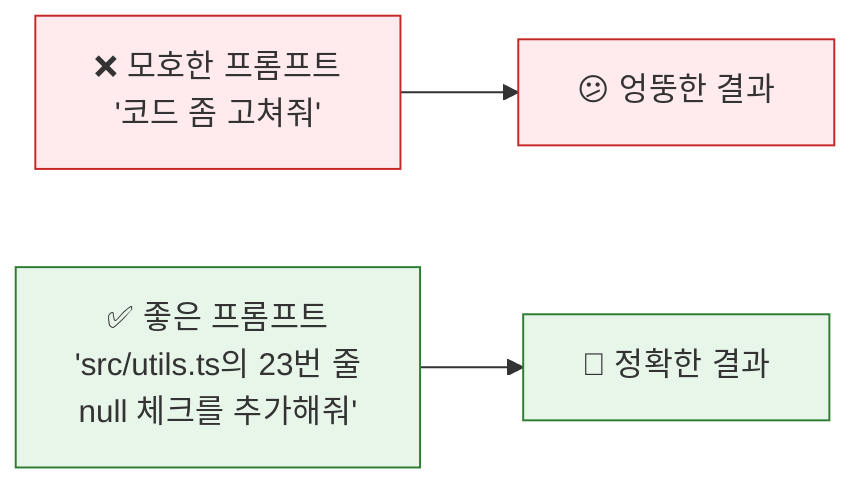
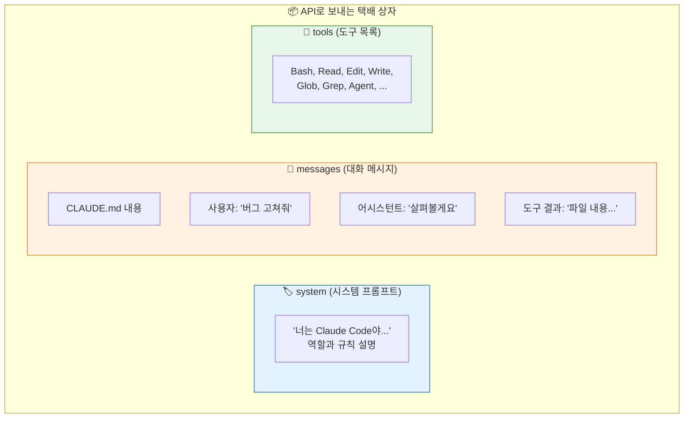
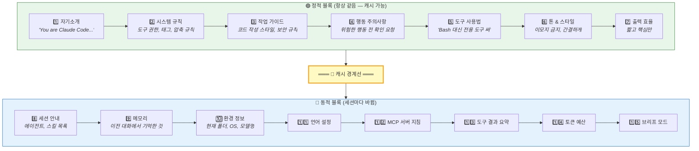
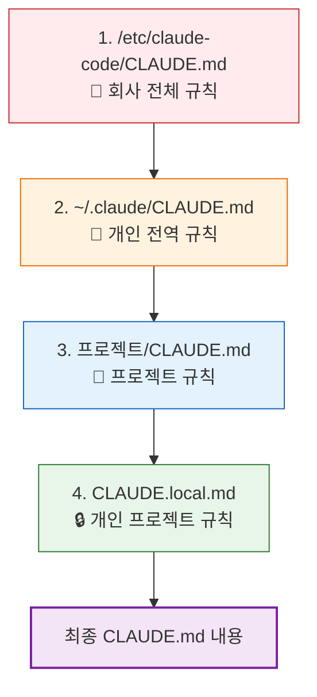
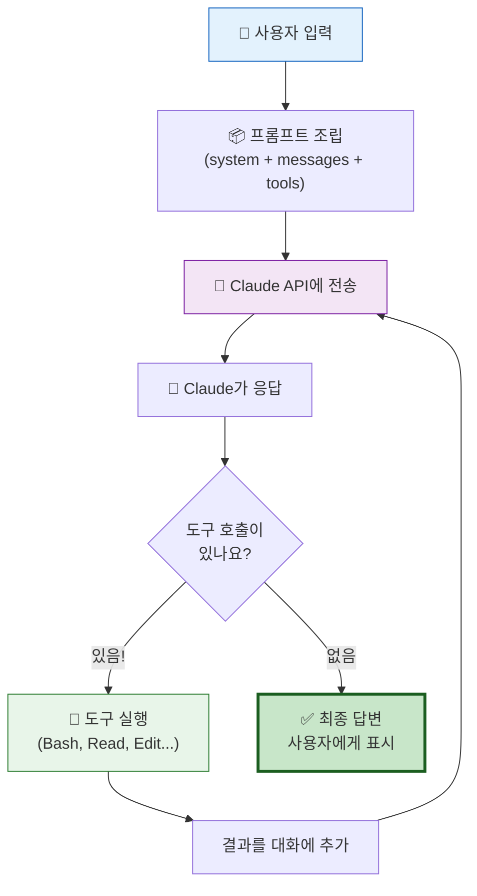
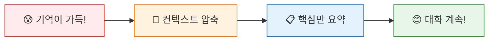

# 🪄 AI를 움직이는 마법의 주문, 프롬프트 엔지니어링

> 이 장에서는 Claude Code가 내부적으로 어떤 '주문서(프롬프트)'를 조립해서 Claude AI에게 보내는지, 그 비밀을 파헤칩니다.

## 📝 프롬프트란 뭘까?

여러분이 음식점에서 주문할 때를 떠올려 보세요:

- ❌ "뭐 좋은 거 주세요" → 뭘 받을지 모름!
- ✅ "페퍼로니 피자, 라지 사이즈, 치즈 크러스트로요!" → 정확히 원하는 걸 받음!

AI에게 주는 명령도 같아요. **프롬프트**는 AI에게 보내는 **정교한 주문서**예요!



## 📦 Claude Code의 프롬프트 '택배 상자'

Claude Code가 Claude AI에게 보내는 것은 단순한 텍스트가 아니에요. 마치 택배 상자처럼 여러 칸으로 나뉘어 있죠:



이 택배 상자를 만드는 코드는 [`src/services/api/claude.ts`](../src/services/api/claude.ts)에 있어요.

## 🧱 시스템 프롬프트 — 15개 레고 블록

시스템 프롬프트는 Claude에게 **"넌 이런 존재야, 이런 규칙을 따라야 해"**라고 알려주는 부분이에요.

놀랍게도, 이건 **15개의 블록**이 순서대로 쌓여서 만들어져요!



왜 두 부분으로 나눌까요? **비용 절약**이에요! 🤑

정적 블록은 매번 같으니까 API에서 **캐시**해서 재사용해요. 이렇게 하면 토큰(=비용)을 아낄 수 있어요!

소스코드: [`src/constants/prompts.ts`](../src/constants/prompts.ts)의 `getSystemPrompt()` 함수

## 📋 CLAUDE.md — 사용자가 작성하는 '지시서'

여러분도 Claude Code에게 자신만의 지시를 내릴 수 있어요! **CLAUDE.md** 파일을 만들면 돼요:



아래쪽에 있는 파일이 더 높은 우선순위를 가져요. 마치 선생님 말보다 엄마 말이 더 센 것처럼? 😄

이 파일들은 [`src/utils/claudemd.ts`](../src/utils/claudemd.ts)에서 로드되어 API 호출 시 `messages[0]`에 `<system-reminder>`로 삽입돼요.

## 🔄 대화의 비밀 — 도구 실행 루프

Claude Code와 대화할 때, 뒤에서는 이런 일이 반복되고 있어요:



한 번 물어봤는데 도구를 5번 쓰는 경우도 있어요! Claude가 "파일을 읽어봐야겠어" → "이 부분을 수정해야겠어" → "테스트를 돌려봐야겠어" 하면서 여러 번 도구를 호출하거든요.

이 루프는 [`src/query.ts`](../src/query.ts)에 구현되어 있어요.

## 🧠 기억 정리 — 컨텍스트 압축

대화가 길어지면 AI의 '기억 창'(컨텍스트 윈도우)이 가득 차요. 마치 칠판이 꽉 차면 지워야 하는 것처럼!



압축할 때 이 9가지를 반드시 기억해요:

1. 📌 **주요 요청과 의도** — 사용자가 원래 뭘 하려 했는지
2. 💡 **핵심 기술 개념** — 중요한 기술 용어
3. 📄 **파일과 코드** — 어떤 파일을 다뤘는지
4. 🐛 **에러와 수정** — 뭘 고쳤는지
5. 🧩 **문제 해결 과정** — 어떻게 해결했는지
6. 💬 **모든 사용자 메시지** — 대화 내용
7. ⏳ **대기 중인 작업** — 아직 안 한 것
8. 🔨 **현재 작업** — 지금 하고 있는 것
9. ➡️ **다음 단계** — 뭘 해야 하는지

소스코드: [`src/services/compact/prompt.ts`](../src/services/compact/prompt.ts)

## 🏷️ 각 에이전트의 '신분증' — 시스템 프롬프트

각 에이전트가 어떤 시스템 프롬프트를 받는지 살펴볼까요?

| 에이전트 | 프롬프트 핵심 내용 | 소스 파일 |
|:---------|:-----------------|:---------|
| 🔧 **general-purpose** | "작업을 완전히 끝내 — 과하게 하지 말고, 반쯤 하고 놔두지도 마" | [`generalPurposeAgent.ts`](../src/tools/AgentTool/built-in/generalPurposeAgent.ts) |
| 🔍 **Explore** | "너는 파일 검색 전문가야... **읽기 전용 모드**" | [`exploreAgent.ts`](../src/tools/AgentTool/built-in/exploreAgent.ts) |
| 📐 **Plan** | "너는 소프트웨어 아키텍트야... **읽기 전용 설계 작업**" | [`planAgent.ts`](../src/tools/AgentTool/built-in/planAgent.ts) |
| ✅ **verification** | "적대적 테스트 — 구현을 깨뜨려 봐. PASS/FAIL/PARTIAL" | [`verificationAgent.ts`](../src/tools/AgentTool/built-in/verificationAgent.ts) |
| 📚 **claude-code-guide** | "Claude Code CLI, Agent SDK, Claude API 질문에 답해" | [`claudeCodeGuideAgent.ts`](../src/tools/AgentTool/built-in/claudeCodeGuideAgent.ts) |

---

## 💡 엔지니어를 위한 팁

<details>
<summary><b>펼쳐서 기술 심화 내용 보기</b></summary>

### 시스템 프롬프트 우선순위 체인

`buildEffectiveSystemPrompt()` 함수 ([`src/utils/systemPrompt.ts`](../src/utils/systemPrompt.ts))는 5단계 우선순위로 프롬프트를 선택합니다:

1. **Override** (loop 모드) — 다른 모든 것을 대체
2. **Coordinator** 시스템 프롬프트
3. **Agent** 정의의 시스템 프롬프트
4. **--system-prompt** CLI 플래그
5. **Default** 시스템 프롬프트

### 프롬프트 캐싱 구조

`SYSTEM_PROMPT_DYNAMIC_BOUNDARY` 마커 기준으로:
- **마커 이전**: `cache_control: { scope: "global", ttl: "5m" }` — 전역 캐시
- **마커 이후**: 세션별 동적 콘텐츠 — 캐시 안 됨

이 구조 덕분에 정적 프롬프트(~수천 토큰)를 매 요청마다 재전송하지 않아요.

### API 호출 시 실제 전달되는 구조

```typescript
anthropic.beta.messages.create({
  model: "claude-sonnet-4-20250514",
  system: [
    { text: "You are Claude Code...", cache_control: { scope: "global" } },
    { text: "[동적 섹션들]" },
    { text: "gitStatus: branch main..." }
  ],
  messages: [
    { role: "user", content: [
      { text: "<system-reminder># claudeMd\n..." },  // CLAUDE.md
      { text: "사용자 실제 입력" }
    ]},
    { role: "assistant", content: [...] }
  ],
  tools: [
    { name: "Bash", description: "...", input_schema: {...}, strict: true },
    // ...40+ tools
  ],
  thinking: { type: "adaptive" },
  max_tokens: 16384
})
```

### 핵심 파일 참조

| 파일 | 함수/역할 |
|:-----|:---------|
| [`src/constants/prompts.ts`](../src/constants/prompts.ts) | `getSystemPrompt()` — 15개 블록 조립 |
| [`src/utils/systemPrompt.ts`](../src/utils/systemPrompt.ts) | `buildEffectiveSystemPrompt()` — 우선순위 체인 |
| [`src/context.ts`](../src/context.ts) | `getUserContext()`, `getSystemContext()` |
| [`src/utils/claudemd.ts`](../src/utils/claudemd.ts) | CLAUDE.md 계층 로딩 |
| [`src/services/api/claude.ts`](../src/services/api/claude.ts) | `paramsFromContext()` — 최종 API 파라미터 |
| [`src/query.ts`](../src/query.ts) | 쿼리 실행 루프 |
| [`src/services/compact/prompt.ts`](../src/services/compact/prompt.ts) | 컨텍스트 압축 프롬프트 |

</details>

---

👉 다음 장: [**4장: 실제 코드로 보는 에이전트의 구조**](./4_Code_Tour.md) 🛠️
