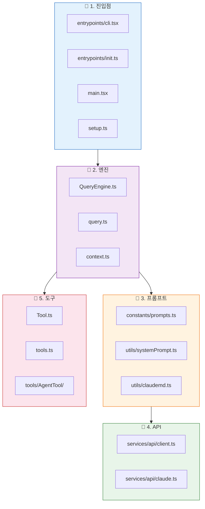
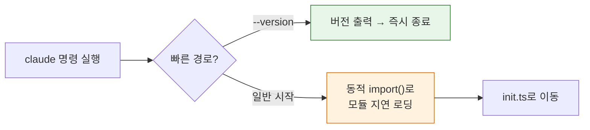
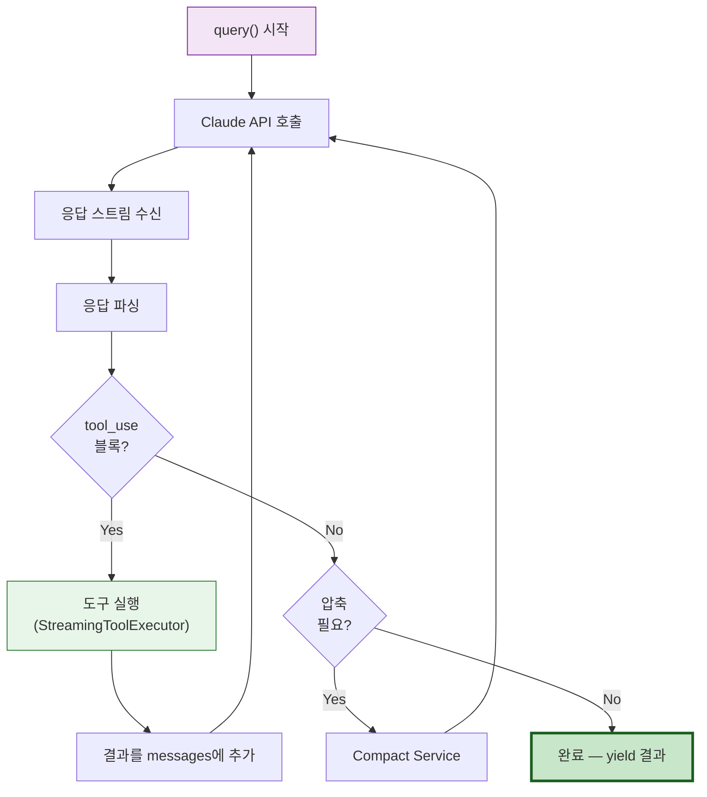
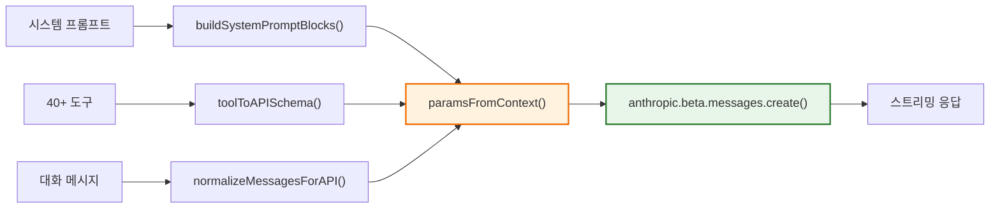
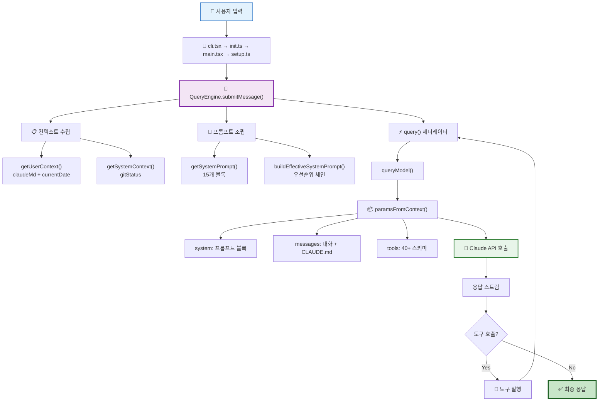

# 🛠️ 실제 코드로 보는 에이전트의 구조 (엔지니어 가이드)

> 이 장에서는 지금까지 배운 개념을 **실제 소스코드**와 연결합니다. 각 파일을 직접 열어보며 Claude Code의 내부를 탐험해 봅시다!

## 🗺️ 코드 여행 지도

이번 여행에서 방문할 핵심 파일들이에요:



## 🚪 Stop 1: 진입점 — 여행의 시작

### 📄 [`src/entrypoints/cli.tsx`](../src/entrypoints/cli.tsx)

모든 것이 시작되는 곳이에요! Claude Code를 터미널에서 실행하면 이 파일이 가장 먼저 실행돼요.

**핵심 포인트:**
- `--version` 같은 빠른 경로(Fast-path)는 무거운 모듈을 로드하지 않고 바로 처리
- 동적 `import()`로 필요한 모듈만 지연 로딩 — 빠른 시작을 위해!



### 📄 [`src/entrypoints/init.ts`](../src/entrypoints/init.ts)

환경을 설정하는 10단계 파이프라인이에요:

| 단계 | 하는 일 | 비유 |
|:-----|:--------|:-----|
| 1 | Config 검증 | 🔑 열쇠 확인 |
| 2 | 환경 변수 | 🌡️ 온도 설정 |
| 3 | CA 인증서 | 🛡️ 보안 인증서 |
| 4 | 종료 핸들러 | 🚪 비상구 설정 |
| 5 | OAuth | 👤 로그인 |
| 6 | 정책 | 📜 규칙 로드 |
| 7 | mTLS | 🔒 암호화 통신 |
| 8 | API 프리커넥션 | 📡 서버 미리 연결 |
| 9 | 프록시 | 🔄 중계 설정 |
| 10 | LSP 정리 | 🧹 언어 서버 관리 |

## 🧠 Stop 2: 엔진 — 대화의 심장부

### 📄 [`src/QueryEngine.ts`](../src/QueryEngine.ts)

**대화의 관리자**예요. 사용자가 메시지를 보내면 이 파일이 전체 흐름을 관리해요.

**핵심 함수: `submitMessage()`**
```
1. getUserContext() 호출 → claudeMd + currentDate 수집
2. getSystemContext() 호출 → gitStatus 수집
3. buildEffectiveSystemPrompt() → 시스템 프롬프트 결정
4. query() 제너레이터 실행 → API 호출 + 도구 실행 루프
```

### 📄 [`src/query.ts`](../src/query.ts)

**실제 API 호출 루프**가 있는 곳이에요. `async function*` 제너레이터로 구현되어 있어요.



### 📄 [`src/context.ts`](../src/context.ts)

두 가지 컨텍스트를 조립하는 곳이에요:

**`getUserContext()`** — 사용자 관련 정보 (메모이제이션):
- `claudeMd`: CLAUDE.md 파일들의 계층적 내용
- `currentDate`: 오늘 날짜

**`getSystemContext()`** — 시스템 관련 정보 (메모이제이션):
- `gitStatus`: 현재 브랜치, 최근 커밋, 변경 파일
- `cacheBreaker`: 캐시 무효화 키 (내부용)

## 📝 Stop 3: 프롬프트 — 마법의 주문 공방

### 📄 [`src/constants/prompts.ts`](../src/constants/prompts.ts)

**시스템 프롬프트의 15개 블록이 조립되는 곳**이에요. 이 파일이 Claude Code에서 가장 중요한 파일 중 하나예요!

**핵심 함수: `getSystemPrompt()`**

```
반환값: string[] (문자열 배열)

정적 블록:
  [0] getSimpleIntroSection()        ← "You are Claude Code..."
  [1] getSimpleSystemSection()       ← 시스템 규칙
  [2] getSimpleDoingTasksSection()   ← 작업 가이드라인
  [3] getActionsSection()            ← 행동 주의사항
  [4] getUsingYourToolsSection()     ← 도구 사용법
  [5] getSimpleToneAndStyleSection() ← 톤 & 스타일
  [6] getOutputEfficiencySection()   ← 출력 간결성

── SYSTEM_PROMPT_DYNAMIC_BOUNDARY ──

동적 블록 (systemPromptSection 레지스트리):
  session_guidance, memory, env_info_simple,
  language, mcp_instructions, scratchpad,
  frc, summarize_tool_results, token_budget, brief
```

### 📄 [`src/utils/systemPrompt.ts`](../src/utils/systemPrompt.ts)

**시스템 프롬프트 우선순위 체인**을 관리해요.

**핵심 함수: `buildEffectiveSystemPrompt()`**

```
우선순위 (높은 순):
  1. override (loop 모드에서 설정)
  2. coordinator 시스템 프롬프트
  3. agent 정의 시스템 프롬프트
  4. --system-prompt 플래그
  5. default 시스템 프롬프트 (getSystemPrompt())
```

### 📄 [`src/utils/claudemd.ts`](../src/utils/claudemd.ts)

CLAUDE.md 파일들을 계층적으로 로드하는 곳이에요.

로딩 순서: `/etc/` → `~/` → 프로젝트 → cwd

`@include` 지시어로 다른 파일을 재귀적으로 포함할 수 있고, 순환 참조는 자동으로 방지돼요.

## 📡 Stop 4: API — 실제 통신

### 📄 [`src/services/api/claude.ts`](../src/services/api/claude.ts)

Claude API와 실제로 통신하는 곳이에요. 약 1,800줄의 대형 파일!

**핵심 함수 1: `queryModel()`**
- 도구 스키마를 `toolToAPISchema()`로 변환
- 메시지를 `normalizeMessagesForAPI()`로 정규화
- 시스템 프롬프트를 캐시 마커와 함께 블록으로 변환

**핵심 함수 2: `paramsFromContext()`**
- 최종 API 파라미터를 조립하는 클로저
- model, messages, system, tools, thinking, betas 등 모든 설정을 결합



### 📄 [`src/services/api/client.ts`](../src/services/api/client.ts)

4개의 API 프로바이더 중 하나를 자동 감지하여 클라이언트를 생성해요:

| 프로바이더 | SDK | 감지 방법 |
|:----------|:----|:---------|
| Anthropic Direct | `@anthropic-ai/sdk` | 기본값 |
| AWS Bedrock | `@anthropic-ai/bedrock-sdk` | 환경 변수 |
| Google Vertex | `@anthropic-ai/vertex-sdk` | 환경 변수 |
| Azure Foundry | `@anthropic-ai/foundry-sdk` | 환경 변수 |

## 🔧 Stop 5: 도구 — 에이전트의 연장

### 📄 [`src/Tool.ts`](../src/Tool.ts)

모든 도구가 구현해야 하는 **인터페이스**가 정의된 곳이에요:

```typescript
interface Tool<Input, Output, Progress> {
  name: string;
  description(): string;
  call(input, context): Promise<Output>;       // 실제 실행
  checkPermissions(input, context): PermResult; // 권한 확인
  isReadOnly(): boolean;                        // 읽기 전용?
  isConcurrencySafe(): boolean;                 // 동시 실행 안전?
}
```

**`buildTool()` 팩토리 함수**로 도구 정의를 완전한 도구 객체로 만들어요.

### 📄 [`src/tools.ts`](../src/tools.ts)

도구 **레지스트리**예요. 모든 도구를 등록하고 관리해요.

- `getAllBaseTools()` — 40개 내장 도구 반환
- `getTools()` — 권한 + 모드 필터 적용
- `assembleToolPool()` — 내장 + MCP 도구 통합 (중복 제거)
- `filterToolsByDenyRules()` — 거부 규칙 필터링

### 📄 [`src/tools/AgentTool/`](../src/tools/AgentTool/)

에이전트 생성 도구! 서브에이전트를 스포닝하는 핵심 모듈이에요.

```
tools/AgentTool/
├── prompt.ts           ← 도구 설명 (AI가 언제 쓸지 판단)
├── loadAgentsDir.ts    ← 에이전트 정의 로딩
├── runAgent.ts         ← 에이전트 실행 로직
└── built-in/           ← 6개 내장 에이전트
    ├── generalPurposeAgent.ts
    ├── exploreAgent.ts
    ├── planAgent.ts
    ├── verificationAgent.ts
    ├── claudeCodeGuideAgent.ts
    └── statuslineSetup.ts
```

## 🔄 전체 흐름 — 처음부터 끝까지

지금까지 배운 것을 하나로 연결해 볼게요:



---

## 💡 엔지니어를 위한 팁

<details>
<summary><b>펼쳐서 기술 심화 내용 보기</b></summary>

### 프롬프트 캐싱 전략

Claude Code는 두 가지 캐시 범위를 사용합니다:

| 범위 | 대상 | TTL |
|:-----|:-----|:----|
| `global` | 정적 시스템 프롬프트 | 5분 |
| `ephemeral` | 개별 도구 스키마 | 요청 단위 |

`buildSystemPromptBlocks()` 함수가 `SYSTEM_PROMPT_DYNAMIC_BOUNDARY`를 기준으로 캐시 마커를 부착합니다.

### 도구 실행 동시성

`StreamingToolExecutor`는 도구의 `isConcurrencySafe()` 반환값에 따라:
- `true` → `Promise.all()`로 병렬 실행
- `false` → 순차 `await`로 직렬 실행

### 메시지 정규화

`normalizeMessagesForAPI()` ([`src/utils/messages.ts`](../src/utils/messages.ts))는:
- tool_use/tool_result 페어링 복구
- 미디어 아이템 제한 (>100개 시 제거)
- 캐시 브레이크포인트 삽입

### 추가 학습 자료

| 분석 문서 | 내용 |
|:---------|:-----|
| [Index.md (MOC)](../Index.md) | 전체 프로젝트 지도 |
| [Tools_Overview.md](../Tools_Overview.md) | 40개 도구 카탈로그 |
| [Services_Overview.md](../Services_Overview.md) | 19개 서비스 상세 |
| [Stats_Report.md](../Stats_Report.md) | 통계 및 품질 지표 |
| [README.md](../README.md) | 프로젝트 전체 README (28개 Mermaid 다이어그램) |

</details>

---

## 🎉 축하합니다!

4개의 장을 모두 읽으셨군요! 이제 여러분은 Claude Code의 내부를 꿰뚫어 보는 눈을 갖게 되었어요.

**배운 것 정리:**
- 1️⃣ **Claude**가 뭔지, Claude Code가 어떤 '집'인지
- 2️⃣ **에이전트**가 스스로 생각하고 행동하는 원리
- 3️⃣ **프롬프트**가 15개 블록으로 조립되는 과정
- 4️⃣ **실제 코드**에서 이 모든 것이 어떻게 연결되는지

더 깊이 알고 싶다면 [`./src/`](../src/) 폴더의 1,902개 파일을 직접 탐험해 보세요! 🚀

---

👉 돌아가기: [**튜토리얼 목차**](./README.md) 🗺️
