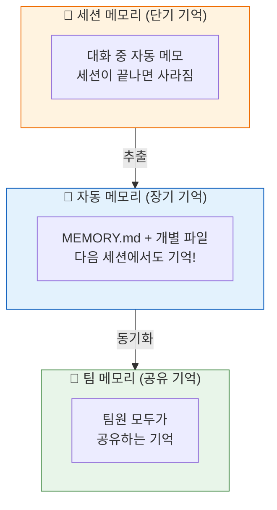
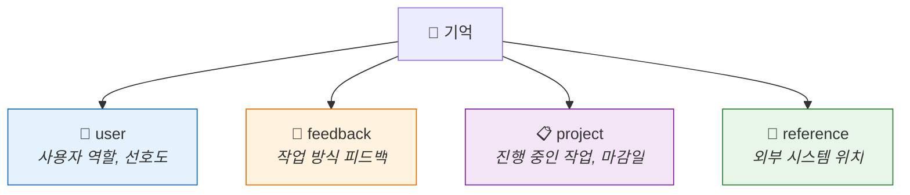
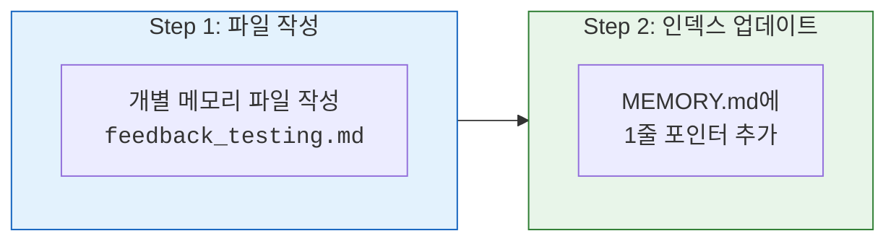
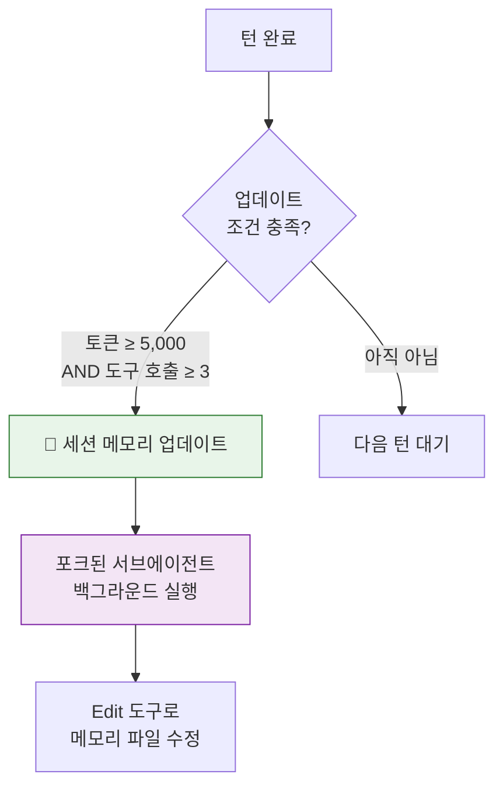
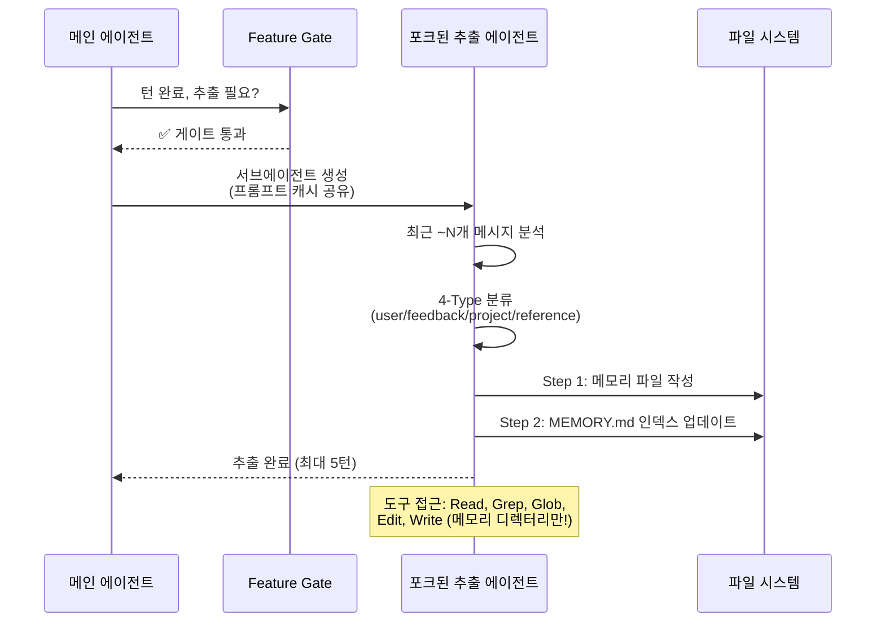
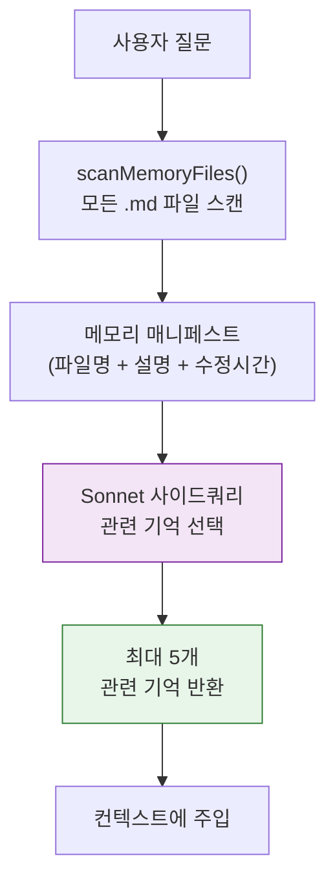
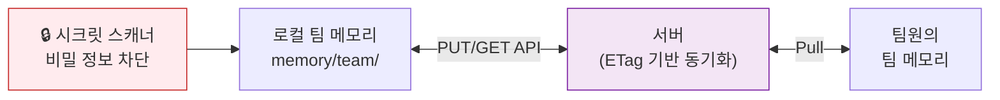

# 🧠 AI의 기억 시스템 — 세션을 넘어 기억하는 비밀

> 이 장에서는 Claude Code가 **대화가 끝나도 기억을 유지**하는 메모리 시스템의 전체 구조를 다룹니다.

## 📦 기억의 3가지 종류

사람도 기억에 종류가 있죠? Claude Code도 마찬가지예요!



| 유형 | 비유 | 저장 위치 | 지속성 |
|:-----|:-----|:---------|:------|
| 🔄 **세션 메모리** | 수업 중 노트 | `~/.claude/session-memory/` | 현재 대화만 |
| 💾 **자동 메모리** | 일기장 | `~/.claude/projects/{hash}/memory/` | 영구 |
| 👥 **팀 메모리** | 공유 위키 | `memory/team/` | 영구 + 공유 |

## 📖 자동 메모리 — MEMORY.md의 비밀

### 기억의 4가지 유형

Claude Code는 기억을 4가지 서랍에 분류해요:



### 저장하면 안 되는 것들 ❌

- 코드 패턴, 아키텍처 → **코드를 읽으면 알 수 있으니까!**
- Git 히스토리 → **`git log`로 확인 가능!**
- 디버깅 해결책 → **코드에 수정이 있으니까!**
- 임시 작업 상태 → **현재 대화에서만 유효!**

### 2단계 저장 프로세스



**메모리 파일 형식:**
```markdown
---
name: 테스트 방식 선호
description: 통합 테스트에 실제 DB 사용 선호
type: feedback
---

통합 테스트는 반드시 실제 데이터베이스를 사용할 것.
**Why:** 지난 분기에 Mock 테스트가 통과했지만 프로덕션 마이그레이션이 실패했음.
**How to apply:** 테스트 코드 작성 시 Mock DB 대신 테스트 DB 사용.
```

**MEMORY.md 인덱스:**
```markdown
- [테스트 방식](feedback_testing.md) — 통합 테스트에 실제 DB 사용
- [배포 일정](project_deploy.md) — 3/5부터 모바일 릴리스 머지 프리즈
```

> 소스: [`src/memdir/memdir.ts`](../src/memdir/memdir.ts) · [`src/memdir/memoryTypes.ts`](../src/memdir/memoryTypes.ts)

## 🔄 세션 메모리 — 대화 중 자동 메모

### 10개 섹션 템플릿

세션 메모리는 포크된 서브에이전트가 백그라운드에서 자동으로 업데이트해요:

```
# Session Title
# Current State          ← 🔥 가장 중요! 압축 후 연속성의 핵심
# Task specification
# Files and Functions
# Workflow               ← bash 명령어, 순서, 해석
# Errors & Corrections
# Codebase and System Documentation
# Learnings
# Key results
# Worklog
```

**제한:** 섹션당 ~2,000 토큰, 전체 최대 12,000 토큰

### 업데이트 타이밍



> 소스: [`src/services/SessionMemory/prompts.ts`](../src/services/SessionMemory/prompts.ts)

## 🤖 메모리 추출 에이전트 — 자동 기억 정리

세션이 끝나거나 컨텍스트가 압축될 때, **포크된 서브에이전트**가 대화에서 기억할 만한 것을 자동으로 추출해요:



> 소스: [`src/services/extractMemories/prompts.ts`](../src/services/extractMemories/prompts.ts) · [`src/services/extractMemories/extractMemories.ts`](../src/services/extractMemories/extractMemories.ts)

## 🔍 관련 기억 검색 — AI가 기억을 고르는 법

모든 기억을 매번 로드하면 비효율적이에요. 그래서 **Sonnet 모델**이 관련성 높은 기억만 골라요!



> 소스: [`src/memdir/findRelevantMemories.ts`](../src/memdir/findRelevantMemories.ts)

## 👥 팀 메모리 — 동료와 기억 공유

팀 메모리는 서버 API를 통해 팀원 간에 동기화돼요:



**보안:** 동기화 전에 **시크릿 스캐너**가 비밀번호, API 키 등을 감지하고 차단해요!

---

## 💡 엔지니어를 위한 팁

<details>
<summary><b>펼쳐서 기술 심화 내용 보기</b></summary>

### MEMORY.md 제한

| 제한 | 값 |
|:-----|:---|
| 최대 줄 수 | 200줄 |
| 최대 바이트 | 25,000 |
| 최대 스캔 파일 | 200개 |

### 핵심 함수 참조

| 함수 | 파일 | 역할 |
|:-----|:-----|:-----|
| `loadMemoryPrompt()` | [`memdir.ts`](../src/memdir/memdir.ts) | 시스템 프롬프트에 메모리 섹션 주입 |
| `buildMemoryLines()` | [`memdir.ts`](../src/memdir/memdir.ts) | 메모리 행동 지침 생성 |
| `scanMemoryFiles()` | [`memoryScan.ts`](../src/memdir/memoryScan.ts) | 메모리 파일 스캔 |
| `findRelevantMemories()` | [`findRelevantMemories.ts`](../src/memdir/findRelevantMemories.ts) | Sonnet 기반 관련 기억 선택 |
| `executeExtractMemories()` | [`extractMemories.ts`](../src/services/extractMemories/extractMemories.ts) | 추출 에이전트 실행 |
| `initSessionMemory()` | [`sessionMemory.ts`](../src/services/SessionMemory/sessionMemory.ts) | 세션 메모리 훅 등록 |

### 팀 메모리 동기화 전략

- **Pull**: 서버 데이터가 로컬을 덮어씀 (Server wins)
- **Push**: 변경된 키만 delta 업로드
- **Delete**: 서버에서 보존, 다음 Pull 시 복원
- **시크릿 스캔**: 파일별 비밀 패턴 검사 후 차단

</details>

---

👉 다음 장: [**6장: 보안 아키텍처와 권한 시스템**](./6_Security_Permissions.md) 🛡️
