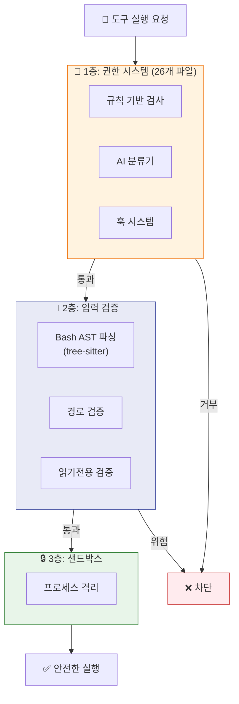
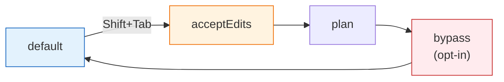
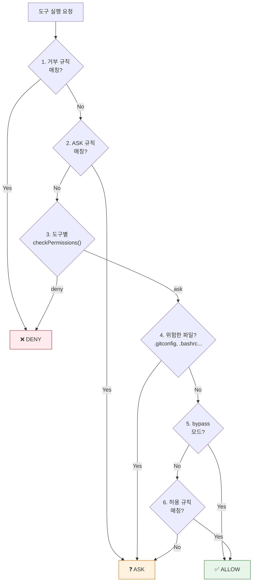
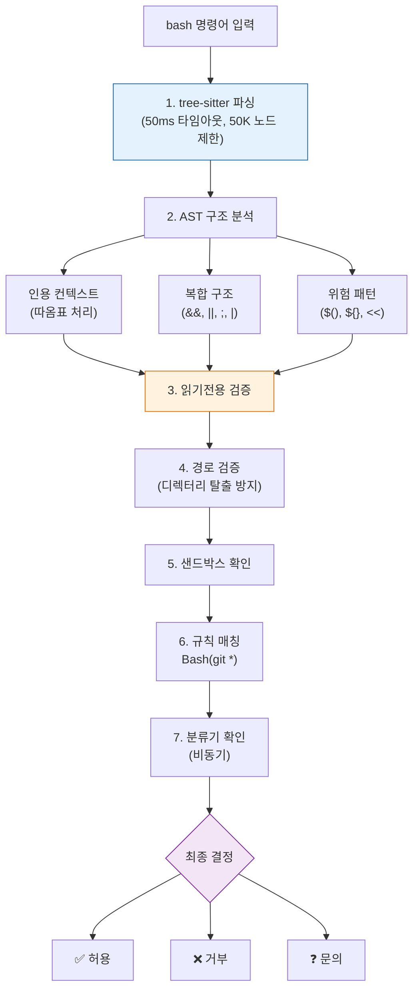
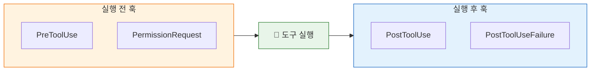

# 🛡️ 보안 아키텍처와 권한 시스템

> 이 장에서는 Claude Code가 **위험한 행동을 방지하는 다층 보안 구조**를 분석합니다.

## 🏰 3겹 성벽 — 다층 방어 구조

Claude Code의 보안은 성의 방어와 같아요. 3겹의 성벽이 있죠!



## 🚦 권한 모드 — 6가지 운전 모드

| 모드 | 비유 | 설명 |
|:-----|:-----|:-----|
| `default` | 🚗 일반 운전 | 매 행동마다 물어봄 |
| `acceptEdits` | 🚕 택시 모드 | 파일 수정은 자동 승인 |
| `plan` | 🗺️ 지도 모드 | 계획만, 실행 안함 |
| `bypassPermissions` | 🏎️ 레이싱 모드 | 모든 것 자동 승인 |
| `auto` | 🤖 자동 운전 | AI 분류기가 판단 |
| `dontAsk` | 🚫 정지 모드 | 모든 것 자동 거부 |



> 소스: [`src/utils/permissions/permissions.ts`](../src/utils/permissions/permissions.ts)

## 🔍 권한 결정 12단계

`hasPermissionsToUseToolInner()` 함수는 12단계로 권한을 결정해요:



**핵심 원칙:** 거부 규칙과 위험 파일 검사는 **bypass 모드에서도 우회할 수 없어요!** (bypass-immune)

## 🌳 Bash 보안 — AST 기반 명령어 검증

Bash 명령어는 특별히 위험해서, **tree-sitter로 AST(구문 트리)를 파싱**해서 검증해요:



> 소스: [`src/utils/bash/bashParser.ts`](../src/utils/bash/bashParser.ts) · [`src/tools/BashTool/bashSecurity.ts`](../src/tools/BashTool/bashSecurity.ts)

## 🪝 훅 시스템 — 도구 실행 전후 가로채기

**훅(Hook)**은 도구가 실행되기 전이나 후에 자동으로 실행되는 커스텀 코드예요:



**훅 유형 4가지:**

| 유형 | 설명 | 예시 |
|:-----|:-----|:-----|
| `command` | 셸 명령 실행 | `"lint-staged"` |
| `prompt` | LLM 프롬프트 평가 | `"이 변경이 안전한가?"` |
| `http` | HTTP POST 전송 | 외부 서비스 알림 |
| `agent` | 에이전트 검증 | 자동 코드 리뷰 |

> 소스: [`src/schemas/hooks.ts`](../src/schemas/hooks.ts) · [`src/utils/hooks.ts`](../src/utils/hooks.ts)

## 🛡️ 위험한 파일 보호

이 파일/폴더들은 **어떤 모드에서도** 자동 승인되지 않아요:

| 보호 대상 | 이유 |
|:----------|:-----|
| `.gitconfig` | Git 설정 변조 방지 |
| `.bashrc`, `.zshrc` | 셸 시작 스크립트 보호 |
| `.mcp.json` | MCP 서버 설정 보호 |
| `.claude.json` | Claude 설정 보호 |
| `.git/` 디렉터리 | Git 저장소 무결성 |

---

## 💡 엔지니어를 위한 팁

<details>
<summary><b>펼쳐서 기술 심화 내용 보기</b></summary>

### 권한 규칙 문법

```
Tool(content)         — 도구명(패턴)
Bash(git *)           — git + 아무 인자
Read(*.ts)            — TypeScript 파일
Write(src/**)         — src/ 하위 전체
Bash(npm publish:*)   — npm publish 서브커맨드
```

### Auto 모드 위험 패턴 제거

Auto 모드 진입 시 자동으로 제거되는 허용 규칙:
- 셸 인터프리터: `python:*`, `node:*`, `ruby:*`
- 패키지 러너: `npm run:*`, `npx:*`, `bunx:*`
- 셸: `bash:*`, `sh:*`, `zsh:*`
- 위험 도구: `eval:*`, `exec:*`, `sudo:*`

### PermissionResult 타입

```typescript
// 허용
{ behavior: 'allow', updatedInput?, decisionReason? }
// 문의
{ behavior: 'ask', message, suggestions?, pendingClassifierCheck? }
// 거부
{ behavior: 'deny', message, decisionReason }
```

### 핵심 파일

| 파일 | 역할 |
|:-----|:-----|
| [`permissions.ts`](../src/utils/permissions/permissions.ts) | 12단계 결정 로직 |
| [`dangerousPatterns.ts`](../src/utils/permissions/dangerousPatterns.ts) | 위험 패턴 |
| [`filesystem.ts`](../src/utils/permissions/filesystem.ts) | 경로/파일 보호 |
| [`bashParser.ts`](../src/utils/bash/bashParser.ts) | tree-sitter 파서 |
| [`treeSitterAnalysis.ts`](../src/utils/bash/treeSitterAnalysis.ts) | AST 분석 |

</details>

---

👉 다음 장: [**7장: MCP와 확장성 아키텍처**](./7_MCP_Extensibility.md) 🔌
