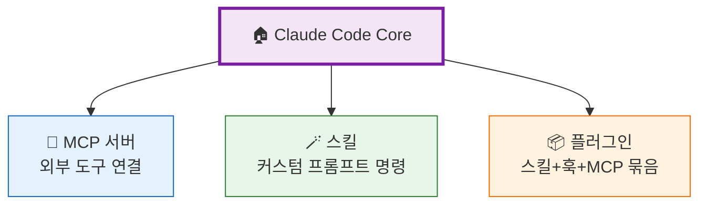
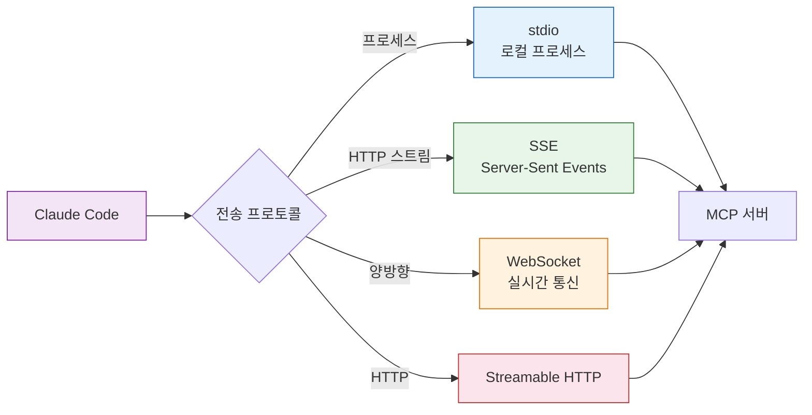
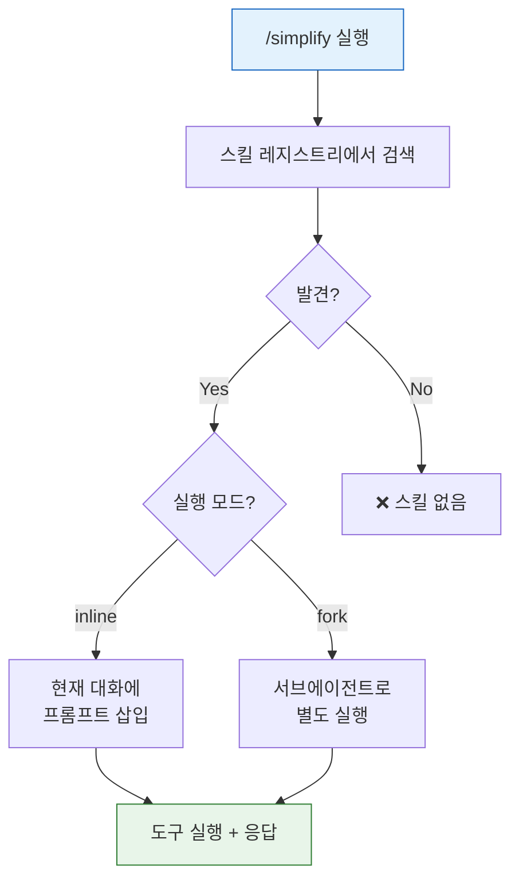
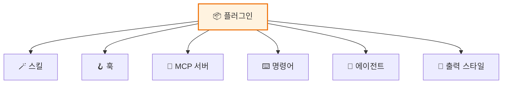
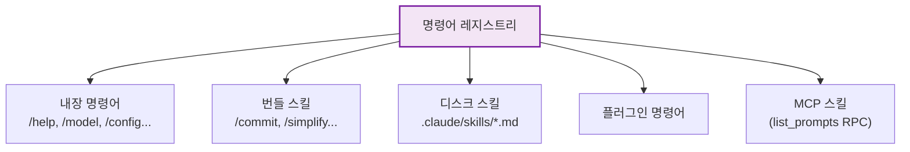

# 🔌 MCP와 확장성 아키텍처 — 무한 확장의 비밀

> 이 장에서는 **Model Context Protocol (MCP)**, 스킬 시스템, 플러그인을 통한 Claude Code의 확장 모델을 분석합니다.

## 🧩 확장의 3가지 축



## 🔌 MCP (Model Context Protocol) — 외부 도구 연결

MCP는 Claude Code가 **외부 서비스의 도구**를 사용할 수 있게 해주는 프로토콜이에요.

### 4가지 전송 프로토콜



### 서버 연결 상태

| 상태 | 의미 |
|:-----|:-----|
| ✅ Connected | 연결 완료, 도구 사용 가능 |
| ❌ Failed | 연결 실패 |
| 🔑 NeedsAuth | OAuth 인증 필요 |
| ⏳ Pending | 연결 시도 중 |
| ⛔ Disabled | 비활성화 |

### 설정 예시 (`.mcp.json`)

```json
{
  "mcpServers": {
    "github": {
      "command": "npx",
      "args": ["-y", "@modelcontextprotocol/server-github"],
      "env": { "GITHUB_TOKEN": "ghp_..." }
    }
  }
}
```

> 소스: [`src/services/mcp/client.ts`](../src/services/mcp/client.ts) · [`src/services/mcp/config.ts`](../src/services/mcp/config.ts)

## 🪄 스킬 시스템 — 커스텀 명령어

스킬은 **재사용 가능한 프롬프트 명령어**예요. `/commit`, `/simplify` 같은 슬래시 명령이 바로 스킬이에요!

### 스킬 정의 구조

```yaml
# .claude/skills/my-skill/skill.md
---
description: 코드 리뷰 자동화
when_to_use: 사용자가 리뷰를 요청할 때
allowed_tools: [Read, Grep, Glob]
model: sonnet
context: fork
---

코드를 검토하고 개선점을 제안해주세요...
```

### 스킬 실행 흐름



### 내장 번들 스킬

| 스킬 | 용도 |
|:-----|:-----|
| `/commit` | 코드 커밋 |
| `/simplify` | 코드 리뷰/최적화 |
| `/loop` | 반복 실행 |
| `/schedule` | 원격 에이전트 스케줄링 |
| `/claude-api` | Claude API 통합 가이드 |

> 소스: [`src/skills/bundledSkills.ts`](../src/skills/bundledSkills.ts) · [`src/tools/SkillTool/SkillTool.ts`](../src/tools/SkillTool/SkillTool.ts)

## 📦 플러그인 — 스킬+훅+MCP의 묶음

플러그인은 여러 확장 기능을 하나로 묶은 패키지예요:



### 플러그인 수명주기


> 소스: [`src/plugins/builtinPlugins.ts`](../src/plugins/builtinPlugins.ts) · [`src/services/plugins/PluginInstallationManager.ts`](../src/services/plugins/PluginInstallationManager.ts)

## 📋 명령어 시스템 — 100+ 슬래시 명령

모든 명령어는 [`src/commands.ts`](../src/commands.ts)의 레지스트리에서 관리돼요:



---

## 💡 엔지니어를 위한 팁

<details>
<summary><b>펼쳐서 기술 심화 내용 보기</b></summary>

### MCP 도구 등록 흐름

```
connectMCPServer()
  → Transport 생성 (stdio/SSE/HTTP/WS)
  → Client 생성 (@modelcontextprotocol/sdk)
  → client.listTools() RPC
  → 도구명 정규화 (normalizeNameForMCP)
  → MCPTool 인스턴스 생성 (buildTool)
  → assembleToolPool()에서 내장 도구와 병합
```

### 스킬 검색 우선순위

```
getCommands(cwd)
├─ 1. 내장 명령어 (commands.ts)
├─ 2. getBundledSkills() — registerBundledSkill()
├─ 3. getBuiltinPluginSkillCommands() — 활성 플러그인
├─ 4. loadSkillsDir() — .claude/skills/ (프로젝트/홈/관리)
└─ 5. fetchMcpSkillsForClient() — MCP list_prompts
```

### 핵심 파일

| 파일 | 역할 |
|:-----|:-----|
| [`src/services/mcp/client.ts`](../src/services/mcp/client.ts) | MCP 클라이언트 (33KB) |
| [`src/services/mcp/types.ts`](../src/services/mcp/types.ts) | MCP 타입 정의 |
| [`src/skills/bundledSkills.ts`](../src/skills/bundledSkills.ts) | 번들 스킬 레지스트리 |
| [`src/skills/loadSkillsDir.ts`](../src/skills/loadSkillsDir.ts) | 디스크 스킬 로더 |
| [`src/commands.ts`](../src/commands.ts) | 명령어 레지스트리 |

</details>

---

👉 다음 장: [**8장: 터미널 렌더링 엔진**](./8_Ink_Rendering.md) 🖥️
