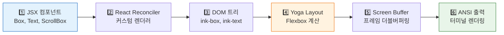
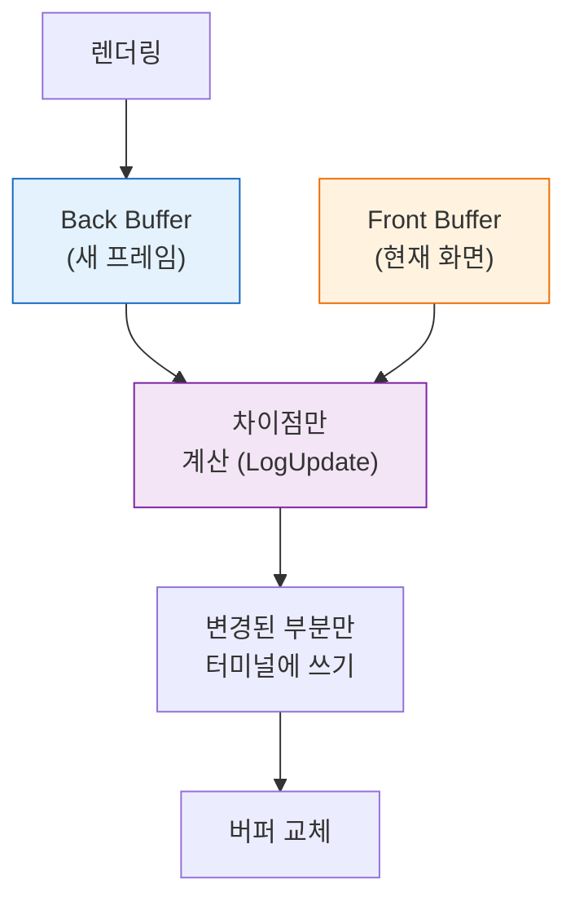

# 🖥️ 터미널 렌더링 엔진 — React로 터미널 UI 그리기

> Claude Code는 웹이 아닌 **터미널**에서 React를 사용합니다. 이 장에서는 커스텀 Ink 렌더링 파이프라인을 분석합니다.

## 🎨 렌더링 파이프라인 6단계



## 🏗️ Yoga Layout — 터미널 Flexbox

웹에서 `display: flex`를 쓰듯, 터미널에서도 Flexbox로 레이아웃을 잡아요! Meta의 Yoga 엔진을 **순수 TypeScript로 포팅**했어요.

지원하는 속성: `flex-direction`, `justify-content`, `align-items`, `padding`, `margin`, `gap`, `width`, `height`, `flex-grow/shrink`

일반적으로 Yoga는 C++이나 WebAssembly로 사용하지만, Claude Code는 **네이티브 바이너리 의존성을 없애기 위해** 1,500줄의 순수 TypeScript로 재구현했어요. 이 덕분에 어떤 플랫폼에서든 추가 설치 없이 바로 동작합니다.

실제로 터미널에서 이렇게 동작해요:
```
┌──────────────────────────────────┐ ← Box (flexDirection: column)
│ ┌────────────────────────────┐   │
│ │ 대화 메시지 영역 (ScrollBox)│   │ ← flex: 1 (남은 공간 전체)
│ │ User: 안녕?                │   │
│ │ Claude: 안녕하세요!         │   │
│ └────────────────────────────┘   │
│ ┌────────────────────────────┐   │
│ │ > 프롬프트 입력 _          │   │ ← 하단 고정
│ └────────────────────────────┘   │
│ ┌────────────────────────────┐   │
│ │ claude-sonnet-4 · tokens: 1.2k│ │ ← StatusLine
│ └────────────────────────────┘   │
└──────────────────────────────────┘
```

> 소스: [`src/native-ts/yoga-layout/index.ts`](../src/native-ts/yoga-layout/index.ts) (1,500줄)

## 📺 프레임 더블버퍼링

매 프레임마다 전체 화면을 다시 그리면 깜빡이겠죠? 그래서 **더블 버퍼링**을 써요:



프레임 간격: ~16ms (60fps), `FRAME_INTERVAL_MS`

이 방식 덕분에 타이핑할 때도, 긴 응답을 스트리밍할 때도 **화면이 깜빡이지 않아요**. 변경된 문자만 정확히 업데이트되기 때문이죠.

> 소스: [`src/ink/ink.tsx`](../src/ink/ink.tsx) (1,722줄) · [`src/ink/renderer.ts`](../src/ink/renderer.ts) · [`src/ink/log-update.ts`](../src/ink/log-update.ts)

## 🎯 왜 React를 터미널에?

"터미널에 React를?" 라고 생각할 수 있지만, 이유가 명확해요:

| 이유 | 설명 |
|:-----|:-----|
| **선언적 UI** | "이 상태면 이렇게 보여야 한다"만 정의하면 됨 |
| **컴포넌트 재사용** | 권한 다이얼로그, 메시지 등을 컴포넌트로 |
| **상태 관리** | React Hooks로 복잡한 상태를 깔끔하게 |
| **389개 컴포넌트** | 이 규모를 수동 렌더링으로는 불가능 |

React는 "어떻게 그릴지"가 아니라 "무엇을 그릴지"만 알려주면 되기 때문에, 복잡한 터미널 UI를 관리하기에 최적이에요.

## 🧩 핵심 컴포넌트

| 컴포넌트 | 용도 | 소스 |
|:---------|:-----|:-----|
| `Box` | Flex 컨테이너 | [`src/ink/components/Box.tsx`](../src/ink/components/Box.tsx) |
| `Text` | 텍스트 노드 | [`src/ink/components/Text.tsx`](../src/ink/components/Text.tsx) |
| `ScrollBox` | 스크롤 뷰포트 | [`src/ink/components/ScrollBox.tsx`](../src/ink/components/ScrollBox.tsx) |
| `Link` | 터미널 하이퍼링크 (OSC 8) | [`src/ink/components/Link.tsx`](../src/ink/components/Link.tsx) |

---

## 💡 엔지니어를 위한 팁

<details>
<summary><b>기술 심화</b></summary>

### 성능 최적화
- **단일 슬롯 Yoga 캐시**: 반복 `calculateLayout()` 방지
- **Blit 패스트 패스**: 레이아웃 변경 없으면 좁은 영역만 업데이트
- **스타일 풀**: ANSI 스타일 전환 중복 제거
- **스크롤 최적화**: DECSTBM blit+shift (하드웨어 스크롤)

### DOM → Output 파이프라인
```
DOMElement → renderNodeToOutput → Screen Buffer (Cell[][]) → LogUpdate diff → ANSI patches → stdout.write()
```

</details>

---

👉 다음 장: [**9장: 상태 관리와 글로벌 스토어**](./9_State_Management.md) ⚙️
