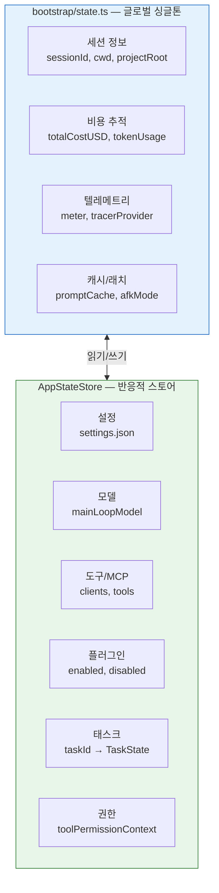

# ⚙️ 상태 관리와 글로벌 스토어

> 웹 앱에서 Redux나 Zustand를 쓰듯이, Claude Code도 앱 전체의 상태를 한 곳에서 관리합니다. 이 장에서는 **209개의 getter/setter**를 가진 글로벌 상태 싱글톤과, React 컴포넌트와 연동되는 반응적 스토어를 분석합니다.

## 🏗️ 2계층 상태 구조



**왜 두 계층인가요?**

`bootstrap/state.ts`는 **어디서든 import해서 바로 읽고 쓸 수 있는** 단순한 싱글톤이에요. 빠르지만 React와 연동이 안 돼요. 반면 `AppStateStore`는 **React의 `useSyncExternalStore`와 호환**되어서 상태가 바뀌면 자동으로 컴포넌트가 리렌더링돼요. 둘을 조합해서, 성능이 중요한 곳은 싱글톤을, UI 연동이 필요한 곳은 스토어를 사용합니다.

## 📊 비용 추적

Claude Code는 모든 API 호출의 **비용과 토큰 사용량을 실시간으로 추적**해요. 세션이 끝나면 저장하고, 다음 세션에서 복원할 수도 있어요:

```typescript
// 세션 중
addToTotalCostState(cost, modelUsage, model)

// 세션 종료 시 저장
saveCurrentSessionCosts(fpsMetrics?)

// 다음 세션에서 복원
restoreCostStateForSession(sessionId)
```

> 소스: [`src/bootstrap/state.ts`](../src/bootstrap/state.ts) (1,758줄) · [`src/cost-tracker.ts`](../src/cost-tracker.ts)

## 🔄 반응적 Store 패턴

```typescript
type Store<T> = {
  getState: () => T;                              // 현재 상태
  setState: (updater: (prev: T) => T) => void;    // 상태 업데이트
  subscribe: (listener: () => void) => () => void; // 구독 (unsubscribe 반환)
}
```

React의 `useSyncExternalStore`와 호환되어, 상태 변경 시 컴포넌트가 자동으로 리렌더링돼요.

---

## 💡 엔지니어를 위한 팁

<details>
<summary><b>기술 심화</b></summary>

### 주요 상태 필드 (209개 중 핵심)

| 카테고리 | 필드 | 용도 |
|:---------|:-----|:-----|
| 세션 | `sessionId`, `originalCwd`, `projectRoot` | 세션 식별 |
| 비용 | `totalCostUSD`, `modelUsage` | 토큰/비용 누적 |
| 텔레메트리 | `meter`, `meterProvider` | OpenTelemetry |
| 캐시 | `systemPromptSectionCache` | 프롬프트 캐시 |
| 래치 | `promptCache1hEligible`, `fastModeHeaderLatched` | 토글 래치 |

### DeepImmutable 패턴

AppState는 `DeepImmutable<T>`로 래핑되어 직접 변경이 불가능하고, `setState(prev => newState)` 패턴만 허용됩니다.

</details>

---

👉 다음 장: [**10장: 컨텍스트 압축과 토큰 관리**](./10_Context_Compaction.md) 🧹
