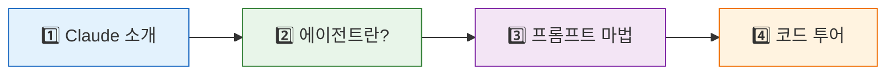

# 🗺️ Claude Code 에이전트 마스터 튜토리얼

> **안녕하세요!** 이 튜토리얼은 Anthropic의 AI 코딩 어시스턴트 **Claude Code**가 내부적으로 어떻게 작동하는지를, 초등학생부터 시니어 엔지니어까지 모두 이해할 수 있도록 설명하는 가이드입니다. 🎓

## 🤔 이 튜토리얼은 누구를 위한 건가요?

| 대상 | 얻을 수 있는 것 |
|:-----|:--------------|
| 🧒 **입문자** | AI 에이전트와 프롬프트가 뭔지 처음부터 이해 |
| 🧑‍💻 **개발자** | Claude Code의 아키텍처와 실행 흐름 파악 |
| 🏗️ **엔지니어** | 소스코드 레벨에서 프롬프트 조립, 에이전트 스포닝 메커니즘 이해 |

## 📚 학습 순서

아래 순서대로 읽으면 자연스럽게 이해가 쌓여요!



| 순서 | 문서 | 한 줄 설명 |
|:-----|:-----|:---------|
| 1️⃣ | [**우리의 똑똑한 친구, Claude**](./1_Hello_Claude.md) | 🤖 Claude가 뭔지, 어떻게 대화하는지 알아봐요 |
| 2️⃣ | [**스스로 생각하는 에이전트**](./2_What_is_Agent.md) | 🕵️ 시키는 대로만 하는 프로그램과 에이전트의 차이 |
| 3️⃣ | [**AI를 움직이는 마법의 주문**](./3_Prompt_Magic.md) | 🪄 프롬프트 엔지니어링의 비밀을 파헤쳐요 |
| 4️⃣ | [**실제 코드로 보는 구조**](./4_Code_Tour.md) | 🛠️ 소스코드를 직접 따라가며 이해하는 엔지니어 가이드 |

## 🏗️ 프로젝트 구조

```
이 저장소/
├── tutorial/           ← 📖 지금 보고 있는 튜토리얼
│   ├── README.md       ← 🗺️ 이 파일 (전체 지도)
│   ├── 1_Hello_Claude.md
│   ├── 2_What_is_Agent.md
│   ├── 3_Prompt_Magic.md
│   └── 4_Code_Tour.md
│
├── src/                ← 💻 Claude Code 실제 소스코드 (1,902개 파일)
├── Index.md            ← 🧭 분석 문서 지도 (Map of Content)
├── README.md           ← 📋 프로젝트 전체 README
└── ...                 ← 📄 39개 분석 문서
```

## 🚀 시작하기

준비되셨나요? 그럼 첫 번째 장으로 가볼까요!

👉 **[1장: 우리의 똑똑한 친구, Claude를 소개합니다!](./1_Hello_Claude.md)** 🤖
