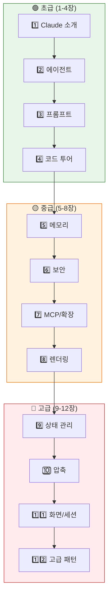

# 🗺️ Claude Code 에이전트 마스터 튜토리얼

> **안녕하세요!** 이 튜토리얼은 Anthropic의 AI 코딩 어시스턴트 **Claude Code**가 내부적으로 어떻게 작동하는지를, 초등학생부터 시니어 엔지니어까지 모두 이해할 수 있도록 설명하는 가이드입니다. 🎓

## 🤔 이 튜토리얼은 누구를 위한 건가요?

| 대상 | 얻을 수 있는 것 |
|:-----|:--------------|
| 🧒 **입문자** | AI 에이전트와 프롬프트가 뭔지 처음부터 이해 |
| 🧑‍💻 **개발자** | Claude Code의 아키텍처와 실행 흐름 파악 |
| 🏗️ **엔지니어** | 소스코드 레벨에서 프롬프트 조립, 에이전트 스포닝 메커니즘 이해 |

## 📚 학습 순서 (12장)

### 🟢 초급 — 기초 다지기

| 장 | 문서 | 한 줄 설명 |
|:---|:-----|:---------|
| 1️⃣ | [**우리의 똑똑한 친구, Claude**](./1_Hello_Claude.md) | 🤖 Claude와 Claude Code 소개, API 프로바이더 |
| 2️⃣ | [**스스로 생각하는 에이전트**](./2_What_is_Agent.md) | 🕵️ ReAct 패턴, 40개 도구, 6개 내장 에이전트 |
| 3️⃣ | [**AI를 움직이는 프롬프트 마법**](./3_Prompt_Magic.md) | 🪄 15개 프롬프트 블록, CLAUDE.md 계층 |
| 4️⃣ | [**실제 코드로 보는 구조**](./4_Code_Tour.md) | 🛠️ 5-Stop 소스코드 가이드 투어 |

### 🟡 중급 — 시스템 이해

| 장 | 문서 | 한 줄 설명 |
|:---|:-----|:---------|
| 5️⃣ | [**AI의 기억 시스템**](./5_Memory_System.md) | 🧠 세션/자동/팀 메모리, 추출 에이전트, MEMORY.md |
| 6️⃣ | [**보안과 권한 시스템**](./6_Security_Permissions.md) | 🛡️ 3층 방어, 12단계 권한, AST 기반 Bash 보안 |
| 7️⃣ | [**MCP와 확장성**](./7_MCP_Extensibility.md) | 🔌 MCP 4 프로토콜, 스킬, 플러그인, 명령어 |
| 8️⃣ | [**터미널 렌더링 엔진**](./8_Ink_Rendering.md) | 🖥️ React→Yoga→ANSI 파이프라인, 더블 버퍼링 |

### 🔴 고급 — 깊은 이해

| 장 | 문서 | 한 줄 설명 |
|:---|:-----|:---------|
| 9️⃣ | [**상태 관리와 글로벌 스토어**](./9_State_Management.md) | ⚙️ 209개 상태, 비용 추적, 반응적 Store |
| 🔟 | [**컨텍스트 압축과 토큰 관리**](./10_Context_Compaction.md) | 🧹 9항목 보존, 3가지 압축 전략, 캐싱 |
| 1️⃣1️⃣ | [**화면 시스템과 세션 관리**](./11_Screens_Sessions.md) | 📺 REPL, Vim 모드, 음성, Buddy |
| 1️⃣2️⃣ | [**고급 패턴과 내부 최적화**](./12_Advanced_Patterns.md) | 🏗️ 8대 패턴, 동시성, 네이티브 TS 포트 |

### 🔮 특별편

| 장 | 문서 | 한 줄 설명 |
|:---|:-----|:---------|
| 1️⃣3️⃣ | [**소스코드에 숨겨진 비밀들**](./13_Hidden_Secrets.md) | 🔮 autoDream, Speculation, YOLO, Buddy, Tengu 등 12개 비밀 |

## 🚀 시작하기

준비되셨나요? 그럼 첫 번째 장으로 가볼까요!

👉 **[1장: 우리의 똑똑한 친구, Claude를 소개합니다!](./1_Hello_Claude.md)** 🤖
